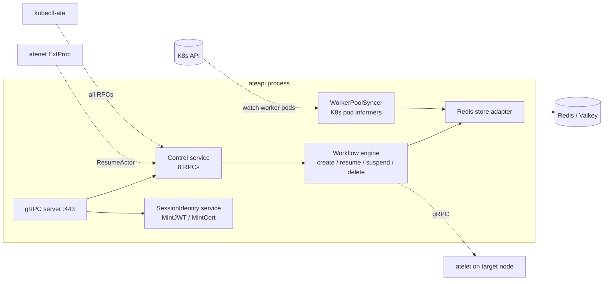

`ateapi` is a stateless gRPC server backed by Redis. It is **the** source of
truth for actor and worker state — every other component either calls it
(atenet) or is called by it (atelet).

## What it owns



## The Control gRPC service

Defined in <code class="fileref">pkg/proto/ateapipb/ateapi.proto:25-49</code>.

| RPC | Purpose | Code |
|---|---|---|
| `GetActor` | Fetch a single actor record | `service.go` |
| `CreateActor` | Create new actor (status = `SUSPENDED`) | <code class="fileref">create_actor.go:30-66</code> |
| `ResumeActor` | Suspended → Running. Drives the [resume flow](/flows/resume-actor/) | <code class="fileref">workflow_resume.go:35-293</code> |
| `SuspendActor` | Running → Suspended. Drives the suspend flow | <code class="fileref">workflow_suspend.go:35-239</code> |
| `DeleteActor` | Delete (only when SUSPENDED) | `service.go` |
| `ListActors` | Paginated list | `service.go` |
| `ListWorkers` | List all worker records | `service.go` |
| `DebugClear` | Flush Redis (debug only) | `service.go` |

## The SessionIdentity gRPC service

A second service on the same server, defined at
<code class="fileref">pkg/proto/ateapipb/ateapi.proto:187-197</code>.

Workloads call these from inside their gVisor sandbox to mint **session-scoped
credentials** that survive worker migration:

- `MintJWT(MintJWTRequest)` — JWT with subject `apps/{appid}/users/{userid}/sessions/{sessionid}`.
- `MintCert(MintCertRequest)` — X.509 cert with a SPIFFE URI scoped to the same app/user/session.

The workload authenticates either with its K8s service-account bearer token
(the pod identity) or with an mTLS client cert; ateapi attests the session
metadata and signs.

<code class="fileref">cmd/ateapi/internal/sessionidentity/sessionidentity.go:42-100</code>

## The workflow engine

All actor state transitions go through a small workflow engine that:

1. **Acquires `lock:actor:<id>` in Redis** with a 30s TTL (workflow timeout
   is 28s, leaving 2s of padding before the lock expires).
2. **Loads the actor** from Redis.
3. **Runs N steps**, each of which reads/writes Redis and may call out to
   atelet over gRPC.
4. **Returns `Aborted`** to the caller if the lock is held by someone else.

<code class="fileref">cmd/ateapi/internal/controlapi/workflow.go:54-212</code>

```mermaid
flowchart LR
  IN[RPC handler] --> LOCK{Acquire<br/>lock:actor:{id}}
  LOCK -- failed --> ABORT[return Aborted]
  LOCK -- ok --> S1[Step 1: LoadActor]
  S1 --> S2[Step 2: ...]
  S2 --> S3[Step 3: ...]
  S3 --> S4[Step N: Finalize]
  S4 --> UNLOCK[Release lock]
  UNLOCK --> OUT[return Actor]
```

The step lists for each workflow:

| Workflow | Steps |
|---|---|
| **Resume** | LoadActorForResume → AssignWorker → CallAteletRestore → FinalizeRunning |
| **Suspend** | LoadActorForSuspend → MarkSuspending → CallAteletSuspend → FinalizeSuspended |

## The WorkerPoolSyncer

The hot path needs to know "give me a free worker in pool X" in microseconds.
That answer comes from Redis. The **WorkerPoolSyncer** keeps Redis in sync with
the actual K8s state:

- **Informer on worker pods**: pod becomes Ready → `CreateWorker(actor_id="")`
  in Redis.
- **Informer DeleteFunc**: pod is gone → `releaseActorOnDeadWorker` (if the
  worker had an actor, reset it to `SUSPENDED`), then `DeleteWorker`.

<code class="fileref">cmd/ateapi/internal/controlapi/syncer.go:28-192</code>

:::caution[Known race]
If a pod dies **and** a concurrent `SuspendActor` is in flight, the actor can
get released twice. Best-effort cleanup only — tracked upstream.
:::

## The Redis keyspace

| Key | Value | Notes |
|---|---|---|
| `actor:<actor-id>` | Actor proto (JSON) | Indexed by actor ID |
| `worker:<ns>:<pool>:<pod>` | Worker proto (JSON) | Indexed by pod identity |
| `lock:actor:<actor-id>` | Lock owner ID | 30s TTL |

<code class="fileref">cmd/ateapi/internal/store/ateredis/ateredis.go:40-80</code>

## Entry point

<code class="fileref">cmd/ateapi/main.go:70-161</code> — gRPC server setup,
Redis connection, K8s informer wiring, TLS config.

## Related

- [Resume actor flow](/flows/resume-actor/) — sees the workflow engine in action.
- [System topology](/topology/) — how ateapi connects to everything else.
- [Storage](/components/storage/) — Redis and GCS details (Cut 3).
