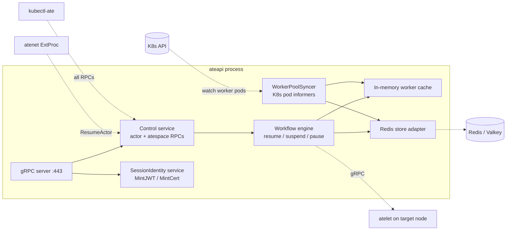
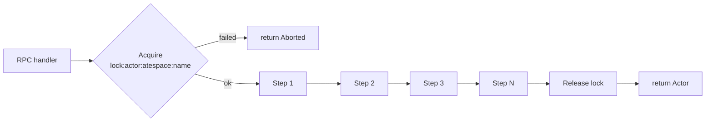

`ateapi` is a stateless gRPC server backed by Redis/Valkey. It is **the** source
of truth for actor and worker state - every other component either calls it
(atenet) or is called by it (atelet).

## What it owns

## Resource identity: `(atespace, name)`

Every Substrate resource now carries a common `ResourceMetadata`
(`atespace`, `name`, `uid`, `version`, `create_time`, `update_time`), and an
actor's identity is the tuple **`(atespace, name)`** - the old bare `actor_id`
is gone. Requests reference a resource with an `ObjectRef{atespace, name}`, or
carry the resource body itself (e.g. `CreateActorRequest{actor: Actor}` where
the identity lives in `actor.metadata`). See the [Atespace](/concepts/atespace/)
concept and `docs/api-style-guide.md` for the Create/Get/List/Delete +
`ObjectRef`/`ResourceMetadata` conventions.

## The Control gRPC service

Defined in <code class="fileref">pkg/proto/ateapipb/ateapi.proto</code>.

| RPC | Request → Response | Notes |
|---|---|---|
| `GetActor` | `GetActorRequest{actor: ObjectRef}` → `Actor` | Fetch one actor record |
| `CreateActor` | `CreateActorRequest{actor: Actor}` → `Actor` | Identity in `actor.metadata.{atespace,name}`; created with status `SUSPENDED` |
| `UpdateActor` | `UpdateActorRequest{actor: ObjectRef, worker_selector: Selector}` → `UpdateActorResponse{actor}` | Updates placement; takes effect on next resume |
| `SuspendActor` | `SuspendActorRequest{actor: ObjectRef}` → `SuspendActorResponse{actor}` | Running → Suspended; uploads snapshot to external storage |
| `PauseActor` | `PauseActorRequest{actor: ObjectRef}` → `PauseActorResponse{actor}` | Running → Paused; keeps the snapshot on the node VM |
| `ResumeActor` | `ResumeActorRequest{actor: ObjectRef, boot: bool}` → `ResumeActorResponse{actor}` | Suspended/Paused → Running. `boot=true` skips the golden snapshot and cold-boots |
| `DeleteActor` | `DeleteActorRequest{actor: ObjectRef}` → `Actor` | Only a `SUSPENDED` or `CRASHED` actor may be deleted; returns the deleted record |
| `ListWorkers` | `ListWorkersRequest{}` → `ListWorkersResponse{workers}` | All worker records |
| `ListActors` | `ListActorsRequest{page_size, page_token, atespace}` → `ListActorsResponse{actors, next_page_token}` | Paginated; optional `atespace` scopes the scan |
| `CreateAtespace` | `CreateAtespaceRequest{atespace: Atespace}` → `Atespace` | Atespace CRUD (see below) |
| `GetAtespace` | `GetAtespaceRequest{atespace: ObjectRef}` → `Atespace` | |
| `ListAtespaces` | `ListAtespacesRequest{}` → `ListAtespacesResponse{atespaces}` | |
| `DeleteAtespace` | `DeleteAtespaceRequest{atespace: ObjectRef}` → `Atespace` | Rejects `FailedPrecondition` if any actors remain |
| `DebugClear` | `DebugClearRequest{}` → `DebugClearResponse{}` | Flush Redis (debug only) |

Actor status is one of `SUSPENDED`, `RESUMING`, `RUNNING`, `SUSPENDING`,
`PAUSING`, `PAUSED`, or `CRASHED` (`Actor.Status` in the proto). `PAUSING`,
`PAUSED`, and `CRASHED` are recent additions that go with the pause/crash flows.

Handlers live in <code class="fileref">cmd/ateapi/internal/controlapi/</code>
(one file per RPC, e.g. `create_actor.go`, `pause_actor.go`,
`list_actors.go`, `create_atespace.go`), wired up in `service.go`.

### Atespaces

Atespaces are the tenancy boundary an actor is created into - Substrate-native
records stored in Redis, not Kubernetes objects. An `Atespace` is
global-scoped (its `metadata.atespace` is empty; its identity is
`metadata.name`). `DeleteAtespace` refuses (`FailedPrecondition`) to remove an
atespace that still holds actors. See [Atespace](/concepts/atespace/).

## The SessionIdentity gRPC service

A second service on the same server, defined at
<code class="fileref">pkg/proto/ateapipb/ateapi.proto</code>.

Workloads call these from inside their sandbox to mint **session-scoped
credentials** that survive worker migration:

- `MintJWT(MintJWTRequest)` - an OIDC-discovery-compatible JWT whose subject is
  `apps/{appid}/users/{userid}/sessions/{sessionid}` and which carries an
  `ate.dev` extension claim with the app/user/session IDs.
- `MintCert(MintCertRequest)` - an X.509 cert (returned as a DER chain,
  leaf-first) scoped to the same app/user/session.

The workload authenticates either with its K8s service-account bearer token
(the pod identity) or with an mTLS client cert; ateapi checks that the
credential belongs to the pod currently mapped to the requested session, then
signs.

<code class="fileref">cmd/ateapi/internal/sessionidentity/sessionidentity.go</code>

## The workflow engine

All actor state transitions go through a small generic workflow engine
(`RunWorkflow` over a list of idempotent `WorkflowStep`s). Each workflow:

1. **Acquires `lock:actor:<atespace>:<name>` in Redis** with a 30s TTL. The
   workflow runs under a context that times out at 28s (TTL minus 2s of
   padding) so the lock cannot be released after it has already expired.
2. **Runs its steps** in order - each step checks `IsComplete` (so a retried
   workflow fast-forwards), then reads/writes Redis and may call atelet over
   gRPC.
3. **Returns `Aborted`** to the caller if the lock is already held.

<code class="fileref">cmd/ateapi/internal/controlapi/workflow.go</code>

The step lists for each workflow:

| Workflow | Steps |
|---|---|
| **Resume** | LoadActorForResume → AssignWorker → CallAteletRestore → FinalizeRunning |
| **Suspend** | LoadActorForSuspend → MarkSuspending → CallAteletSuspend → FinalizeSuspended |
| **Pause** | LoadActorForPause → MarkPausing → CallAteletPause → FinalizePaused |

## The WorkerPoolSyncer and worker cache

The hot path needs to answer "give me a free worker in pool X" fast. That
answer comes from Redis, fronted by an **in-memory worker cache**. The
**WorkerPoolSyncer** keeps Redis in sync with actual K8s state, and the cache
keeps an in-process view current:

- **Informer on worker pods**: pod becomes Ready → `CreateWorker` (idle, no
  `assignment`) in Redis.
- **Informer DeleteFunc**: pod is gone → `releaseActorOnDeadWorker` (if the
  worker had an `Assignment`, reset its actor to `SUSPENDED`), then
  `DeleteWorker`.
- The worker cache (<code class="fileref">cmd/ateapi/internal/workercache/workercache.go</code>)
  streams updates via the store's `WatchWorkers` and periodically relists to
  recover from missed events, exposing an O(1) view for scheduling.

<code class="fileref">cmd/ateapi/internal/controlapi/syncer.go</code>

:::caution[Known race]
If a pod dies **and** a concurrent `SuspendActor` is in flight, the actor can
get released twice. Best-effort cleanup only - tracked upstream.
:::

## The Redis keyspace

| Key | Value | Notes |
|---|---|---|
| `actor:<atespace>:<name>` | Actor proto (JSON) | Keyed by `(atespace, name)` |
| `atespace:<name>` | Atespace proto (JSON) | Global-scoped |
| `worker:<ns>:<pool>:<pod>` | Worker proto (JSON) | Keyed by pod identity |
| `lock:actor:<atespace>:<name>` | Lock owner ID | 30s TTL |

<code class="fileref">cmd/ateapi/internal/store/ateredis/ateredis.go</code>

## Authentication

Incoming gRPC auth is selected by `--auth-mode`
(<code class="fileref">cmd/ateapi/main.go</code>):

- **`mtls`** (default) - client identity comes from transport-level mTLS.
- **`jwt`** - *additionally* requires a Kubernetes ServiceAccount Bearer token
  on every RPC, verified against the cluster's OIDC issuer in a gRPC
  interceptor. This mode is a stopgap that will be dropped once Pod Certificates
  are enabled by default in the minimum supported Kubernetes version.

## Entry point

<code class="fileref">cmd/ateapi/main.go</code> - gRPC server setup, Redis/Valkey
connection, K8s informer wiring, TLS config, and auth-mode selection.

## Related

- [Resume actor flow](/flows/resume-actor/) - sees the workflow engine in action.
- [Atespace](/concepts/atespace/) - the tenancy boundary in resource identity.
- [System topology](/topology/) - how ateapi connects to everything else.
- [Storage](/components/storage/) - Redis/Valkey and GCS/S3 details.
