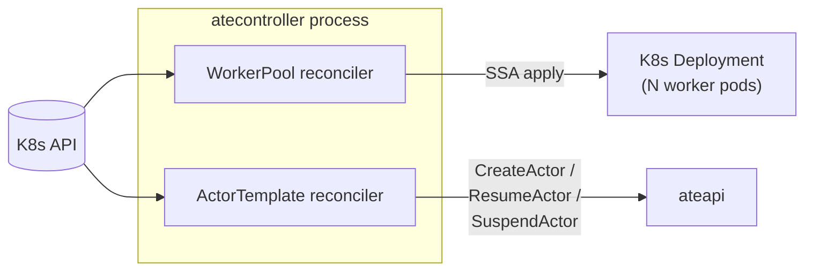
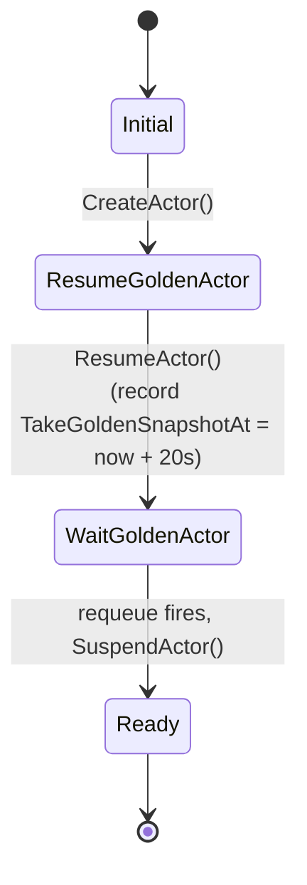

`atecontroller` is the Kubernetes-native half of the control plane.
Everything declarative about Substrate goes through it: `WorkerPool` and
`ActorTemplate` are the CRDs it owns, and reconciling them produces real
K8s resources (Deployments) and ateapi state (golden snapshots).

## What it owns



<code class="fileref">cmd/atecontroller/main.go:49-107</code>

## WorkerPool reconciler

```yaml
apiVersion: ate.dev/v1alpha1
kind: WorkerPool
metadata:
  name: default
spec:
  replicas: 10
  ateomImage: ghcr.io/.../ateom-gvisor:vX
```

The reconciler:

1. Reads desired state from `WorkerPool.spec`.
2. Server-side-applies a K8s `Deployment` named `<workerpool-name>-deployment`.
3. Updates `WorkerPool.status` with actual replica count.

That's it. No data plane involvement, no Redis writes. The pods themselves
get registered in Redis by ateapi's `WorkerPoolSyncer` once they go Ready.

<code class="fileref">internal/controllers/workerpool_controller.go:52-176</code>

## ActorTemplate reconciler

```yaml
apiVersion: ate.dev/v1alpha1
kind: ActorTemplate
metadata:
  name: my-agent
spec:
  workerPoolRef: { name: default }
  containers: [...]
  pauseImage: ...
  snapshotsConfig: { location: gs://my-bucket/actors }
```

This one is more interesting — it runs the **5-phase golden snapshot
bootstrap** described in [Golden snapshot](/flows/golden-snapshot/):



`PhaseFailed` is declared in the CRD type but the reconciler never assigns
it — errors just return and trigger a requeue. The 20s wait between resume
and suspend is not a blocking sleep; the reconciler stamps
`Status.TakeGoldenSnapshotAt` and uses `RequeueAfter` to come back later.

The result: every ready ActorTemplate has a `Status.GoldenSnapshot` URI that
new actors of this template can restore from in milliseconds.

<code class="fileref">internal/controllers/actortemplate_controller.go:55-162</code>

## Why is this a separate process from ateapi?

It uses the Kubernetes informer cache and has reconcile-loop semantics —
the standard operator pattern. ateapi is stateless gRPC, optimized for QPS.
Different concerns, different scaling profiles. (Note: the manager is
constructed with `ctrl.Options{Scheme: scheme}`, so leader election is
**off** by default. If you scale this to multiple replicas, they will all
reconcile concurrently.)

## Entry point

<code class="fileref">cmd/atecontroller/main.go:49-107</code> — controller-runtime
manager setup, scheme registration, both reconcilers wired up.

## Related

- [WorkerPool](/concepts/workerpool/) · [ActorTemplate](/concepts/actortemplate/)
- [Golden snapshot bootstrap](/flows/golden-snapshot/) — the ActorTemplate
  reconciler's interesting flow.
- [ateapi](/components/ateapi/) — atecontroller's only gRPC client.
