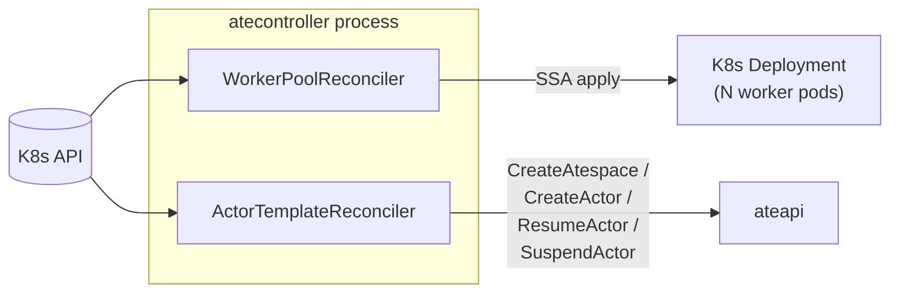
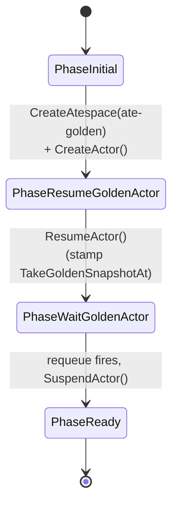

`atecontroller` is the Kubernetes-native half of the control plane.
Everything declarative about Substrate goes through it: `WorkerPool` and
`ActorTemplate` are the CRDs it reconciles, and reconciling them produces real
K8s resources (Deployments) and ateapi state (golden snapshots).

## What it owns

It runs **exactly two reconcilers** - one per CRD:



<code class="fileref">cmd/atecontroller/main.go</code>

There is no atespace or SandboxConfig reconciler here. `SandboxConfig` is a
cluster-scoped CRD, but ateapi consumes it directly (via a lister) when
scheduling - atecontroller does not reconcile it.

## WorkerPool reconciler

```yaml
apiVersion: ate.dev/v1alpha1
kind: WorkerPool
metadata:
  name: default
spec:
  replicas: 10
  ateomImage: ghcr.io/.../ateom-gvisor:vX
  sandboxClass: gvisor
```

The reconciler:

1. Reads desired state from `WorkerPool.spec`.
2. Server-side-applies a K8s `Deployment` named `<workerpool-name>-deployment`
   (owning it, so pod changes re-trigger reconcile).
3. Updates `WorkerPool.status.replicas` with the Deployment's actual replica
   count.

That's it. No data plane involvement, no Redis writes. The pods themselves get
registered in Redis by ateapi's `WorkerPoolSyncer` once they go Ready.

Crucially, a WorkerPool is **decoupled from ActorTemplate**: templates no longer
reference a pool. Instead, placement is selector-based - the scheduler ANDs a
template's `workerSelector` with the actor's own `worker_selector` and matches
against pool labels (and `sandboxClass`).

<code class="fileref">cmd/atecontroller/internal/controllers/workerpool_controller.go</code>

## ActorTemplate reconciler

```yaml
apiVersion: ate.dev/v1alpha1
kind: ActorTemplate
metadata:
  name: my-agent
spec:
  sandboxClass: gvisor
  workerSelector: { matchLabels: { pool: default } }
  containers: [...]
  pauseImage: ...
  snapshotsConfig: { location: gs://my-bucket/actors }
```

This one is more interesting - it runs a **golden snapshot bootstrap** as a
small phase machine (`ActorTemplate.Status.Phase`), described in
[Golden snapshot](/flows/golden-snapshot/):



Two things worth calling out:

- **The golden actor lives in the reserved `ate-golden` atespace.** In
  `PhaseInitial` the reconciler first ensures that atespace exists
  (`CreateAtespace`, tolerating `AlreadyExists`), then creates a golden actor
  there whose name is a fresh UUID (`Status.GoldenActorID`).
- **The warmup wait is readyz-gated.** The reconciler stamps
  `Status.TakeGoldenSnapshotAt` and uses `RequeueAfter` (not a blocking sleep)
  before it suspends the golden actor to capture the snapshot. That delay is
  `goldenSnapshotWarmup` (**20s**) *only as a fallback*: if every container in
  the template declares a `readyz` probe, the delay is **0**, because
  `ResumeActor` already blocked until the workload reported readiness. A
  template with no containers keeps the 20s default.

The reconciler never assigns a `PhaseFailed`; on error it just returns and lets
controller-runtime requeue. The result: every ready ActorTemplate has a
`Status.GoldenSnapshot` URI (read from the suspended golden actor's
`latest_snapshot_info.external.snapshot_uri_prefix`) that new actors of this
template can restore from in milliseconds.

<code class="fileref">cmd/atecontroller/internal/controllers/actortemplate_controller.go</code>

## Why is this a separate process from ateapi?

It uses the Kubernetes informer cache and has reconcile-loop semantics -
the standard operator pattern. ateapi is stateless gRPC, optimized for QPS.
Different concerns, different scaling profiles. (The manager is constructed
without leader election, so if you scale this to multiple replicas they will
all reconcile concurrently.)

## Entry point

<code class="fileref">cmd/atecontroller/main.go</code> - controller-runtime
manager setup, scheme registration, both reconcilers wired up.

## Related

- [WorkerPool](/concepts/workerpool/) · [ActorTemplate](/concepts/actortemplate/)
- [Golden snapshot bootstrap](/flows/golden-snapshot/) - the ActorTemplate
  reconciler's interesting flow.
- [Atespace](/concepts/atespace/) - including the reserved `ate-golden` atespace.
- [ateapi](/components/ateapi/) - atecontroller's only gRPC client.
