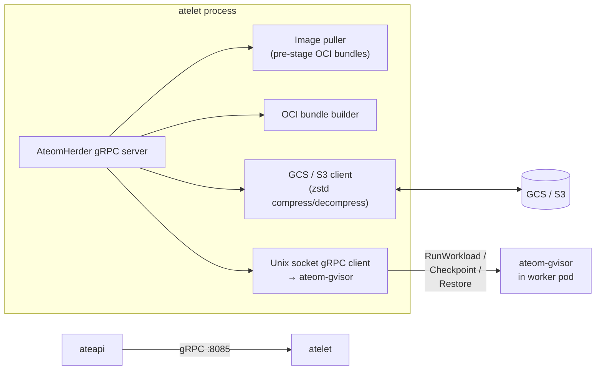

`atelet` is the node-side workhorse. One pod per worker node (it's a
DaemonSet), exposing a gRPC server that ateapi calls into for every Run /
Checkpoint / Restore. atelet doesn't make decisions — it executes.

## What it does



<code class="fileref">cmd/atelet/main.go</code>

## The AteomHerder gRPC service

Three RPCs, each called by ateapi during the corresponding workflow:

| RPC | Caller | What atelet does |
|---|---|---|
| `Run(RunRequest)` | ateapi resume workflow (cold boot fallback) | Pull images, build fresh OCI bundle, download runsc binary, call `ateom.RunWorkload` |
| `Checkpoint(CheckpointRequest)` | ateapi suspend workflow | Call `ateom.CheckpointWorkload`, then zstd-compress + upload the 3 image files to GCS/S3 |
| `Restore(RestoreRequest)` | ateapi resume workflow | Download snapshot files from GCS/S3 in parallel, zstd-decompress to local volume, call `ateom.RestoreWorkload` |

<code class="fileref">cmd/atelet/main.go:172,278-474</code>

## How atelet talks to ateom-gvisor

Each worker pod has a host-bind-mounted Unix socket at:

```
/var/lib/ateom-gvisor/ateoms/<pod-uid>/ateom.sock
```

atelet dials this socket (`DialAteomPod`) and gets a gRPC client to that
specific pod's ateom. No TCP, no service discovery — the pod UID in the
filesystem path is the addressing scheme.

<code class="fileref">cmd/atelet/main.go:592</code>

## Snapshot upload / download

atelet is the **only** component that talks to object storage. Backend is
chosen via `ATE_STORAGE_BACKEND` env var; the same interface fronts both GCS
and S3 (see `cmd/atelet/internal/ategcs`).

Snapshots live under the prefix supplied by the `ActorTemplate`:

```
<spec.snapshotsConfig.location>/<actorId>/<RFC3339-ts>-<random>/
  checkpoint.img.zstd
  pages.img.zstd        (optional)
  pages_meta.img.zstd   (optional)
```

The two `pages*` files are uploaded only if `runsc checkpoint` produced them
(`uploadIfExists`). Restore **downloads** happen in parallel via an
`errgroup`; checkpoint **uploads** are sequential. zstd compression is
applied on the atelet side to keep network bytes down.

<code class="fileref">cmd/atelet/main.go:385-405,432-448</code>

## Local filesystem layout

atelet manages a tree on each node:

| Path | Contents |
|---|---|
| `/var/lib/ateom-gvisor/static-files/runsc-<sha>` | Downloaded runsc binaries, content-addressed |
| `/var/lib/ateom-gvisor/actors/<ns>:<name>:<id>/bundles/<container>/` | OCI bundles per container |
| `.../runsc-state/` | runsc bundle state |
| `.../checkpoint-state/` | Output of `runsc checkpoint` |
| `.../restore-state/` | Input to `runsc restore` (downloaded files staged here) |

`checkpoint-state` and `restore-state` are kept separate so a future restore
doesn't trample a checkpoint in progress.

<code class="fileref">internal/ateompath/ateompath.go:34,63-123</code>

## Why a DaemonSet, not a sidecar?

atelet is heavy: it caches runsc binaries, holds object-storage credentials,
and image-pulls. Running one per worker pod would multiply those costs by
the worker count. One atelet per node, shared by all worker pods on that
node, is much cheaper.

## Related

- [Resume actor flow](/flows/resume-actor/) · [Suspend actor flow](/flows/suspend-actor/) —
  atelet's two main jobs.
- [ateom-gvisor](/components/ateom-gvisor/) — what atelet drives.
- [Storage](/components/storage/) — GCS/S3 layout details.
