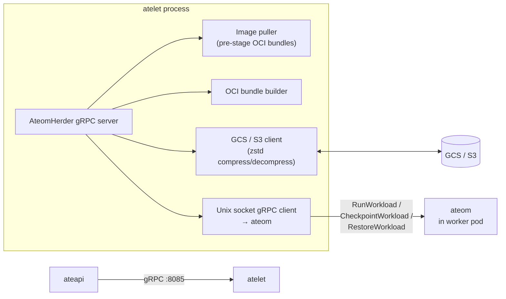

`atelet` is the node-side workhorse. One pod per worker node (it's a
DaemonSet), exposing a gRPC server that ateapi calls into for every Run /
Checkpoint / Restore. atelet doesn't make decisions - it executes.

It is **runtime-agnostic**: it drives whichever sandbox a worker pod runs
(`ateom-gvisor` or `ateom-microvm`) over the same Unix-socket gRPC contract.

## What it does



<code class="fileref">cmd/atelet/main.go</code>

## The AteomHerder gRPC service

Three RPCs, each called by ateapi during the corresponding workflow. Every
request's path components (atespace, actor name, container names, target ateom
UID, snapshot URI prefix) are validated up front through the shared
`internal/resources` validators, and an invalid request is rejected with
gRPC `InvalidArgument`.

| RPC | Caller | What atelet does |
|---|---|---|
| `Run(RunRequest)` | ateapi resume workflow (cold boot fallback) | Fetch sandbox assets, reset actor dirs, build OCI bundles, call `ateom.RunWorkload` |
| `Checkpoint(CheckpointRequest)` | ateapi suspend / pause workflow | Re-fetch the recorded sandbox assets, call `ateom.CheckpointWorkload`, then ship exactly the files ateom reports (zstd-compressed) locally or to GCS/S3 |
| `Restore(RestoreRequest)` | ateapi resume workflow | Fetch sandbox assets, download the snapshot files (parallel), decompress to a local volume, call `ateom.RestoreWorkload` |

<code class="fileref">cmd/atelet/main.go</code>

## Sandbox assets (not a hardcoded runsc download)

The runtime binaries are no longer a baked-in "download runsc" step. The
`RunRequest` carries a **`SandboxAssets`** message: a `sandbox_class` plus a
per-architecture set of content-addressed files (`url` + `sha256`). atelet
projects that onto the node's `GOARCH`, then fetches each asset:

- The download is **streamed to a temp file** (hashing as it goes, verified
  against the expected sha256 and capped) and atomically renamed into the
  shared content-addressed cache - never buffered whole in memory.
- Public buckets (gVisor's `runsc` in `gs://gvisor`) are tried anonymously
  first, then the cluster's own object-storage client.
- gVisor needs a single `runsc` asset; the micro-VM runtime needs several
  (e.g. `cloud-hypervisor`, `kata-kernel`, `kata-image`).

atelet also **records the asset set on the node** at Run/Restore
(`sandbox-assets.json` under the actor dir) so a later Checkpoint - whose
request no longer carries the sandbox config - can re-fetch the identical
binaries and pin them into the snapshot manifest.

<code class="fileref">cmd/atelet/sandbox_assets.go</code>

## Actor identity file

Before building the OCI bundles, atelet writes the actor's own name to
`actor-id` in the per-actor identity dir and **bind-mounts that dir read-only
at `/run/ate`** in each application container. The write is atomic, and the
dir is **regenerated on every resume**, so the value is correct even when the
actor was restored from a shared golden snapshot (whose checkpointed process
environment would otherwise carry the golden actor's identity).

<code class="fileref">cmd/atelet/oci.go</code> ·
<code class="fileref">cmd/atelet/main.go</code>

## How atelet talks to ateom

Each worker pod has a host-bind-mounted Unix socket at:

```
/var/lib/ateom-gvisor/ateoms/<pod-uid>/ateom.sock
```

atelet dials this socket (`DialAteomPod`, via `unix://` + `AteomSocketPath`)
and gets a gRPC client to that specific pod's ateom. No TCP, no service
discovery - the pod UID in the filesystem path is the addressing scheme. The
base path constant lives in `internal/ateompath`, shared by atelet and ateom.

<code class="fileref">cmd/atelet/main.go</code> ·
<code class="fileref">internal/ateompath/ateompath.go</code>

## Snapshot upload / download

atelet is the **only** component that talks to object storage; the same
interface fronts both GCS and S3 (see `cmd/atelet/internal/ategcs`).

ateom reports the exact set of files it wrote (rather than atelet assuming a
fixed list), so atelet ships precisely that set: gVisor's checkpoint image
files, or the micro-VM's cloud-hypervisor snapshot set. For the micro-VM
runtime, memory images use a **sparse-extent zstd format** (magic `ATESPRSE`)
so only resident pages are stored. Snapshots can be kept node-local (for
Pause) or uploaded to external storage (for Suspend), keyed under the prefix
supplied by the `ActorTemplate`. Restore downloads happen in parallel; zstd
compression is applied on the atelet side to keep network bytes down.

<code class="fileref">cmd/atelet/main.go</code> ·
<code class="fileref">cmd/atelet/internal/ategcs/sparsezstd.go</code>

## Local filesystem layout

atelet manages a tree on each node (paths from `internal/ateompath`):

| Path | Contents |
|---|---|
| `/var/lib/ateom-gvisor/static-files/runsc-<sha>` | Content-addressed sandbox asset binaries |
| `/var/lib/ateom-gvisor/actors/<atespace>:<name>/` | Per-actor working tree |
| `.../identity/` | The `actor-id` file, bind-mounted read-only at `/run/ate` |
| `.../sandbox-assets.json` | Recorded sandbox asset set (survives Run→Checkpoint) |
| `.../bundles/<container>/` | OCI bundles per container |
| `.../checkpoint-state/` | Output of a checkpoint |
| `.../restore-state/` | Input to a restore (downloaded files staged here) |

`checkpoint-state` and `restore-state` are kept separate so a future restore
doesn't trample a checkpoint in progress.

<code class="fileref">internal/ateompath/ateompath.go</code>

## Why a DaemonSet, not a sidecar?

atelet is heavy: it caches sandbox binaries, holds object-storage credentials,
and image-pulls. Running one per worker pod would multiply those costs by
the worker count. One atelet per node, shared by all worker pods on that
node, is much cheaper.

## Related

- [Resume actor flow](/flows/resume-actor/) · [Suspend actor flow](/flows/suspend-actor/) -
  atelet's two main jobs.
- [ateom-gvisor](/components/ateom-gvisor/) · [ateom-microvm](/components/ateom-microvm/) -
  the two runtimes atelet drives.
- [Storage](/components/storage/) - GCS/S3 layout details.
