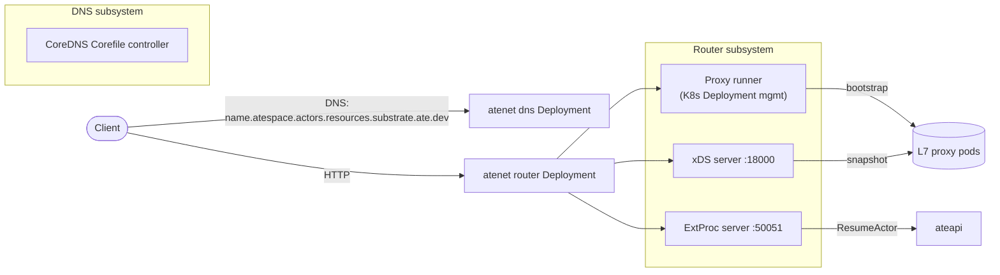

`atenet` is one binary that exposes two Cobra subcommands: `atenet router`
and `atenet dns`. Each subcommand is run as its **own Deployment** in
practice. The router does the per-request actor lookup via an L7 proxy + ExtProc;
the DNS controller programs CoreDNS so
`<actor_name>.<atespace>.actors.resources.substrate.ate.dev` resolves to the
router.

## What it does

<code class="fileref">cmd/atenet/internal/router/router.go</code> ·
<code class="fileref">cmd/atenet/internal/dns/dns.go</code>

## The Router subsystem

Three pieces sharing one process:

### xDS server (:18000)

Serves the L7 proxy's dynamic configuration. The snapshot it publishes
contains:

- `ingress_http_listener` on `:8080` and `ingress_https_listener` on `:8443`
  (the HTTPS listener is added only when a TLS port is configured).
- A route table (`substrate_routes`) whose single catch-all route forwards to
  the `dynamic_forward_proxy_cluster`; the HTTP connection manager runs
  **every request through the `ext_proc` filter** first.
- A static `ate-cluster` pointing at ExtProc (default `127.0.0.1:50051`, HTTP/2).
- A `dynamic_forward_proxy_cluster` that follows whatever `:authority` the
  proxy has after ExtProc rewrites it.

When an OTLP collector address is configured, the snapshot also carries an
`otel_collector_cluster` and the connection manager gets an OpenTelemetry
tracing provider so Envoy emits ingress spans.

The router's controller loop runs every 5 seconds and re-snapshots after
polling `atStore.readyTemplates(...)` (a periodic poll, not an informer-driven
watch).

<code class="fileref">cmd/atenet/internal/router/xds.go</code> ·
<code class="fileref">cmd/atenet/internal/router/controller.go</code>

### ExtProc server (:50051)

This is the brain of the routing. The L7 proxy hands every request's
headers off to ExtProc; ExtProc:

1. Parses the `:authority` / `Host` header into an **`(atespace, actor_name)`**
   pair (`ParseActorDNSName` on
   `<actor_name>.<atespace>.actors.resources.substrate.ate.dev`, port
   stripped). An unparseable host is answered with a 404.
2. Calls `ateapi.ResumeActor` with an `ObjectRef{atespace, name}` (dedup'd via
   singleflight).
3. Receives the `Actor` back and reads `ateom_pod_ip`.
4. Returns a `HeaderMutation` telling the proxy to overwrite `:authority`
   with `<pod_ip>:80`. (The `:80` is currently hardcoded - see the
   `TODO(bowei)` in `extproc.go` about supporting other actor ports.)

After that, the proxy's dynamic forward proxy carries the request to the
worker. The server is instrumented with OTel: it extracts any inbound
`traceparent` from the request headers and starts a span so its work links to
the Envoy ingress span.

<code class="fileref">cmd/atenet/internal/router/extproc.go</code> ·
<code class="fileref">cmd/atenet/internal/router/extproc_in.go</code> ·
<code class="fileref">cmd/atenet/internal/router/extproc_out.go</code>

### Proxy runner

atenet **manages a K8s Deployment of L7 proxy pods** as part of its own
reconciliation - it's not a sidecar pattern, the proxy pods are a separate
fleet that this process keeps healthy. Bootstrap config points the proxies
at the xDS server above. (Reconciliation of the proxy Deployment is skipped
in standalone / file-backed modes.)

<code class="fileref">cmd/atenet/internal/router/envoyrunner.go</code>

## The DNS subsystem

Independent from the router - it's a separate Cobra subcommand
(`atenet dns`) typically run as its own Deployment. The DNS controller
reconciles on an interval and:

1. Looks up the `atenet-router` and `dns` Service ClusterIPs in the
   `ate-system` namespace.
2. Generates a CoreDNS Corefile whose `template` plugin answers any
   `<actor_name>.<atespace>.actors.resources.substrate.ate.dev` name (both
   labels are DNS-1123, matched with `ResourceNameRegexPattern`) with the
   **`atenet-router` ClusterIP**.
3. Writes the Corefile to the shared volume and signals CoreDNS to reload
   (`SIGUSR1`), and points GKE's `kube-dns` ConfigMap `stubDomains` at the
   `dns` service for the actor suffix.

The trick: DNS answers point at the **router**, not at any worker. Worker
IPs change too often for DNS to be a good source of truth.

<code class="fileref">cmd/atenet/internal/dns/dns.go</code> ·
<code class="fileref">cmd/atenet/internal/dns/corefile.go</code>

## The singleflight optimization

If 50 simultaneous requests hit a cold actor, ExtProc would naïvely fire
50 `ResumeActor` calls at ateapi. A `singleflight.Group` keyed by
`<atespace>/<actor_name>` collapses them: only the first goes through, the
rest piggyback on its result. The in-flight resume also runs under a detached
background timeout so a caller disconnecting doesn't abort the resume for the
others, and `Aborted` responses (a concurrent resume) are retried with backoff.

<code class="fileref">cmd/atenet/internal/router/resumer.go</code>

## Logging hygiene

The router's status dashboard records recent requests, but it **redacts the
query string** off recorded paths (it may carry credentials) before storing
them. Secrets are never logged verbatim.

<code class="fileref">cmd/atenet/internal/router/status.go</code>

## Why ship router + DNS in one binary?

They share Go packages (CRD types, K8s clients, logging) and are versioned
together, but each is its own Cobra subcommand with its own Deployment.
Splitting them into separate binaries would be a packaging change, not an
architectural one.

## Related

- [Request path flow](/flows/request-path/) - the warm-path mechanics.
- [Resume actor flow](/flows/resume-actor/) - the cold-path mechanics
  through atenet.
- [ateapi](/components/ateapi/) - atenet's only gRPC dependency.
- [Atespace](/concepts/atespace/) - why the DNS name carries an atespace.
