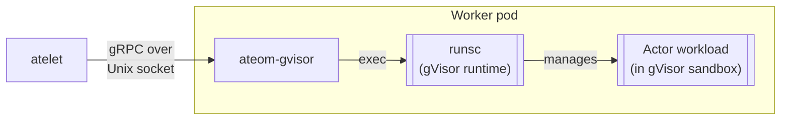

`ateom-gvisor` is one of **two sandbox runtimes** in Substrate (its peer is
[ateom-microvm](/components/ateom-microvm/)). It lives **inside each gVisor
worker pod** and turns gRPC calls from atelet into `runsc` exec calls, plus it
sets up the actor's network. The actual gVisor sandbox is just below it.

Both runtimes implement the same `Run · Checkpoint · Restore` gRPC contract on
a Unix socket, so atelet drives them identically; only the mechanics inside
differ. A WorkerPool is single-class, and snapshots are **not** portable
across classes.

## What it does



<code class="fileref">cmd/ateom-gvisor/main.go</code> ·
<code class="fileref">cmd/ateom-gvisor/runsc.go</code>

## The three operations

Each RPC is a thin wrapper over `runsc` shell-outs (the runsc binary itself is
fetched by atelet as a content-addressed sandbox asset and passed in per
request; the pinned release is `20260622`). Every application container's
stdout/stderr is forwarded to the pod logs tagged with its container name
(`ate.dev/container_name`).

### RunWorkload - boot from scratch

Sets up the actor network, then creates + starts the `pause` container (the
sandbox root) and each application container:

```bash
runsc -root <state-dir> create -bundle <bundle-dir> -pid-file <pid-file> <container>
runsc -root <state-dir> start <container>
```

Before returning, it **blocks until every readyz-enabled container reports
200** (`internal/readyz`), probing the actor's veth IP. Used when there's no
snapshot to restore from - the cold path.

<code class="fileref">cmd/ateom-gvisor/main.go</code> ·
<code class="fileref">cmd/ateom-gvisor/runsc.go</code>

### CheckpointWorkload - freeze to disk

For a `Full` snapshot it checkpoints the `pause` container (sandbox root); for
a `Data` snapshot it `fscheckpoint`s only the durable-dir volumes:

```bash
runsc -root <state-dir> checkpoint -image-path <checkpoint-state-dir> <container>
```

It then reports **exactly the files runsc wrote** (rather than a hardcoded
list) so atelet ships precisely that set - historically `checkpoint.img` plus
the `pages*` images. After checkpointing it tears down the actor network.

<code class="fileref">cmd/ateom-gvisor/main.go</code> ·
<code class="fileref">cmd/ateom-gvisor/runsc.go</code>

### RestoreWorkload - thaw from disk

Sets up the actor network, then creates and restores the `pause` container and
each application container:

```bash
runsc -root <state-dir> restore \
      -bundle <bundle-dir> -image-path <restore-state-dir> \
      -pid-file <pid-file> -background -direct -detach <container>
```

The flags do real work:

| Flag | Effect |
|---|---|
| `-background` | Lazy demand-paging from the image files - `runsc` returns as soon as the sentry is up |
| `-direct` | Skip certain filesystem checks on the snapshot data |
| `-detach` | Don't block on the workload - return immediately |

As with Run, restore then **waits on container readyz** before returning. A
`Data` snapshot instead `create`s each container with `--fs-restore-image-path`
and cold-boots the process (only the durable-dir contents are restored).

<code class="fileref">cmd/ateom-gvisor/main.go</code> ·
<code class="fileref">cmd/ateom-gvisor/runsc.go</code>

## Actor networking: veth pair + nftables

ateom-gvisor no longer moves the worker pod's `eth0` into the sandbox netns.
Instead, on each activation it builds a fresh **point-to-point veth pair** into
a named interior netns and installs **nftables** rules in the pod netns. The
pair is torn down on checkpoint and rebuilt on restore.

The concrete wiring (all constants from `cmd/ateom-gvisor/main.go`):

| Thing | Value |
|---|---|
| Host-side veth (stays in pod netns) | `ateom0`, `169.254.17.1/30` |
| Actor-side veth (moved into interior netns, renamed) | `eth0`, `169.254.17.2/30` |
| Actor default gateway | `169.254.17.1` |
| nftables table (IPv4) | `ateom_actor` |

The pod keeps its real `eth0`; the actor's default route points at the
worker-side veth address. The `ateom_actor` table then:

- **postrouting**: masquerades actor egress (`169.254.17.2`) behind the worker
  pod IP.
- **prerouting**: DNATs inbound traffic to the pod IP on **TCP/80** to the
  actor veth IP on TCP/80 (this is why the router rewrites `:authority` to
  `<pod_ip>:80`).
- **forward**: accepts forwarded packets between the actor veth and pod `eth0`
  (IPv4 forwarding is enabled in the pod netns).

Keeping every rule in one ateom-owned table makes teardown a single
delete-table, and avoids touching CNI-managed chains. The path is IPv4-only
today.

<code class="fileref">cmd/ateom-gvisor/main.go</code>

## Why a separate process per pod?

The sandbox has to be **inside** the pod's namespaces. atelet runs on the
host, so it can't directly invoke `runsc` against the pod's mount/PID
namespaces. ateom-gvisor sits inside each pod and brokers between the two.

## The socket convention

Each pod's ateom listens at:

```
/var/lib/ateom-gvisor/ateoms/<pod-uid>/ateom.sock
```

The directory is host-bind-mounted into the pod, so atelet (on the host)
sees the same socket the pod's ateom is binding. The pod UID in the path
is the addressing scheme.

<code class="fileref">internal/ateompath/ateompath.go</code>

## Footprint

ateom-gvisor itself is small: a gRPC server, a runsc exec helper, and the
veth/nftables plumbing. The gVisor runtime (`runsc`) is fetched separately by
atelet and passed in - that's the big binary.

## Related

- [ateom-microvm](/components/ateom-microvm/) - the micro-VM sibling runtime.
- [atelet](/components/atelet/) - ateom-gvisor's only client.
- [Suspend actor flow](/flows/suspend-actor/) · [Resume actor flow](/flows/resume-actor/) -
  where the runsc calls happen.
- [Snapshot](/concepts/snapshot/) - what these files mean.
