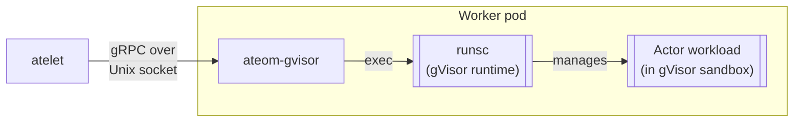

`ateom-gvisor` is the smallest component in Substrate. It lives **inside each
worker pod** and does exactly one thing: turn gRPC calls from atelet into
`runsc` exec calls. The actual gVisor sandbox is just below it.

## What it does



<code class="fileref">cmd/ateom-gvisor/main.go</code> ·
<code class="fileref">cmd/ateom-gvisor/runsc.go</code>

## The three operations

All three are thin wrappers over `runsc` shell-outs.

### RunWorkload — boot from scratch

```bash
runsc -root <state-dir> create \
      -bundle <bundle-dir> \
      -pid-file <pid-file> \
      <containerName>
runsc -root <state-dir> start <containerName>
```

Used when there's no snapshot to restore from — the cold cold path.

<code class="fileref">cmd/ateom-gvisor/runsc.go:37-72</code>

### CheckpointWorkload — freeze to disk

```bash
runsc -root <state-dir> checkpoint \
      -image-path <local-checkpoint-state-dir> \
      <containerName>
```

Produces three files on the worker pod's local volume:

- `checkpoint.img` — sentry state, registers, FD table
- `pages.img` — RAM page contents
- `pages_meta.img` — page metadata

atelet picks these up and uploads them to GCS/S3.

<code class="fileref">cmd/ateom-gvisor/runsc.go:102-130</code>

### RestoreWorkload — thaw from disk

```bash
runsc -root <state-dir> restore \
      -bundle <bundle-dir> \
      -pid-file <pid-file> \
      -background -direct -detach \
      -image-path <local-restore-state-dir> \
      <containerName>
```

The flags are doing real work:

| Flag | Effect |
|---|---|
| `-background` | Enable lazy demand-paging from the image files — `runsc` returns as soon as the sentry is up |
| `-direct` | Skip certain security restrictions on snapshot data (needed because snapshot files don't go through the usual filesystem checks) |
| `-detach` | Don't block on the workload — return immediately |

The combination is what makes resume fast: control returns to atelet in
milliseconds, and pages stream in lazily as the workload touches them.

<code class="fileref">cmd/ateom-gvisor/runsc.go:134-158</code>

## Why a separate process per pod?

The sandbox has to be **inside** the pod's namespaces. atelet runs on the
host, so it can't directly invoke `runsc` against the pod's mount/PID
namespaces. ateom-gvisor sits inside each pod and brokers between the two.

## The socket convention

Each pod's ateom listens at:

```
/var/lib/ateom-gvisor/ateoms/<pod-uid>/ateom.sock
```

The directory is host-bind-mounted into the pod, so atelet (on the host)
sees the same socket the pod's ateom is binding. The pod UID in the path
is the addressing scheme — atelet uses it to know which pod's ateom it's
talking to.

## Footprint

ateom-gvisor itself is small: a gRPC server, an exec helper, and a few
filesystem path helpers. The gVisor runtime (`runsc`) is downloaded
separately by atelet and bind-mounted in — that's the big binary.

<code class="fileref">internal/ateompath/ateompath.go</code> — path helpers used
by both atelet and ateom-gvisor.

## Related

- [atelet](/components/atelet/) — ateom-gvisor's only client.
- [Suspend actor flow](/flows/suspend-actor/) · [Resume actor flow](/flows/resume-actor/) —
  where the runsc calls happen.
- [Snapshot](/concepts/snapshot/) — what these files mean.
