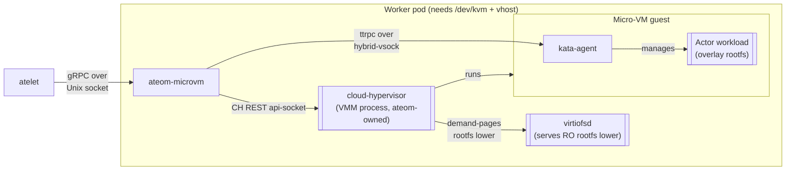

`ateom-microvm` is one of **two sandbox runtimes** in Substrate (its peer is
[ateom-gvisor](/components/ateom-gvisor/)). Instead of a gVisor sandbox, it
runs each actor as a **cloud-hypervisor (CH) micro-VM** launched via the kata
guest model, and drives full suspend/resume through CH's native
snapshot/restore.

It implements the **same `Run · Checkpoint · Restore` gRPC contract** on the
same Unix socket as ateom-gvisor, so atelet drives it identically - only the
mechanics inside the pod differ. A WorkerPool is single-class
(`sandboxClass: microvm`), and snapshots are **not** portable across classes.
Micro-VM worker nodes must expose **`/dev/kvm` and vhost devices**.

## What it does



<code class="fileref">cmd/ateom-microvm/main.go</code>

## The building blocks

ateom-microvm boots cloud-hypervisor **directly** (no kata shim) and does the
post-boot work the shim would normally do:

- **cloud-hypervisor** - the VMM. ateom launches the process, drives it over
  its REST **api-socket** (create VM, add net device, boot, pause, snapshot,
  restore, resume), and owns it for teardown. The binary is fetched by atelet
  as a sandbox asset (`cloud-hypervisor`).
- **kata-agent** - runs inside the guest; ateom talks to it over
  **ttrpc on a hybrid-vsock** socket to create the sandbox, configure guest
  networking, and start/stop containers.
- **Guest kernel + OS image** - fetched as the `kata-kernel` and `kata-image`
  assets; the image is attached read-only as `/dev/vda` (ext4 rootfs).
- **virtiofsd** - serves each container's OCI image as the read-only lower of
  an overlay rootfs over virtio-fs; the writable upper is a **guest tmpfs**
  (so it lives in guest RAM and is captured by the memory snapshot). ateom
  owns this process too.

Guest sizing (memory, vCPUs) and kernel params come from a base kata
`configuration.toml` (`kata-config` asset). Actor container output is
forwarded to the pod logs tagged with the container name
(`ate.dev/container_name`), matching ateom-gvisor.

<code class="fileref">cmd/ateom-microvm/run.go</code>

## The three operations

### RunWorkload - cold boot

Sets up the actor network, prepares each container's overlay rootfs, launches
CH + virtiofsd, creates and boots the VM, dials the kata-agent, then (as the
shim would) creates the agent sandbox, configures guest networking, and starts
each container. Before returning it **blocks until every readyz-enabled
container reports 200** (`internal/readyz`).

### CheckpointWorkload - snapshot the VM

Drives the CH api-socket: **pause → snapshot → tear the VMM down**. The
snapshot dir holds CH's `config.json` + `state.json` + (sparse) `memory-ranges`
plus a small `base-id` file. Because the writable rootfs upper is a guest
tmpfs, **process memory and rootfs writes both persist** in the memory
snapshot; the read-only lower is reconstructed from the OCI image at restore,
so no rootfs disk ships. ateom reports exactly the files it wrote so atelet
ships precisely that set.

### RestoreWorkload - relaunch and resume

Reconstructs each overlay RO lower from the local OCI bundle, rebuilds the
per-activation veth + tap (the snapshot's virtio-net is fd-backed, so CH needs
fresh tap FDs), rewrites the snapshot config's per-VM socket/console paths to
this actor's, then **relaunches CH with `--restore` (OnDemand / userfaultfd)
and resumes**. Guest RAM - including in-memory state, the tmpfs rootfs upper,
and the frozen network config - comes back from the memory snapshot. It then
waits on container readyz before returning.

Because CH's OnDemand snapshot only writes the pages faulted in since restore,
a later Checkpoint of a restored actor **overlays that delta onto the source
snapshot** to rebuild a complete, self-contained image.

<code class="fileref">cmd/ateom-microvm/run.go</code> ·
<code class="fileref">cmd/ateom-microvm/checkpoint.go</code> ·
<code class="fileref">cmd/ateom-microvm/restore.go</code>

## Actor networking

Networking mirrors ateom-gvisor's model: a fresh point-to-point **veth pair**
per activation, with the worker side (`ateom0`, `169.254.17.1/30`) staying in
the pod netns next to the pod's real `eth0`, and the peer moved into the
interior netns as `eth0` with the stable actor address `169.254.17.2/30`. The
same `ateom_actor` nftables table masquerades actor egress behind the pod IP
and DNATs inbound pod-IP:80 to the actor.

kata consumes that interior netns like a CNI-provisioned container netns: it
builds a tap cross-connected to the veth peer and hands the guest `eth0`'s
address. Two MACs are **deliberately fixed** (the gateway `ateom0` and the
guest `eth0`) so a restored guest's frozen ARP cache and interface config stay
valid on any pod. The guest also gets the worker pod's `/etc/resolv.conf`
copied into its rootfs so egress name resolution works.

<code class="fileref">cmd/ateom-microvm/net.go</code>

## The socket convention

Like ateom-gvisor, each pod's ateom listens at:

```
/var/lib/ateom-gvisor/ateoms/<pod-uid>/ateom.sock
```

host-bind-mounted into the pod, addressed by pod UID. (The base path constant
is shared across both runtimes.)

<code class="fileref">internal/ateompath/ateompath.go</code>

## Why a micro-VM instead of gVisor?

gVisor gives a userspace kernel with fast checkpoint/restore and a small
footprint. A micro-VM gives a **stronger, hardware-virtualized isolation
boundary** (a real guest kernel behind KVM) for workloads that need it, while
still supporting suspend/resume - here via cloud-hypervisor's snapshot/restore
rather than `runsc checkpoint`. The trade-off is the `/dev/kvm` + vhost
requirement and a heavier per-actor footprint.

## Related

- [ateom-gvisor](/components/ateom-gvisor/) - the gVisor sibling runtime.
- [atelet](/components/atelet/) - drives ateom-microvm over the Unix socket.
- [Suspend actor flow](/flows/suspend-actor/) · [Resume actor flow](/flows/resume-actor/) -
  where the snapshot/restore calls happen.
- [Workers](/components/workers/) - micro-VM worker pods.
