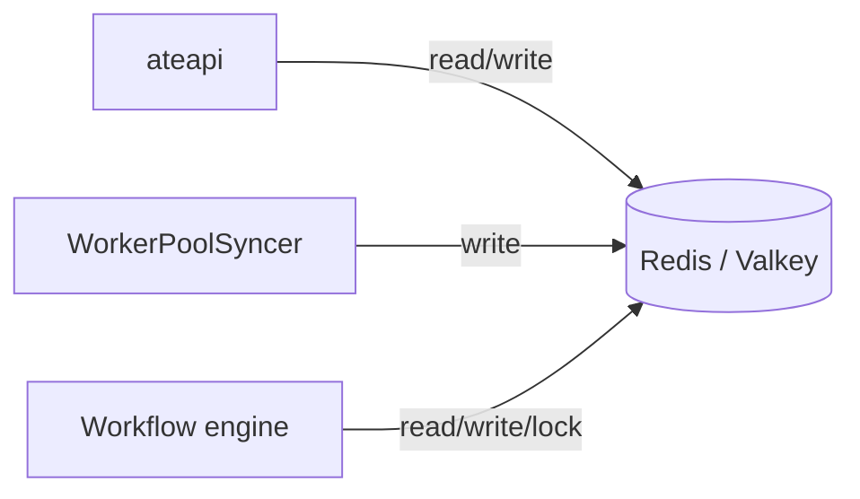
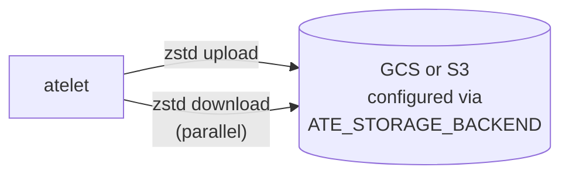

Substrate has **two** persistent stores. They serve completely different
needs and have completely different access patterns.

## Redis / Valkey - hot path

The source of truth for actor and worker state. Every routing decision
reads from here.



### Keyspace

| Key pattern | Value | Notes |
|---|---|---|
| `actor:<actor-id>` | Actor proto (JSON) | One per actor |
| `worker:<ns>:<pool>:<pod>` | Worker proto (JSON) | One per Ready worker pod |
| `lock:actor:<actor-id>` | Workflow-instance ID | 30s TTL, used by ateapi workflows |

<code class="fileref">cmd/ateapi/internal/store/ateredis/ateredis.go:40-80</code>

### Why Redis (and not the K8s API)?

The hot path needs sub-millisecond reads and atomic compare-and-set for
locks. Etcd-backed K8s API isn't built for that. Substrate uses K8s for
declarative state (CRDs) and Redis for high-frequency operational state.

### Locks

`lock:actor:<id>` is set with a 30-second TTL whenever a workflow starts on
an actor. The workflow itself times out at 28 seconds (TTL minus 2s of
padding). Two concurrent operations on the same actor cannot both succeed -
the second returns `Aborted`.

<code class="fileref">cmd/ateapi/internal/controlapi/workflow.go:189-212</code>

## GCS / S3 - cold path

The store for **snapshot images** - the RAM + sentry-state blobs that let
suspended actors come back to life.



### Object layout

The snapshot prefix is built from the per-template config, not a hardcoded
bucket path:

```
<ActorTemplate.spec.snapshotsConfig.location>/<actorId>/<RFC3339-timestamp>-<random>/
  checkpoint.img.zstd
  pages.img.zstd        (optional)
  pages_meta.img.zstd   (optional)
```

`spec.snapshotsConfig.location` is whatever the template provides
(e.g. `gs://my-bucket/some/prefix`). ateapi appends `/<actorId>/<ts>-<rand>`
to form the per-snapshot directory.

| File | Purpose |
|---|---|
| `checkpoint.img.zstd` | Sentry state, registers, FD table. Read up front during restore. Always present. |
| `pages.img.zstd` | RAM page contents. **Lazy-paged** via `runsc restore -background`. Uploaded only if produced by checkpoint. |
| `pages_meta.img.zstd` | Index that tells `runsc` where in `pages.img` to fetch a given page. Uploaded only if produced by checkpoint. |

Checkpoint uploads are **sequential** in atelet
(<code class="fileref">cmd/atelet/main.go:385-405</code>); the parallel
`errgroup` is on the restore *download* path
(<code class="fileref">cmd/atelet/main.go:432-448</code>).
<code class="fileref">cmd/atelet/internal/ategcs</code> · <code class="fileref">internal/ateompath/ateompath.go</code>

### Why two compression+decompression hops?

Network bandwidth between worker nodes and object storage is the bottleneck
on cold resume. zstd buys roughly 3-5× on these RAM-image files. The
CPU cost is paid once on suspend, hidden behind storage I/O on restore.

### Why GCS *or* S3?

`ATE_STORAGE_BACKEND` selects the backend at atelet startup. Both
implement the same internal interface (`cmd/atelet/internal/ategcs`). The choice is
environmental - GCS in GCP, S3 in AWS - not a runtime decision per
snapshot.

## Who reads each store

| Component | Redis | GCS / S3 |
|---|---|---|
| ateapi | read + write | never |
| atecontroller | never (via ateapi) | never |
| atelet | never | read + write |
| atenet | never (via ateapi) | never |
| ateom-gvisor | never | never (uses local files atelet stages) |

This is a deliberate isolation: **only ateapi touches Redis, only atelet
touches object storage.** Everything else goes through them.

## Related

- [ateapi internals](/components/ateapi/) - Redis is its private database.
- [atelet](/components/atelet/) - the GCS/S3 client.
- [Snapshot](/concepts/snapshot/) - what the three image files actually are.
