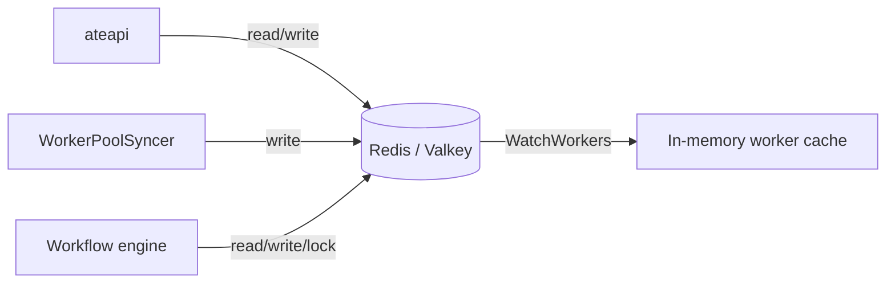
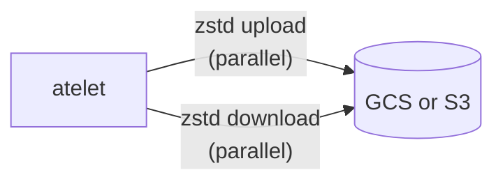

Substrate has **two** persistent stores. They serve completely different
needs and have completely different access patterns.

## Redis / Valkey - hot path

The source of truth for actor and worker state. Every routing decision
reads from here. The deployed backend is **ValKey 9.1**
(<code class="fileref">manifests/ate-install/valkey.yaml</code>), run as a TLS
cluster; the cluster reloads its own TLS certificate on an interval
(`tls-auto-reload-interval`, 12h in the shipped config) so pod-certificate
rotations take effect without a restart.



### Keyspace

| Key pattern | Value | Notes |
|---|---|---|
| `actor:<atespace>:<name>` | Actor proto (JSON) | Keyed by `(atespace, name)` |
| `atespace:<name>` | Atespace proto (JSON) | Global-scoped |
| `worker:<ns>:<pool>:<pod>` | Worker proto (JSON) | One per Ready worker pod |
| `lock:actor:<atespace>:<name>` | Workflow-instance ID | 30s TTL, used by ateapi workflows |

<code class="fileref">cmd/ateapi/internal/store/ateredis/ateredis.go</code>

To speed up scheduling, ateapi also fronts the worker keys with an in-memory
worker cache that streams changes over Redis pub/sub (`WatchWorkers`) and
relists periodically. See [ateapi](/components/ateapi/).

### Why Redis (and not the K8s API)?

The hot path needs sub-millisecond reads and atomic compare-and-set for
locks. Etcd-backed K8s API isn't built for that. Substrate uses K8s for
declarative state (CRDs) and Redis for high-frequency operational state.

### Locks

`lock:actor:<atespace>:<name>` is set with a 30-second TTL whenever a workflow
starts on an actor. The workflow itself runs under a context that times out at
28 seconds (TTL minus 2s of padding). Two concurrent operations on the same
actor cannot both succeed - the second returns `Aborted`.

<code class="fileref">cmd/ateapi/internal/controlapi/workflow.go</code>

## Snapshots: external vs. local

A snapshot is the memory + sandbox state that lets a stopped actor come back to
life. There are now **two storage locations**, modeled as a oneof on
`SnapshotInfo` (`Actor.latest_snapshot_info`,
<code class="fileref">pkg/proto/ateapipb/ateapi.proto</code>):

| `SnapshotInfo` variant | Where it lives | Backs which state |
|---|---|---|
| `ExternalSnapshotInfo { snapshot_uri_prefix }` | Object storage (GCS or S3) | `SUSPENDED` - actor released from its worker |
| `LocalSnapshotInfo { snapshot_prefix, node_vms_with_local_snapshots[] }` | On the worker node's disk | `PAUSED` - snapshot kept on the node VM for a fast resume |

`SuspendActor` uploads to **external** storage; `PauseActor` keeps the
snapshot **local** on the node and records which node VMs hold it. What each
transition captures is governed by the template's
`snapshotsConfig` (`onPause`, `onCommit`, each a `SnapshotScope` of `Full` or
`Data`). See [Snapshot](/concepts/snapshot/).

## GCS / S3 - external snapshots



### Object layout

The external snapshot prefix is built by ateapi from the per-template config,
not a hardcoded bucket path
(<code class="fileref">cmd/ateapi/internal/controlapi/workflow_suspend.go</code>):

```
<ActorTemplate.spec.snapshotsConfig.location>/<actorName>/<RFC3339-timestamp>-<random>/
  <snapshot-file>.zstd     (one per file runsc actually wrote)
  manifest.json            (sandbox binaries + the snapshot file list)
```

`spec.snapshotsConfig.location` is whatever the template provides (e.g.
`gs://my-bucket/some/prefix`); ateapi appends `/<actorName>/<ts>-<rand>` to form
the per-snapshot directory.

atelet no longer ships a hardcoded set of image files. The sandbox runtime
(e.g. ateom-gvisor via `runsc`) reports exactly the files it produced, and
atelet uploads precisely that set, each zstd-compressed, plus a
`manifest.json` so a later Restore on any node is self-describing
(<code class="fileref">cmd/atelet/main.go</code>,
<code class="fileref">cmd/atelet/sandbox_assets.go</code>). For a gVisor
checkpoint this set is typically `checkpoint.img` (always) plus lazy-paged RAM
images such as `pages.img` / `pages_meta.img` when produced; the micro-VM
runtime uses a sparse-zstd on-disk format
(<code class="fileref">cmd/atelet/internal/ategcs/sparsezstd.go</code>).

Both the checkpoint **upload** and the restore **download** run in parallel via
an `errgroup` (<code class="fileref">cmd/atelet/main.go</code>).
<code class="fileref">cmd/atelet/internal/ategcs/</code>

### Why compress?

Network bandwidth between worker nodes and object storage is the bottleneck
on cold resume. zstd buys a large reduction on these RAM-image files. The
CPU cost is paid once on suspend, hidden behind storage I/O on restore.

### Why GCS *or* S3?

Both back-ends implement the same internal object interface
(<code class="fileref">cmd/atelet/internal/ategcs/</code>, with `gcs.go` and
`s3.go`). The choice is environmental - GCS in GCP, S3 in AWS - selected at
atelet startup, not per snapshot.

## Node-local snapshots

For a `PAUSED` actor, atelet keeps the snapshot on the worker node's disk
instead of uploading it, under a per-actor directory
(`ateompath.LocalCheckpointsDir(atespace, actorName)`,
`/var/lib/ateom-gvisor/...`, plus the `snapshot_prefix`), again beside a
`manifest.json` (<code class="fileref">internal/ateompath/ateompath.go</code>,
<code class="fileref">cmd/atelet/main.go</code>). Because the bytes never
leave the node, resuming a paused actor on the same node avoids the object-store
round trip entirely; `LocalSnapshotInfo.node_vms_with_local_snapshots` records
which nodes hold a copy.

## Who reads each store

| Component | Redis | GCS / S3 | Node-local snapshot |
|---|---|---|---|
| ateapi | read + write | never | never |
| atecontroller | never (via ateapi) | never | never |
| atelet | never | read + write | read + write |
| atenet | never (via ateapi) | never | never |
| ateom | never | never | reads files atelet stages |

This is a deliberate isolation: **only ateapi touches Redis, only atelet
touches object storage and node-local snapshot files.** Everything else goes
through them.

## Related

- [ateapi internals](/components/ateapi/) - Redis is its private database.
- [atelet](/components/atelet/) - the GCS/S3 and node-local snapshot client.
- [Snapshot](/concepts/snapshot/) - what the snapshot files actually are.
