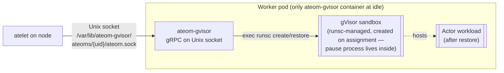

A **worker** in Substrate is a Kubernetes Pod that's *ready to host an actor*.
It's pre-warmed: `ateom-gvisor` is already running and runsc is staged on
the node — so when ateapi assigns the worker, ateom-gvisor can create the
gVisor sandbox (with its own pause process) and `runsc restore` an actor
into it without waiting on image pulls or sandbox boot.

## Anatomy of a worker pod



## What a worker is, in three sentences

1. A Pod owned by a `WorkerPool` Deployment.
2. Running a single `ateom-gvisor` container (the pod manifest only declares
   `ateom-gvisor`; a pause process is created later, **inside** the gVisor
   sandbox, when an actor is assigned).
3. A row in Redis (`worker:<ns>:<pool>:<pod>`) once it has an IP, indicating
   whether it's currently hosting an actor.

## Worker states

Workers have a two-state lifecycle on the actor side: Idle or Assigned. See
[Worker lifecycle](/flows/worker-lifecycle/) for the full state machine.

| State | Identifier |
|---|---|
| Idle | `actor_id == ""` in the Redis worker record |
| Assigned | `actor_id == <some actor ID>` |

A given worker hosts **at most one actor at a time**. There's no
multi-tenancy inside the gVisor sandbox.

## How a worker is created

You don't create workers directly. You create a `WorkerPool`:

```yaml
apiVersion: ate.dev/v1alpha1
kind: WorkerPool
metadata: { name: default }
spec:
  replicas: 10
  ateomImage: ghcr.io/.../ateom-gvisor:vX
```

`atecontroller` turns this into a Deployment named `<workerpool-name>-deployment`
with `replicas` pods. As each pod goes Ready, ateapi's `WorkerPoolSyncer`
inserts an idle worker record into Redis.

<code class="fileref">internal/controllers/workerpool_controller.go:52-176</code> ·
<code class="fileref">cmd/ateapi/internal/controlapi/syncer.go:28-192</code>

## How a worker is assigned

When `ResumeActor` runs, ateapi's `AssignWorkerStep`:

1. Lists idle workers belonging to the target WorkerPool.
2. Picks one at random.
3. Updates the worker record with the actor's ID, namespace, template.
4. Updates the actor with the worker's pod UID + IP.

Random selection (not first-fit) spreads load evenly and avoids hot pods.

<code class="fileref">cmd/ateapi/internal/controlapi/workflow_resume.go:78-158</code>

## How a worker is released

After `SuspendActor` finishes the checkpoint and upload, ateapi's
`FinalizeSuspendedStep` zeros the worker's `actor_id` / `actor_namespace` /
`actor_template` fields. The worker is immediately eligible for the next
actor.

<code class="fileref">cmd/ateapi/internal/controlapi/workflow_suspend.go:174-239</code>

## What happens when a worker pod dies

The WorkerPoolSyncer's pod-delete handler runs `releaseActorOnDeadWorker`:

1. If the worker had an `actor_id`, that actor is **forced back to
   SUSPENDED** (with whatever `LastSnapshot` it already had).
2. The worker record is deleted from Redis.

This is a recovery path with a known race against concurrent `SuspendActor`
calls.

<code class="fileref">cmd/ateapi/internal/controlapi/syncer.go:54-78,161-192</code>

## Why gVisor (and not, say, Kata Containers)?

`runsc` (gVisor's runtime) is one of the very few sandboxes that supports
**checkpoint and restore** — the entire point of Substrate. CRIU-based
restore for normal containers exists but is fragile; `runsc checkpoint` and
`runsc restore -background` are first-class operations.

## What's pre-warmed vs. lazy

| Pre-warmed (idle pod has it) | Lazy (only on resume) |
|---|---|
| ateom-gvisor running | Container image for the actor's workload |
| runsc binary cached | OCI bundle built |
| Pod scheduled, IP, network ready | gVisor sandbox created + RAM pages restored (lazy via `-background`) |

The first three are what makes resume sub-second despite the sandbox
boundary.

## Related

- [Worker lifecycle](/flows/worker-lifecycle/) — full state machine.
- [WorkerPool](/concepts/workerpool/) — the CRD that makes workers exist.
- [ateom-gvisor](/components/ateom-gvisor/) — what runs inside.
- [atelet](/components/atelet/) — who drives them externally.
