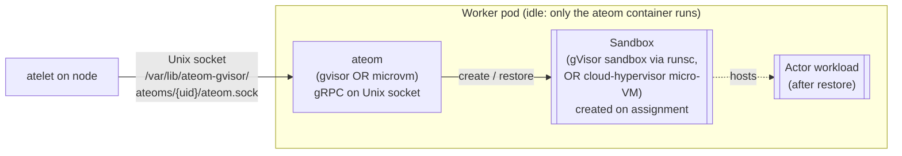

A **worker** in Substrate is a Kubernetes Pod that's *ready to host an actor*.
It's pre-warmed: the in-pod `ateom` helper is already running and the sandbox
binaries are staged on the node - so when ateapi assigns the worker, ateom can
create the sandbox and restore an actor into it without waiting on image pulls
or sandbox boot.

Every worker belongs to exactly one `WorkerPool`, and a pool is
**single-class**: either gVisor (`ateom-gvisor` + runsc) or micro-VM
(`ateom-microvm` + cloud-hypervisor). All pods in a pool run the same runtime,
and snapshots are **not** portable across classes.

## Anatomy of a worker pod



The actor's network is wired up **on assignment** by ateom - a per-activation
veth pair into an interior netns, with nftables masquerade/DNAT in the pod
netns. It's torn down on checkpoint and rebuilt on restore. (Same model in
both runtimes; see [ateom-gvisor](/components/ateom-gvisor/) and
[ateom-microvm](/components/ateom-microvm/).)

## What a worker is, in three sentences

1. A Pod owned by a `WorkerPool` Deployment.
2. Running a single `ateom` container of its pool's class (a pause process and
   the sandbox are created later, **on assignment**, not at pod start).
3. A row in Redis (`worker:<namespace>:<pool>:<pod>`) once it has an IP,
   tracking whether it's currently hosting an actor.

## Worker states

Workers have a two-state lifecycle on the actor side: Idle or Assigned. See
[Worker lifecycle](/flows/worker-lifecycle/) for the full state machine.

| State | Identifier |
|---|---|
| Idle | `assignment == nil` in the Redis worker record |
| Assigned | `assignment` set to an `Assignment{actor_template, actor}` |

A given worker hosts **at most one actor at a time**. There's no multi-tenancy
inside the sandbox.

## The worker record

Each worker's Redis record carries, among other fields:

- `assignment` - an **`Assignment{actor_template: KubeNamespacedObjectRef,
  actor: ObjectRef}`**; `nil` means idle. This replaces the old flat
  `actor_id` / `actor_namespace` / `actor_template` fields, and scopes the
  binding by `(atespace, actor_name)`.
- `sandbox_class` - the pool's class (`gvisor` or `microvm`), cached on the
  worker so scheduling can match it against an actor's template class.
- `node_name`, `labels` - the node the pod landed on and the pool's labels,
  both cached for eligibility and node-local snapshot placement.
- `ip`, `worker_pod_uid` - the pod IP and UID (the UID is the ateom socket
  address).

## How a worker is created

You don't create workers directly. You create a `WorkerPool`:

```yaml
apiVersion: ate.dev/v1alpha1
kind: WorkerPool
metadata: { name: default }
spec:
  replicas: 10
  sandboxClass: gvisor        # or microvm
  ateomImage: ghcr.io/.../ateom-gvisor:vX
  # sandboxConfigName: ...    # else the cluster-default SandboxConfig for the class
```

`atecontroller` turns this into a Deployment named `<workerpool-name>`
with `replicas` pods. As each pod gets a `PodIP`, ateapi inserts an idle worker
record into Redis (stamping in the pool's `sandbox_class`, `node_name`, and
`labels`). Registration is keyed on the pod having an IP, **not** on the Ready
condition.

## How a worker is assigned

When ResumeActor runs, ateapi's worker-assignment step:

1. Filters workers to those with **no assignment** that are **eligible** for
   the actor - the worker's `sandbox_class` must equal the template's class,
   and the worker must satisfy both the template's `workerSelector` and the
   actor's own `worker_selector`.
2. Honors node restrictions when the actor has node-local snapshots (a Pause
   prefers the node its snapshot lives on).
3. Picks one at random (shuffles the eligible set) to spread load.
4. Sets the worker's `assignment` and stamps the worker's pool + IP back onto
   the actor.

## How a worker is released

After SuspendActor finishes the checkpoint and upload, ateapi clears the
worker's `assignment` (and the actor's `worker_pool_name`). The worker is
immediately eligible for the next actor.

## What happens when a worker pod dies

When a worker pod is deleted, ateapi's recovery path:

1. If the worker had an `assignment`, that actor is **forced back to
   SUSPENDED** (with whatever latest snapshot it already had).
2. The worker record is deleted from Redis.

This is a recovery path with a known race against concurrent SuspendActor
calls.

## Why two runtimes?

`runsc` (gVisor) gives a small-footprint userspace kernel with first-class
`checkpoint`/`restore` - the entire point of Substrate. The micro-VM class
trades that footprint for a hardware-virtualized boundary (a real guest kernel
behind KVM), suspending/resuming via cloud-hypervisor's snapshot/restore
instead. A pool commits to one or the other.

## What's pre-warmed vs. lazy

| Pre-warmed (idle pod has it) | Lazy (only on assignment) |
|---|---|
| ateom running | Container image for the actor's workload |
| Sandbox binaries cached on the node | OCI bundle built, actor network wired |
| Pod scheduled, IP, pod network ready | Sandbox created + actor state restored |

The first three are what makes resume sub-second despite the sandbox boundary.

## Related

- [Worker lifecycle](/flows/worker-lifecycle/) - full state machine.
- [WorkerPool](/concepts/workerpool/) - the CRD that makes workers exist.
- [ateom-gvisor](/components/ateom-gvisor/) · [ateom-microvm](/components/ateom-microvm/) -
  the two runtimes that run inside.
- [atelet](/components/atelet/) - who drives them externally.
