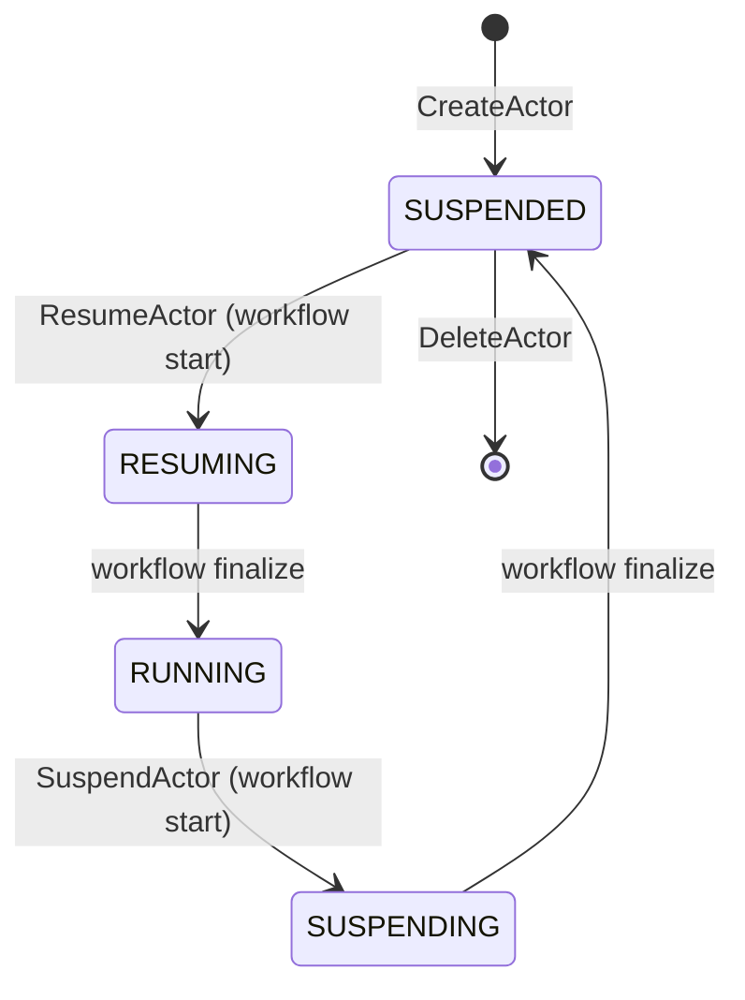

An **actor** is the unit of work in Substrate. Think "an instance of an
agent" - it has its own RAM state, its own filesystem, its own identity -
but it's *not pinned to a pod*. The same actor can suspend on worker A,
resume on worker B, and pick up exactly where it left off.

## What an actor consists of

| Piece | Where it lives |
|---|---|
| Actor record | Redis at `actor:<id>` |
| Spec (image, env, entrypoint) | Inherited from the actor's `ActorTemplate` |
| Snapshot (RAM + sentry state) | GCS/S3 at `<template.snapshotsConfig.location>/<id>/<ts>-<rand>/` |
| Running state | A gVisor sandbox inside a worker pod (only when `status=RUNNING`) |

## Lifecycle

The proto defines five status values:
`STATUS_UNSPECIFIED`, `STATUS_RESUMING`, `STATUS_RUNNING`, `STATUS_SUSPENDING`,
`STATUS_SUSPENDED` (`pkg/proto/ateapipb/ateapi.proto`). `RESUMING` and
`SUSPENDING` are transient - they're set when the workflow begins and
cleared when it finalizes.

See [Actor lifecycle](/flows/actor-lifecycle/) for the full machine.

## Identity

Actors are addressed by `actor_id`. The `:authority` header
`<actor_id>.actors.resources.substrate.ate.dev` is the canonical
externally-facing handle that clients use to talk to an actor over HTTP
(suffix defined in `internal/resources/actor.go`).

## What's the relationship to a Pod?

**Decoupled.** An actor is a logical entity in Redis; a worker pod is a
physical hosting slot. The mapping changes every time the actor
suspends/resumes - the same actor will likely live in a different worker
pod across resumes.

This is the whole point of Substrate: 30 actors per pod, not 1.

## What's the relationship to an ActorTemplate?

Many-to-one. An `ActorTemplate` defines *what kind* of actor (image,
entrypoint, worker pool). Many actor instances can share a template, each
with their own state and snapshot.

## Related

- [ActorTemplate](/concepts/actortemplate/) · [Worker](/concepts/worker/) ·
  [Snapshot](/concepts/snapshot/) · [Session](/concepts/session/)
- [Actor lifecycle](/flows/actor-lifecycle/) - full state machine.
