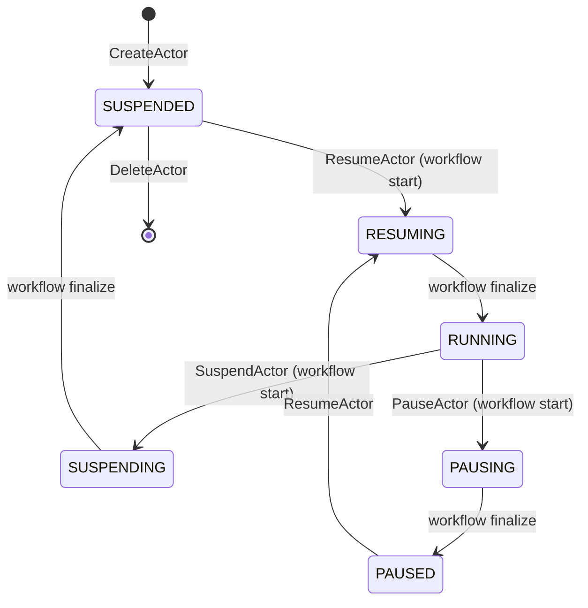

An **actor** is the unit of work in Substrate. Think "an instance of an
agent" - it has its own RAM state, its own filesystem, its own identity -
but it's *not pinned to a pod*. The same actor can suspend on worker A,
resume on worker B, and pick up exactly where it left off.

## What an actor consists of

| Piece | Where it lives |
|---|---|
| Actor record | Redis at `actor:<atespace>:<name>` |
| Spec (image, env, entrypoint) | Inherited from the actor's `ActorTemplate` |
| Snapshot | Object storage (GCS/S3) when suspended, or on the node VM when paused - referenced by the actor's `latest_snapshot_info` |
| Running state | A gVisor **or** micro-VM sandbox inside a worker pod (only when `status=RUNNING`) |

## Lifecycle

An actor's status is one of eight values:
`STATUS_UNSPECIFIED`, `STATUS_RESUMING`, `STATUS_RUNNING`, `STATUS_SUSPENDING`,
`STATUS_SUSPENDED`, `STATUS_PAUSING`, `STATUS_PAUSED`, and `STATUS_CRASHED`.
`RESUMING`, `SUSPENDING`, and `PAUSING` are transient - they're set when the
workflow begins and cleared when it finalizes. `PAUSED` is a lighter-weight
hibernation than `SUSPENDED`: the snapshot is kept on the node VM rather than
uploaded to object storage (see [Snapshot](/concepts/snapshot/)). `CRASHED`
marks an actor whose workflow failed.

See [Actor lifecycle](/flows/actor-lifecycle/) for the full machine.

## Identity

An actor's identity is the tuple **`(atespace, name)`**, carried in a common
`ResourceMetadata` (`metadata.atespace`, `metadata.name`) on the `Actor`
message. There is no longer a single `actor_id` field - the actor's name is
`metadata.name`, and it is only unique *within* its [atespace](/concepts/atespace/).
Both are caller-specified at creation and immutable thereafter.

The canonical externally-facing handle - the `:authority` a client uses to
reach an actor over HTTP - is
`<actor_name>.<atespace>.actors.resources.substrate.ate.dev`.

## What's the relationship to a Pod?

**Decoupled.** An actor is a logical entity in Redis; a worker pod is a
physical hosting slot. The mapping changes every time the actor
suspends/resumes - the same actor will likely live in a different worker
pod across resumes.

This is the whole point of Substrate: many actors per pod over time, not 1.

## What's the relationship to an ActorTemplate?

Many-to-one. An `ActorTemplate` defines *what kind* of actor (container
image(s), env, snapshot config, sandbox class). Many actor instances can
share a template, each with their own state and snapshot.

## Placement

Where an actor runs is **selector-based**, not a fixed pool reference. The
`Actor` message carries a per-actor `worker_selector` (a `Selector` of
`match_labels`); the scheduler evaluates the AND of this selector and the
template's `workerSelector` to find eligible worker pools. It can be updated
at any time via `UpdateActor` and takes effect on the next `ResumeActor`. Once
a worker is assigned, `worker_pool_name` records the pool that owns it (and is
cleared when the worker is freed).

## Related

- [Atespace](/concepts/atespace/) - the isolation boundary an actor's name is
  scoped to.
- [ActorTemplate](/concepts/actortemplate/) · [Worker](/concepts/worker/) ·
  [Snapshot](/concepts/snapshot/) · [Session](/concepts/session/)
- [Actor lifecycle](/flows/actor-lifecycle/) - full state machine.
