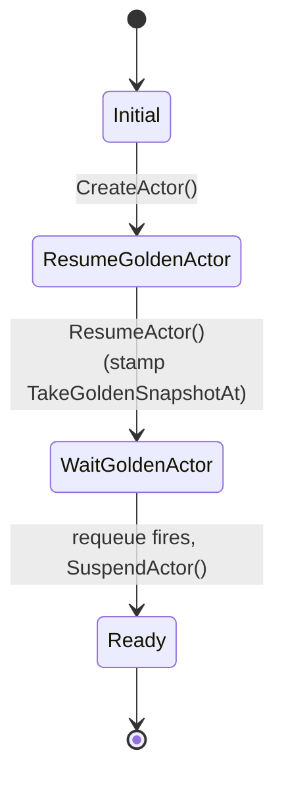

`ActorTemplate` declares the *shape* of an actor: which container image(s),
which entrypoint, which sandbox runtime, which volumes, and where snapshots
go. From a single template you create many actors (instances).

:::note[This spec is immutable]
`ActorTemplate.spec` carries an `XValidation` rule (`self == oldSelf`) that
rejects any edit after creation. Changing an image would invalidate the
golden snapshot, so a new "version" means a **new template**, not an edit.
:::

## The spec

```yaml
apiVersion: ate.dev/v1alpha1
kind: ActorTemplate
metadata:
  name: my-agent
spec:
  pauseImage: gcr.io/gke-release/pause@sha256:...   # required, must be @-pinned
  sandboxClass: gvisor                              # gvisor (default) | microvm
  containers:
    - name: app                                     # required, DNS-1123 label
      image: ghcr.io/.../my-agent@sha256:...        # required, must be @-pinned
      command: [/bin/my-agent]
      env:
        - name: LOG_LEVEL
          value: info                               # literal value
        - name: OPENAI_API_KEY
          valueFrom:
            secretKeyRef: { name: my-secret, key: OPENAI_API_KEY }
      readyz:                                        # optional HTTP readiness probe
        httpGet: { path: /readyz, port: 80 }
      volumeMounts:
        - { name: data, mountPath: /var/data }
  volumes:
    - name: data
      durableDir: {}                                # persists across resume; snapshot-able
  snapshotsConfig:
    location: gs://my-bucket/some/prefix            # required
    onPause: Full                                   # Full (default) | Data
    onCommit: Full                                  # must be a subset of onPause
  workerSelector:                                   # optional placement gate
    matchLabels: { tier: gpu }
status:
  phase: Ready
  goldenSnapshot: gs://my-bucket/some/prefix/<id>/<ts-rand>/
```

`spec.pauseImage` and `spec.snapshotsConfig` are `+required`; each
`containers[].name` and `containers[].image` are required too. Both
`containers[].image` and `pauseImage` carry an `XValidation` rule that the
value must contain `@` (digest-pinning) - changing an image invalidates
existing snapshots.

<code class="fileref">pkg/api/v1alpha1/actortemplate_types.go</code>

## What changed

The old `spec.workerPoolRef` and `spec.runsc` fields are **gone**:

- **Placement is now selector-based.** `spec.workerSelector` is a
  `LabelSelector` that *gates* which worker pools this template's actors may
  use. It is AND'd with the actor's own `worker_selector` (which can only
  narrow the set further, never widen it) and with `spec.sandboxClass`. If
  `workerSelector` is nil, all pools are eligible. Templates no longer name a
  pool - see [WorkerPool](/concepts/workerpool/) for the decoupling.
- **Sandbox binaries moved out of the template.** Instead of an inline
  `runsc` block, `spec.sandboxClass` selects a runtime *family*
  (`gvisor`, the default, or `microvm`), and the concrete binaries are
  resolved by the worker pool via a [SandboxConfig](/concepts/sandboxconfig/).

### Containers

Each `containers[]` entry supports:

- `env[]` - either a literal `value` or a `valueFrom.secretKeyRef` (a key
  from a `Secret` in the template's namespace). Exactly one of the two must be
  set. Literal values are **not** `$(VAR)`-interpolated.
- `readyz` - an optional HTTP readiness probe (`httpGet.path`, default
  `/readyz`, and `httpGet.port`). When set, the actor is not considered
  ready - and `Run`/`Restore` RPCs do not return success - until the endpoint
  returns 200.
- `volumeMounts[]` - mount a `spec.volumes[]` entry by name at a clean
  absolute path.

### Volumes

`spec.volumes[]` currently supports one source type, `durableDir` (a
`DurableDirVolumeSource`): a directory on rootfs that persists across resumes
and participates in snapshots. At most one `DurableDir` volume is allowed per
template, and a container may mount at most one. `DurableDir` volumes are
**not supported** when `sandboxClass` is `microvm`.

### Snapshots

`spec.snapshotsConfig` has three fields:

- `location` (required) - the object-store prefix snapshots are written to.
- `onPause` (`SnapshotScope`, default `Full`) - what a [Pause](/concepts/snapshot/)
  keeps on the node.
- `onCommit` (`SnapshotScope`, default `Full`) - what a Suspend uploads to
  snapshot storage. **`onCommit` must be a subset of `onPause`.**

`SnapshotScope` is `Full` (process memory plus the rootfs delta, including
`DurableDir` volumes) or `Data` (only `DurableDir` volumes; rootfs cold-boots
on resume).

## A real example: `hello-substrate`

Here's a live `ActorTemplate` from the `kagent` namespace - created by
kagent's `SandboxAgent` controller when you declare a tiny "hello world"
declarative agent. It's the minimum-viable end-to-end shape:

```yaml
apiVersion: ate.dev/v1alpha1
kind: ActorTemplate
metadata:
  name: hello-substrate
  namespace: kagent
  labels:
    app.kubernetes.io/managed-by: kagent
    kagent.dev/sandbox-agent: hello-substrate
  ownerReferences:
    - apiVersion: kagent.dev/v1alpha2
      kind: SandboxAgent
      name: hello-substrate
      controller: true
spec:
  sandboxClass: gvisor
  pauseImage: gcr.io/gke-release/pause@sha256:bcbd57ba...
  containers:
    - name: kagent
      image: localhost:5001/kagent-dev/kagent/golang-adk@sha256:1fbfae31...
      command: [/app, --host, 0.0.0.0, --port, "80"]
      env:
        - name: KAGENT_CONFIG_JSON
          valueFrom: { secretKeyRef: { name: hello-substrate, key: config.json } }
        - name: KAGENT_AGENT_CARD_JSON
          valueFrom: { secretKeyRef: { name: hello-substrate, key: agent-card.json } }
        - name: OPENAI_API_KEY
          valueFrom: { secretKeyRef: { name: kagent-openai, key: OPENAI_API_KEY } }
        - name: KAGENT_NAME
          value: hello-substrate
        - name: KAGENT_URL
          value: http://kagent-controller.kagent:8083
  snapshotsConfig:
    location: gs://ate-snapshots/kagent/hello-substrate
status:
  phase: Ready
  conditions:
    - type: Ready
      status: "True"
      reason: Ready
      message: Actor template is ready for use
  goldenActorID: 75d4bbdf-5ce4-481c-8e7c-0c79cb87f334
  goldenSnapshot: gs://ate-snapshots/kagent/hello-substrate/75d4bbdf-.../2026-06-09T03:24:14Z-BBBH4RYLIHT3XDAFMKMABLHIUS
  takeGoldenSnapshotAt: "2026-06-09T03:24:14Z"
```

A few things worth pointing out:

- **Owner reference up to a `SandboxAgent`.** A user didn't write this
  YAML by hand - they declared a `kagent.dev/v1alpha2 SandboxAgent` named
  `hello-substrate`, and kagent's controller projected it down into this
  `ActorTemplate` (plus a `Secret` holding the agent's config). Delete
  the SandboxAgent and the ActorTemplate is garbage-collected.
- **No `workerPoolRef`.** This template omits `workerSelector`, so its
  actors are eligible for any `gvisor` worker pool in the cluster - pool
  choice is selector-based, not a hard-coded reference. See
  [WorkerPool](/concepts/workerpool/).
- **`containers[0]` is the agent binary.** `localhost:5001/...golang-adk`
  is kagent's Go ADK runtime, pulled from the in-cluster registry. The
  digest pin is what makes the golden snapshot below valid - bump the
  image and you invalidate the snapshot.
- **`env` is mostly secret refs.** `config.json` and `agent-card.json`
  come from a `Secret` that kagent also manages. `OPENAI_API_KEY` comes
  from a shared `kagent-openai` Secret via `valueFrom.secretKeyRef`. None
  of this is baked into the image; the container reads it at startup.
- **`snapshotsConfig.location` is per-template.** All actors of this
  template - and the golden snapshot itself - live under
  `gs://ate-snapshots/kagent/hello-substrate/`.
- **`status.goldenSnapshot` is set.** That's the artifact the bootstrap
  below produced. New actors of this template start from it instead of
  cold-booting the container.

## What atecontroller does with it

Runs the **golden snapshot bootstrap** described in detail at
[Golden snapshot](/flows/golden-snapshot/). The golden boot happens in the
reserved `ate-golden` atespace (see `resources.GoldenActorAtespace` and the
[Atespace](/concepts/atespace/) page):



`PhaseFailed` is declared in the CRD type but the reconciler never assigns
it - errors return up and trigger a requeue. The "wait" is not a blocking
sleep: the reconciler stamps `Status.TakeGoldenSnapshotAt` and uses
`RequeueAfter` to come back later. The default warmup is 20s, but templates
whose containers all declare a `readyz` probe skip that wait - `ResumeActor`
only returns once `readyz` reports 200.

The result: `status.goldenSnapshot` points at a fresh, just-booted
snapshot of the template's image. Future actors of this template can
restore from it in milliseconds instead of cold-booting.

<code class="fileref">cmd/atecontroller/internal/controllers/actortemplate_controller.go</code>

## What the golden snapshot is *for*

In the resume workflow, when an actor has no snapshot of its own (because
it's never run yet), the strategy selector falls back to the template's
golden snapshot (unless `boot` is requested):

```go
} else if state.ActorTemplate.Status.GoldenSnapshot != "" && !input.Boot {
    // restore from the template's golden snapshot
}
```

So every brand-new actor of this template starts from the same
pre-initialized state, not from cold boot.

<code class="fileref">cmd/ateapi/internal/controlapi/workflow_resume.go</code>

## Relationship to other concepts

| Concept | Cardinality |
|---|---|
| ActorTemplate → WorkerPool | many-to-many, selector-gated (no pinned reference) |
| ActorTemplate → Actor | one-to-many (template is the "class") |
| ActorTemplate → GoldenSnapshot | one-to-one |

## Related

- [Actor](/concepts/actor/) - the per-instance entity.
- [WorkerPool](/concepts/workerpool/) - selected by `sandboxClass` + `workerSelector`, not a hard reference.
- [SandboxConfig](/concepts/sandboxconfig/) - where the sandbox binaries come from.
- [Snapshot](/concepts/snapshot/) - golden vs. latest, Full vs. Data.
- [Golden snapshot bootstrap](/flows/golden-snapshot/) - the reconciler's flow.
- [atecontroller](/components/atecontroller/) - the reconciler.
