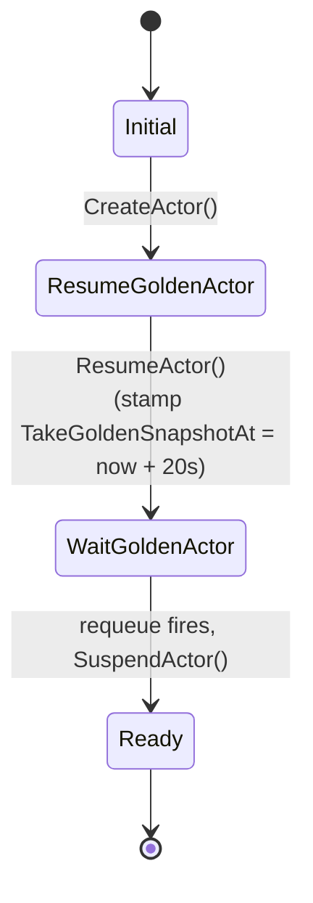

`ActorTemplate` is the second of Substrate's two CRDs. It declares the
*shape* of an actor: which container image, which entrypoint, which
worker pool, where snapshots go. From a single template, you create many
actors (instances).

## The spec

```yaml
apiVersion: ate.dev/v1alpha1
kind: ActorTemplate
metadata:
  name: my-agent
spec:
  workerPoolRef:
    name: default
  containers:
    - name: app                                    # required
      image: ghcr.io/.../my-agent@sha256:...        # must be @-pinned
      command: [/bin/my-agent]
      env: [...]
  pauseImage: gcr.io/.../pause@sha256:...           # required, must be @-pinned
  snapshotsConfig:
    location: gs://my-bucket/some/prefix            # required
  runsc:                                            # required
    amd64:
      url: gs://my-bucket/runsc/runsc
      sha256Hash: ...
    authentication:
      gcp: {}
status:
  phase: Ready
  goldenSnapshot: gs://my-bucket/some/prefix/<id>/<ts-rand>/
```

`container[].name`, `spec.pauseImage`, `spec.snapshotsConfig`,
`spec.workerPoolRef`, and `spec.runsc` are all `+required`. Both
`container.image` and `pauseImage` carry an `XValidation` rule that the
value must contain `@` (digest-pinning) - changing an image invalidates
existing snapshots.

<code class="fileref">pkg/api/v1alpha1/actortemplate_types.go</code>

## A real example: `hello-substrate`

Here's a live `ActorTemplate` from the `kagent` namespace - created by
kagent's `SandboxAgent` controller when you declare a tiny "hello world"
declarative agent. It's the minimum-viable end-to-end shape:

```yaml
apiVersion: ate.dev/v1alpha1
kind: ActorTemplate
metadata:
  name: hello-substrate
  namespace: kagent
  labels:
    app.kubernetes.io/managed-by: kagent
    kagent.dev/sandbox-agent: hello-substrate
  ownerReferences:
    - apiVersion: kagent.dev/v1alpha2
      kind: SandboxAgent
      name: hello-substrate
      controller: true
spec:
  workerPoolRef:
    name: kagent-default
    namespace: kagent
  containers:
    - name: kagent
      image: localhost:5001/kagent-dev/kagent/golang-adk@sha256:1fbfae31...
      command: [/app, --host, 0.0.0.0, --port, "80"]
      env:
        - name: KAGENT_CONFIG_JSON
          valueFrom: { secretKeyRef: { name: hello-substrate, key: config.json } }
        - name: KAGENT_AGENT_CARD_JSON
          valueFrom: { secretKeyRef: { name: hello-substrate, key: agent-card.json } }
        - name: OPENAI_API_KEY
          valueFrom: { secretKeyRef: { name: kagent-openai, key: OPENAI_API_KEY } }
        - name: KAGENT_NAME
          value: hello-substrate
        - name: KAGENT_URL
          value: http://kagent-controller.kagent:8083
      ports:
        - { containerPort: 80, name: http, protocol: TCP }
  pauseImage: gcr.io/gke-release/pause@sha256:bcbd57ba...
  runsc:
    amd64:
      url: gs://gvisor/releases/nightly/2026-05-19/x86_64/runsc
      sha256Hash: a397be1abc24...
    arm64:
      url: gs://gvisor/releases/nightly/2026-05-19/aarch64/runsc
      sha256Hash: 1ba2366ae2ef...
    authentication: {}
  snapshotsConfig:
    location: gs://ate-snapshots/kagent/hello-substrate
status:
  phase: Ready
  conditions:
    - type: Ready
      status: "True"
      reason: Ready
      message: Actor template is ready for use
  goldenActorID: 75d4bbdf-5ce4-481c-8e7c-0c79cb87f334
  goldenSnapshot: gs://ate-snapshots/kagent/hello-substrate/75d4bbdf-.../2026-06-09T03:24:14Z-BBBH4RYLIHT3XDAFMKMABLHIUS
  takeGoldenSnapshotAt: "2026-06-09T03:24:14Z"
```

A few things worth pointing out:

- **Owner reference up to a `SandboxAgent`.** A user didn't write this
  YAML by hand - they declared a `kagent.dev/v1alpha2 SandboxAgent` named
  `hello-substrate`, and kagent's controller projected it down into this
  `ActorTemplate` (plus a `Secret` holding the agent's config). Delete
  the SandboxAgent and the ActorTemplate is garbage-collected.
- **`workerPoolRef` points at `kagent-default`.** That's the pool we
  walk through on the [WorkerPool page](/concepts/workerpool/). Every
  actor created from this template will land on a worker from that pool.
- **`containers[0]` is the agent binary.** `localhost:5001/...golang-adk`
  is kagent's Go ADK runtime, pulled from the in-cluster registry. The
  digest pin is what makes the golden snapshot below valid - bump the
  image and you invalidate the snapshot.
- **`env` is mostly secret refs.** `config.json` and `agent-card.json`
  come from a `Secret` that kagent also manages. `OPENAI_API_KEY` comes
  from a shared `kagent-openai` Secret. None of this is baked into the
  image; the container reads it at startup.
- **`snapshotsConfig.location` is per-template.** All actors of this
  template - and the golden snapshot itself - live under
  `gs://ate-snapshots/kagent/hello-substrate/`.
- **`status.goldenSnapshot` is set.** That's the artifact the 5-phase
  bootstrap below produced. New actors of this template start from it
  instead of cold-booting the container.

## What atecontroller does with it

Runs the 5-phase **golden snapshot bootstrap** described in detail at
[Golden snapshot](/flows/golden-snapshot/):



`PhaseFailed` is declared in the CRD type but the reconciler never assigns
it - errors return up and trigger a requeue. The 20s "wait" is not a
blocking sleep: the reconciler stamps `Status.TakeGoldenSnapshotAt` and
uses `RequeueAfter` to come back later.

The result: `status.goldenSnapshot` points at a fresh, just-booted
snapshot of the template's image. Future actors of this template can
restore from it in milliseconds instead of cold-booting.

<code class="fileref">internal/controllers/actortemplate_controller.go:55-162</code>

## What the golden snapshot is *for*

In the resume workflow, when an actor has no `LastSnapshot` of its own
(because it's never run yet), the strategy selector falls back to:

```go
if template.Status.GoldenSnapshot != "" && !boot {
    // restore from the template's golden snapshot
}
```

So every brand-new actor of this template starts from the same
pre-initialized state, not from cold boot.

<code class="fileref">cmd/ateapi/internal/controlapi/workflow_resume.go:230-248</code>

## Relationship to other concepts

| Concept | Cardinality |
|---|---|
| ActorTemplate → WorkerPool | many-to-one (template pins to pool) |
| ActorTemplate → Actor | one-to-many (template is the "class") |
| ActorTemplate → GoldenSnapshot | one-to-one |

## Related

- [Actor](/concepts/actor/) - the per-instance entity.
- [WorkerPool](/concepts/workerpool/) - what the template binds to.
- [Snapshot](/concepts/snapshot/) - golden vs. last.
- [Golden snapshot bootstrap](/flows/golden-snapshot/) - the reconciler's flow.
- [atecontroller](/components/atecontroller/) - the reconciler.
