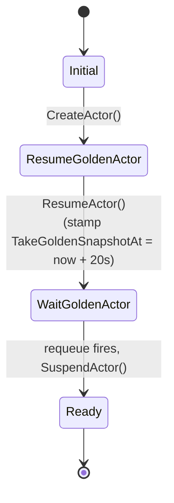

`ActorTemplate` is the second of Substrate's two CRDs. It declares the
*shape* of an actor: which container image, which entrypoint, which
worker pool, where snapshots go. From a single template, you create many
actors (instances).

## The spec

```yaml
apiVersion: ate.dev/v1alpha1
kind: ActorTemplate
metadata:
  name: my-agent
spec:
  workerPoolRef:
    name: default
  containers:
    - name: app                                    # required
      image: ghcr.io/.../my-agent@sha256:...        # must be @-pinned
      command: [/bin/my-agent]
      env: [...]
  pauseImage: gcr.io/.../pause@sha256:...           # required, must be @-pinned
  snapshotsConfig:
    location: gs://my-bucket/some/prefix            # required
  runsc:                                            # required
    amd64:
      url: gs://my-bucket/runsc/runsc
      sha256Hash: ...
    authentication:
      gcp: {}
status:
  phase: Ready
  goldenSnapshot: gs://my-bucket/some/prefix/<id>/<ts-rand>/
```

`container[].name`, `spec.pauseImage`, `spec.snapshotsConfig`,
`spec.workerPoolRef`, and `spec.runsc` are all `+required`. Both
`container.image` and `pauseImage` carry an `XValidation` rule that the
value must contain `@` (digest-pinning) — changing an image invalidates
existing snapshots.

<code class="fileref">pkg/api/v1alpha1/actortemplate_types.go</code>

## What atecontroller does with it

Runs the 5-phase **golden snapshot bootstrap** described in detail at
[Golden snapshot](/flows/golden-snapshot/):



`PhaseFailed` is declared in the CRD type but the reconciler never assigns
it — errors return up and trigger a requeue. The 20s "wait" is not a
blocking sleep: the reconciler stamps `Status.TakeGoldenSnapshotAt` and
uses `RequeueAfter` to come back later.

The result: `status.goldenSnapshot` points at a fresh, just-booted
snapshot of the template's image. Future actors of this template can
restore from it in milliseconds instead of cold-booting.

<code class="fileref">internal/controllers/actortemplate_controller.go:55-162</code>

## What the golden snapshot is *for*

In the resume workflow, when an actor has no `LastSnapshot` of its own
(because it's never run yet), the strategy selector falls back to:

```go
if template.Status.GoldenSnapshot != "" && !boot {
    // restore from the template's golden snapshot
}
```

So every brand-new actor of this template starts from the same
pre-initialized state, not from cold boot.

<code class="fileref">cmd/ateapi/internal/controlapi/workflow_resume.go:230-248</code>

## Relationship to other concepts

| Concept | Cardinality |
|---|---|
| ActorTemplate → WorkerPool | many-to-one (template pins to pool) |
| ActorTemplate → Actor | one-to-many (template is the "class") |
| ActorTemplate → GoldenSnapshot | one-to-one |

## Related

- [Actor](/concepts/actor/) — the per-instance entity.
- [WorkerPool](/concepts/workerpool/) — what the template binds to.
- [Snapshot](/concepts/snapshot/) — golden vs. last.
- [Golden snapshot bootstrap](/flows/golden-snapshot/) — the reconciler's flow.
- [atecontroller](/components/atecontroller/) — the reconciler.
