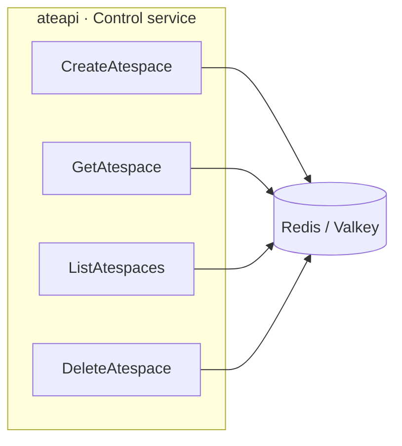

An **atespace** is Substrate's isolation boundary for actors - the closest thing
to a "namespace," but a Substrate-native resource rather than a Kubernetes one.
Every actor is created *into* an atespace, and an actor's name is only unique
*within* its atespace. So the real identity of an actor is the tuple
**`(atespace, name)`**, not a bare id.

:::note[This is a recent, load-bearing change]
Substrate used to identify actors by a single `actor_id`. That is gone. Identity
is now `(atespace, name)`, carried in a common `ResourceMetadata` on every
resource. This changes the DNS name, the Redis keys, and the shape of every
Control RPC - so it shows up all over this atlas.
:::

## Where the atespace shows up

| Surface | Form |
|---|---|
| **DNS name** | `<actor_name>.<atespace>.actors.resources.substrate.ate.dev` |
| **Redis actor record** | `actor:<atespace>:<name>` |
| **Per-actor lock** | `lock:actor:<atespace>:<name>` |
| **Control API** | requests carry an `ObjectRef{atespace, name}` (or an `Actor` whose `metadata.atespace`/`metadata.name` are set) |
| **`ListActors`** | optional `atespace` field scopes the scan to `actor:<atespace>:*` |

The atespace is **caller-specified at creation and immutable** thereafter, just
like the actor name.

## It is a first-class resource

Atespaces are Substrate-native records stored in Redis (not Kubernetes objects),
with their own CRUD RPCs on the `Control` service:

An `Atespace` is **global-scoped**: it does not itself live inside another
atespace, so its `metadata.atespace` is empty and its identity is just
`metadata.name`. `DeleteAtespace` refuses (gRPC `FailedPrecondition`) to remove
an atespace that still contains actors.

## The reserved golden atespace

Per-template **golden actors** (the throwaway boots used to capture a
[golden snapshot](/flows/golden-snapshot/)) live in a reserved system atespace
named **`ate-golden`** rather than in any tenant atespace. See
`resources.GoldenActorAtespace`.

## Why identity is scoped this way

Scoping the name to an atespace lets two tenants each have an actor named, say,
`checkout` without collision, and lets scheduling, locking, and routing all key
off the same `(atespace, name)` pair. Worker assignment and the per-actor
workflow lock are both scoped by this tuple, so the same actor name in two
different atespaces never contends.

:::tip[Where in the code]
- DNS name + reserved atespace: <code class="fileref">internal/resources/actor.go</code>
- Redis key layout: <code class="fileref">cmd/ateapi/internal/store/ateredis/ateredis.go</code>
- `Atespace` / `ObjectRef` / `ResourceMetadata` messages: <code class="fileref">pkg/proto/ateapipb/ateapi.proto</code>
:::

## Related

- [Actor](/concepts/actor/) - what lives inside an atespace.
- [Snapshot](/concepts/snapshot/) - snapshots are keyed under the actor, which is keyed under its atespace.
- [ateapi](/components/ateapi/) - serves the atespace CRUD and actor RPCs.
