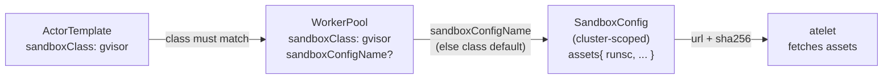

`SandboxConfig` is a **cluster-scoped** CRD that describes the sandbox
binaries for a sandbox class (`gvisor` or `microvm`). It decouples binary
selection from the [ActorTemplate](/concepts/actortemplate/): a template
declares only a `sandboxClass`, and a [WorkerPool](/concepts/workerpool/)
resolves the actual assets - a runsc binary for gVisor, or a
kernel/firmware/hypervisor set for a micro-VM - through a `SandboxConfig`.

## The spec

```yaml
apiVersion: ate.dev/v1alpha1
kind: SandboxConfig
metadata:
  name: gvisor-default          # cluster-scoped: no namespace
spec:
  sandboxClass: gvisor          # required; gvisor (default) | microvm
  default: true                 # cluster-wide default for this class
  assets:                       # map[arch]map[name]AssetFile
    amd64:
      runsc:
        url: gs://gvisor/releases/.../x86_64/runsc
        sha256: 0123...def       # lower-case hex, 64 chars
    arm64:
      runsc:
        url: gs://gvisor/releases/.../aarch64/runsc
        sha256: 89ab...012
```

Fields:

- `sandboxClass` (required, `gvisor` default or `microvm`) - the runtime
  family this config applies to. A WorkerPool only uses `SandboxConfig`s
  whose class matches its own.
- `default` (optional) - marks this config as the **cluster-wide default**
  for its `sandboxClass`. A WorkerPool with no explicit `sandboxConfigName`
  resolves to the default for its class. At most one default is expected per
  class.
- `assets` - the files atelet fetches, keyed first by architecture (GOARCH,
  e.g. `amd64`, `arm64`) and then by asset name. Each `AssetFile` has a
  `url` (where to download from, e.g. a `gs://` URL) and a `sha256`
  (lower-case hex, which both names the cached file and verifies integrity).

Asset names are interpreted by the sandbox backend: gVisor expects a
`runsc` asset; a micro-VM backend expects several (for example
`cloud-hypervisor`, `kata-kernel`, `kata-image`). The schema is
intentionally generic; per-class requirements are enforced by a
`ValidatingAdmissionPolicy`.

## How it fits together



A WorkerPool picks its config by `spec.sandboxConfigName`; if that's empty,
it falls back to the `default` `SandboxConfig` for its `sandboxClass`. The
referenced config's `sandboxClass` must match the pool's. atelet then
downloads each `AssetFile` and verifies it against the `sha256` before the
sandbox runtime uses it.

## A micro-VM example

```yaml
apiVersion: ate.dev/v1alpha1
kind: SandboxConfig
metadata:
  name: microvm-default
spec:
  sandboxClass: microvm
  default: true
  assets:
    amd64:
      cloud-hypervisor:
        url: gs://my-bucket/microvm/cloud-hypervisor
        sha256: aaaa...
      kata-kernel:
        url: gs://my-bucket/microvm/vmlinux
        sha256: bbbb...
      kata-image:
        url: gs://my-bucket/microvm/kata.img
        sha256: cccc...
```

## Related

- [WorkerPool](/concepts/workerpool/) - references a `SandboxConfig` via `sandboxConfigName`.
- [ActorTemplate](/concepts/actortemplate/) - declares the `sandboxClass` a config must match.
- [atelet](/components/atelet/) - fetches and verifies the assets on each node.
