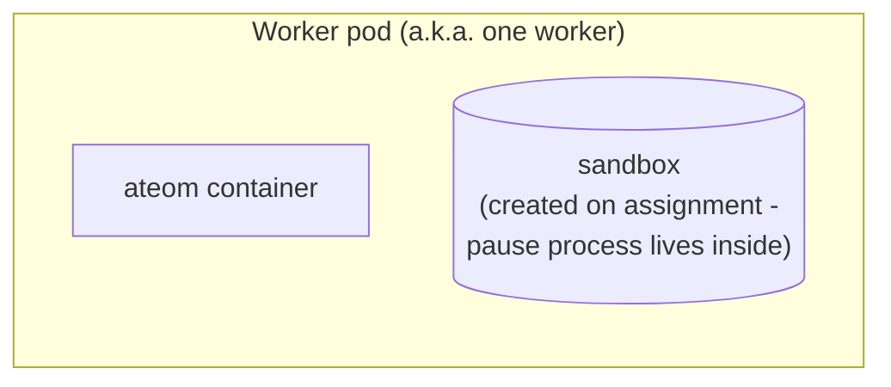

A **worker** is a Pod that's pre-warmed to host actors. It's not the actor
itself - it's the *hosting slot*. Worker pods come from a `WorkerPool`
Deployment and are pooled, fungible, and reassigned across many actors over
their lifetime.

## What a worker actually is



Two pieces:
1. `ateom` running as the pod's only container, ready to receive
   Run/Checkpoint/Restore RPCs. Its runtime family (gVisor or micro-VM)
   is set by the pool's `sandboxClass`.
2. A sandbox that ateom will create on assignment - its pause process lives
   **inside** that sandbox, not as a peer pod-level container.

## Worker record (in Redis)

```
key:   worker:<worker_namespace>:<worker_pool>:<worker_pod>
value: {
  worker_namespace, worker_pool, worker_pod, worker_pod_uid, ip, version,
  node_name, sandbox_class, labels{},
  assignment: { actor_template: {namespace, name}, actor: {atespace, name} },
}
```

(There is no `pod_name` field; the pod-name component is `worker_pod`.)

The old flat `actor_id` / `actor_namespace` / `actor_template` fields are
gone. An assignment is now a single `Assignment` record:

- `actor_template` - a namespaced object reference (`namespace`, `name`).
- `actor` - an `ObjectRef` (`atespace`, `name`), the actor's identity tuple.

When no `assignment` is set, the worker is **idle**. Otherwise it's
**assigned** to that actor. The worker also caches pool metadata -
`sandbox_class` and `labels{}` - so the scheduler can match eligibility
without re-reading the pool.

## One actor per worker

A worker hosts **at most one** actor at a time. The actor's sandbox gets the
whole pod's resources. When the actor suspends, the worker returns to the
idle pool. Assignment and scheduling are scoped by the actor's `(atespace,
actor_name)` identity.

## How workers get *created*

Not directly. You declare a [`WorkerPool`](/concepts/workerpool/) and
`atecontroller` reconciles a Deployment of N pods. Each pod gets
inserted into Redis as a worker by ateapi's syncer once it has a `PodIP`
(registration is keyed on the pod having an IP, not on the Ready condition).

## How workers get *destroyed*

When a pod terminates (manual delete, eviction, node drain), the syncer
removes the worker record. If an actor was assigned, it's forced back to a
snapshot first.

## Related

- [Worker lifecycle](/flows/worker-lifecycle/) - Idle ↔ Assigned state machine.
- [WorkerPool](/concepts/workerpool/) - where workers come from.
- [Workers component](/components/workers/) - the worker pod itself, in more depth.
