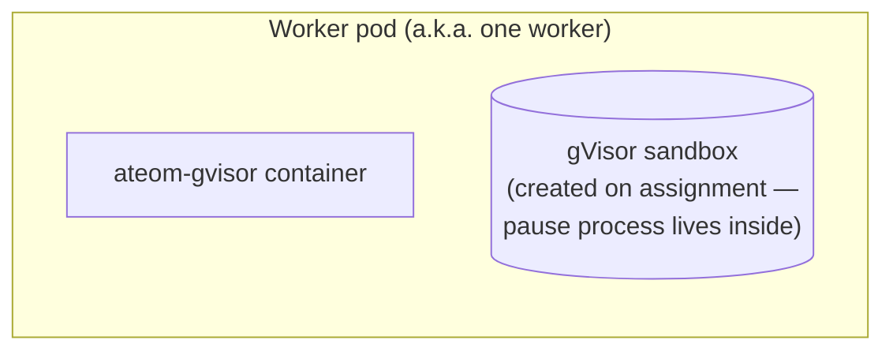

A **worker** is a Pod that's pre-warmed to host actors. It's not the actor
itself — it's the *hosting slot*. Worker pods come from a `WorkerPool`
Deployment and are pooled, fungible, and reassigned across many actors over
their lifetime.

## What a worker actually is



Two pieces:
1. `ateom-gvisor` running as the pod's only container, ready to receive
   Run/Checkpoint/Restore RPCs.
2. A gVisor sandbox that ateom-gvisor will create on assignment — its
   pause process lives **inside** that sandbox, not as a peer pod-level
   container.

## Worker record (in Redis)

```
key:   worker:<worker_namespace>:<worker_pool>:<worker_pod>
value: {
  worker_namespace, worker_pool, worker_pod, worker_pod_uid, ip, version,
  actor_id, actor_namespace, actor_template,
}
```

(Proto field names from `pkg/proto/ateapipb/ateapi.proto`. There is no
`pod_name` field; the pod-name component is `worker_pod`.)

When `actor_id == ""`, the worker is **idle**. Otherwise it's **assigned**
to that actor.

<code class="fileref">cmd/ateapi/internal/store/ateredis/ateredis.go:40-80</code>

## One actor per worker

A worker hosts **at most one** actor at a time. The actor's gVisor sandbox
gets the whole pod's resources. When the actor suspends, the worker
returns to the idle pool.

## How workers get *created*

Not directly. You declare a [`WorkerPool`](/concepts/workerpool/) and
`atecontroller` reconciles a Deployment of N pods. Each Ready pod gets
inserted into Redis as a worker by ateapi's syncer.

## How workers get *destroyed*

When a pod terminates (manual delete, eviction, node drain), the syncer's
`DeleteFunc` removes the worker record. If an actor was assigned, it's
forced back to `SUSPENDED` first.

## Related

- [Worker lifecycle](/flows/worker-lifecycle/) — Idle ↔ Assigned state machine.
- [WorkerPool](/concepts/workerpool/) — where workers come from.
- [Workers component](/components/workers/) — the worker pod itself, in more depth.
