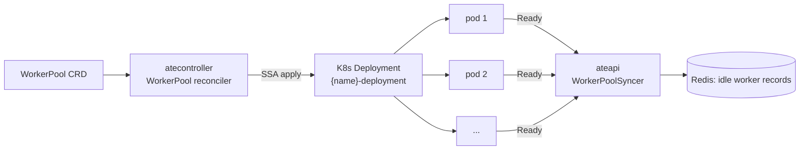

`WorkerPool` is one of Substrate's two CRDs. It says: *"I want N pre-warmed
worker pods running this ateom-gvisor image, ready to host actors of
templates that target this pool."*

## The spec

```yaml
apiVersion: ate.dev/v1alpha1
kind: WorkerPool
metadata:
  name: default
spec:
  replicas: 10
  ateomImage: ghcr.io/agent-substrate/ateom-gvisor:vX
status:
  replicas: 10           # actual count
```

<code class="fileref">pkg/api/v1alpha1/workerpool_types.go</code>

## A real example: `kagent-default`

Here's the live `WorkerPool` from the `kagent` namespace - installed by
the kagent Helm chart and used by every `SandboxAgent` running on
substrate today, including the [`hello-substrate`
ActorTemplate](/concepts/actortemplate/#a-real-example-hello-substrate):

```yaml
apiVersion: ate.dev/v1alpha1
kind: WorkerPool
metadata:
  name: kagent-default
  namespace: kagent
  labels:
    app.kubernetes.io/instance: kagent
    app.kubernetes.io/managed-by: Helm
    app.kubernetes.io/name: kagent
    app.kubernetes.io/part-of: kagent
spec:
  ateomImage: localhost:5001/ateom-gvisor:latest
  replicas: 2
status:
  replicas: 2
```

The whole spec is two fields. atecontroller's `WorkerPool` reconciler
turned that into a Deployment named `kagent-default-deployment` (the
`-deployment` suffix is hard-coded by the reconciler):

```text
$ kubectl get deploy -n kagent kagent-default-deployment
NAME                        READY   UP-TO-DATE   AVAILABLE   AGE
kagent-default-deployment   2/2     2            2           11h

$ kubectl get pods -n kagent -l ate.dev/worker-pool=kagent-default
NAME                                         READY   STATUS    RESTARTS   AGE
kagent-default-deployment-7f464cd64c-m2fps   1/1     Running   0          11h
kagent-default-deployment-7f464cd64c-r6lhv   1/1     Running   0          11h
```

A few things worth pointing out:

- **`ateomImage` is the gVisor-hosting pod image, not the agent image.**
  Every pod in this Deployment runs `ateom-gvisor`, which is the
  per-node manager that boots runsc sandboxes for actors. Actor
  containers (e.g. the `golang-adk` image from `hello-substrate`) live
  *inside* runsc, not in this pod's container spec. See
  [ateom-gvisor](/components/ateom-gvisor/).
- **`replicas: 2` is the whole capacity knob.** This cluster can host
  exactly two actors concurrently per template-pool binding. Bump it
  and atecontroller scales the Deployment; new pods register themselves
  with `WorkerPoolSyncer` and Redis without restarting anything.
- **The pods are `privileged` and mount `/var/lib/ateom-gvisor` from
  the host.** That's how ateom-gvisor manages runsc state across the
  pod boundary - actors that survive a pod restart do so via files on
  the host path, not in the pod's ephemeral storage.
- **The Deployment selector is `ate.dev/worker-pool=kagent-default`.**
  ateapi uses this label to find pool members when reconciling
  Redis-side worker records.
- **Owner-referenced by the WorkerPool.** Delete the `WorkerPool` CRD
  and the Deployment (and all its pods) go away.

## What atecontroller does with it



1. Reconciler reads `spec.replicas` and `spec.ateomImage`.
2. Server-side-applies a Deployment named `<workerpool-name>-deployment`
   with that replica count and image.
3. Updates `status.replicas` with what K8s reports.

That's the whole reconciler. **It doesn't insert worker records into
Redis** - that happens later via ateapi's `WorkerPoolSyncer`, which
watches the pods directly.

<code class="fileref">internal/controllers/workerpool_controller.go:52-176</code>

## Isolation boundary

`ActorTemplate.spec.workerPoolRef` pins each template to a specific pool.
Different pools never share workers. Use this to:

- Run actors with different sandbox images.
- Scale capacity for different workload classes independently.
- Isolate failure domains.

## Scaling

Edit `spec.replicas`, apply, done. atecontroller updates the Deployment,
new pods come up, the syncer registers them. No actor downtime.

Scaling down: terminated pods that were hosting actors trigger the
"worker died" recovery path - actors are reset to `SUSPENDED` from their
`LastSnapshot`.

## Related

- [Worker](/concepts/worker/) - what a pool member actually is.
- [Workers component](/components/workers/) - pod-level detail.
- [Worker lifecycle](/flows/worker-lifecycle/) - the state machine.
- [atecontroller](/components/atecontroller/) - the reconciler.
