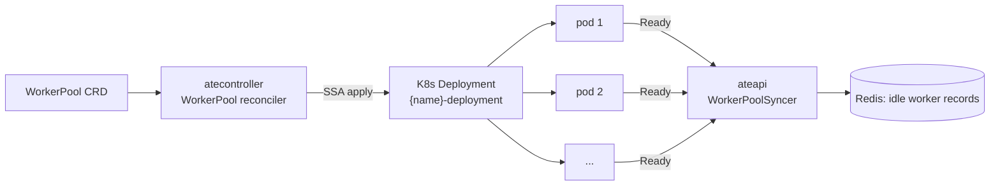

`WorkerPool` is one of Substrate's two CRDs. It says: *"I want N pre-warmed
worker pods running this ateom-gvisor image, ready to host actors of
templates that target this pool."*

## The spec

```yaml
apiVersion: ate.dev/v1alpha1
kind: WorkerPool
metadata:
  name: default
spec:
  replicas: 10
  ateomImage: ghcr.io/agent-substrate/ateom-gvisor:vX
status:
  replicas: 10           # actual count
```

<code class="fileref">pkg/api/v1alpha1/workerpool_types.go</code>

## What atecontroller does with it



1. Reconciler reads `spec.replicas` and `spec.ateomImage`.
2. Server-side-applies a Deployment named `<workerpool-name>-deployment`
   with that replica count and image.
3. Updates `status.replicas` with what K8s reports.

That's the whole reconciler. **It doesn't insert worker records into
Redis** — that happens later via ateapi's `WorkerPoolSyncer`, which
watches the pods directly.

<code class="fileref">internal/controllers/workerpool_controller.go:52-176</code>

## Isolation boundary

`ActorTemplate.spec.workerPoolRef` pins each template to a specific pool.
Different pools never share workers. Use this to:

- Run actors with different sandbox images.
- Scale capacity for different workload classes independently.
- Isolate failure domains.

## Scaling

Edit `spec.replicas`, apply, done. atecontroller updates the Deployment,
new pods come up, the syncer registers them. No actor downtime.

Scaling down: terminated pods that were hosting actors trigger the
"worker died" recovery path — actors are reset to `SUSPENDED` from their
`LastSnapshot`.

## Related

- [Worker](/concepts/worker/) — what a pool member actually is.
- [Workers component](/components/workers/) — pod-level detail.
- [Worker lifecycle](/flows/worker-lifecycle/) — the state machine.
- [atecontroller](/components/atecontroller/) — the reconciler.
