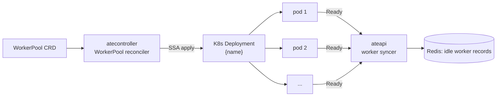

`WorkerPool` is one of Substrate's CRDs. It says: *"I want N pre-warmed
worker pods of a given sandbox class, ready to host actors."* From a single
pool, `atecontroller` maintains a Kubernetes `Deployment`.

:::note[Decoupled from ActorTemplate]
A WorkerPool no longer knows anything about templates, and templates no
longer name a pool. Eligibility is **selector-based**: an actor lands on a
pool whose `sandboxClass` matches the template's and whose labels satisfy the
template's `workerSelector` (AND'd with the actor's own `worker_selector`).
:::

## The spec

```yaml
apiVersion: ate.dev/v1alpha1
kind: WorkerPool
metadata:
  name: default
  labels:
    tier: gpu                     # matched against ActorTemplate.workerSelector
spec:
  replicas: 10                    # required
  ateomImage: ghcr.io/agent-substrate/ateom-gvisor:vX   # required
  sandboxClass: gvisor            # gvisor (default) | microvm
  sandboxConfigName: gvisor-default   # optional; else the class default
  template:                       # optional pod scheduling / resources
    nodeSelector: { cloud.google.com/gke-nodepool: gpu }
    tolerations: [...]
    priorityClassName: high
    nodeAffinity: {...}
    resources:
      requests: { cpu: "2", memory: 4Gi }
status:
  replicas: 10                    # actual count
```

Fields:

- `replicas` (required, `>= 0`) - desired worker pod count.
- `ateomImage` (required) - the ateom container image to deploy as workers.
- `sandboxClass` (`gvisor` default, or `microvm`) - the runtime family. It
  drives the worker pod shape (for `microvm`, `/dev/kvm` mount plus
  node placement) and which [SandboxConfig](/concepts/sandboxconfig/)s are
  eligible.
- `sandboxConfigName` (optional) - a cluster-scoped `SandboxConfig` to fetch
  sandbox binaries from. Its `sandboxClass` must match this pool's. If empty,
  the cluster default `SandboxConfig` for the class is used.
- `template` (optional, `WorkerPoolPodTemplate`) - `nodeSelector`,
  `tolerations`, `priorityClassName`, `nodeAffinity`, and `resources` for the
  worker pods.

## A real example: `kagent-default`

Here's the live `WorkerPool` from the `kagent` namespace - installed by
the kagent Helm chart and used by every `SandboxAgent` running on
substrate today, including the [`hello-substrate`
ActorTemplate](/concepts/actortemplate/#a-real-example-hello-substrate):

```yaml
apiVersion: ate.dev/v1alpha1
kind: WorkerPool
metadata:
  name: kagent-default
  namespace: kagent
  labels:
    app.kubernetes.io/instance: kagent
    app.kubernetes.io/managed-by: Helm
    app.kubernetes.io/name: kagent
    app.kubernetes.io/part-of: kagent
spec:
  ateomImage: localhost:5001/ateom-gvisor:latest
  replicas: 2
status:
  replicas: 2
```

The spec omits `sandboxClass` (so it defaults to `gvisor`) and
`sandboxConfigName` (so it resolves the cluster default gVisor
`SandboxConfig`). atecontroller's `WorkerPool` reconciler turned that into a
Deployment that takes the pool's own name, `kagent-default` (upstream dropped
the old `-deployment` suffix to avoid redundant object names):

```text
$ kubectl get deploy -n kagent kagent-default
NAME             READY   UP-TO-DATE   AVAILABLE   AGE
kagent-default   2/2     2            2           11h

$ kubectl get pods -n kagent -l ate.dev/worker-pool=kagent-default
NAME                              READY   STATUS    RESTARTS   AGE
kagent-default-7f464cd64c-m2fps   1/1     Running   0          11h
kagent-default-7f464cd64c-r6lhv   1/1     Running   0          11h
```

A few things worth pointing out:

- **`ateomImage` is the sandbox-hosting pod image, not the agent image.**
  Every pod in this Deployment runs ateom (here `ateom-gvisor`), the
  per-node manager that boots sandboxes for actors. Actor containers (e.g.
  the `golang-adk` image from `hello-substrate`) live *inside* the sandbox,
  not in this pod's container spec. See [ateom-gvisor](/components/ateom-gvisor/).
- **`replicas: 2` is the whole capacity knob.** This pool can host exactly
  two actors concurrently. Bump it and atecontroller scales the Deployment;
  new pods register themselves with `ateapi` and Redis without restarting
  anything.
- **The pods are `privileged` and mount `/var/lib/ateom-gvisor` from
  the host.** That's how ateom manages sandbox state across the pod
  boundary - actors that survive a pod restart do so via files on the host
  path, not in the pod's ephemeral storage.
- **The Deployment selector is `ate.dev/worker-pool=kagent-default`.**
  ateapi uses this label to find pool members when reconciling
  Redis-side worker records.
- **Owner-referenced by the WorkerPool.** Delete the `WorkerPool` CRD
  and the Deployment (and all its pods) go away.

## What atecontroller does with it



1. Reconciler reads the spec and builds a Deployment apply-config. For
   `sandboxClass: microvm` it also mounts `/dev/kvm` and pins placement to
   KVM-capable nodes via a `ate.dev/sandboxClass=microvm` nodeSelector +
   toleration; `spec.template` settings are merged in.
2. Server-side-applies a Deployment named `<workerpool-name>` (same name as the
   pool) with the replica count, `ateomImage`, and pod shape.
3. Updates `status.replicas` with what K8s reports.

That's the whole reconciler. **It doesn't insert worker records into
Redis** - that happens later via ateapi's worker syncer, which watches the
pods directly.

## Isolation and eligibility

Pools are the isolation and capacity boundary. Because binding is
selector-based, you can use them to:

- Separate sandbox runtimes: a `gvisor` pool and a `microvm` pool never
  share workers, and snapshots aren't portable across classes.
- Steer workloads with labels: label a pool (e.g. `tier: gpu`) and gate
  templates to it with `workerSelector`.
- Scale capacity for different workload classes independently.
- Isolate failure domains.

## Scaling

Edit `spec.replicas`, apply, done. atecontroller updates the Deployment,
new pods come up, the syncer registers them. No actor downtime. The CRD
exposes a `scale` subresource, so `kubectl scale` works too.

Scaling down: terminated pods that were hosting actors trigger the
"worker died" recovery path - actors are reset from their latest snapshot.

## Related

- [Worker](/concepts/worker/) - what a pool member actually is.
- [SandboxConfig](/concepts/sandboxconfig/) - where a pool's sandbox binaries come from.
- [ActorTemplate](/concepts/actortemplate/) - the `sandboxClass` + `workerSelector` that gate a pool.
- [Worker lifecycle](/flows/worker-lifecycle/) - the state machine.
- [atecontroller](/components/atecontroller/) - the reconciler.
