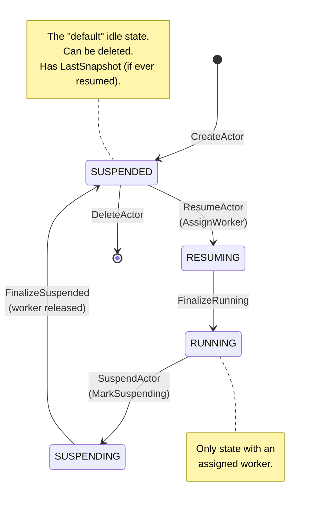
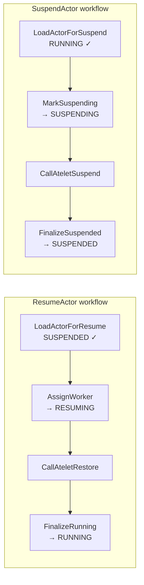

Every actor is in exactly one of **four states** at any moment. State is
stored in Redis at `actor:<id>` and changed only by ateapi's workflow engine
under a per-actor lock.

## The states

<code class="fileref">pkg/proto/ateapipb/ateapi.proto:58-64</code>

## What each state means

| State | Worker assigned? | Snapshot? | Can be deleted? |
|---|---|---|---|
| `SUSPENDED` | No | Maybe (after first run) | **Yes** |
| `RESUMING` | Yes (just assigned) | Restoring from one | No |
| `RUNNING` | Yes | n/a (live) | No |
| `SUSPENDING` | Yes (about to release) | Being written | No |

## Allowed transitions

| From | RPC | To |
|---|---|---|
| `(none)` | `CreateActor` | `SUSPENDED` |
| `SUSPENDED` | `ResumeActor` | `RESUMING` → `RUNNING` |
| `RUNNING` | `SuspendActor` | `SUSPENDING` → `SUSPENDED` |
| `SUSPENDED` | `DeleteActor` | gone |

Some "no-op" transitions are idempotent rather than rejected. Suspending
an already-suspended actor short-circuits inside the workflow and returns
the actor unchanged (`workflow_suspend.go` `MarkSuspendingStep.IsComplete`
returns early for SUSPENDED/SUSPENDING actors). `DeleteActor` currently
does **not** check status - it removes the Redis record regardless. The
real serialization guarantee is the per-actor lock below, not status-
based precondition errors.

## Who writes each transition

<code class="fileref">cmd/ateapi/internal/controlapi/workflow_resume.go:35-293</code> ·
<code class="fileref">cmd/ateapi/internal/controlapi/workflow_suspend.go:35-239</code>

## The lock that protects all of this

Every transition runs inside a workflow that holds `lock:actor:<id>` in
Redis with a 30-second TTL. The workflow itself times out at 28 seconds
(TTL minus 2s of padding before the lock expires). Two concurrent calls for
the same actor cannot both succeed - the second gets `Aborted`.

This is what prevents nasty races like "resume + suspend at the same time"
or "delete while a worker is still assigned."

<code class="fileref">cmd/ateapi/internal/controlapi/workflow.go:189-212</code>

## What can move an actor *without* an RPC?

One path: **the worker pod dies**. The WorkerPoolSyncer's pod-delete
handler runs `releaseActorOnDeadWorker`, which finds the assigned actor
and forces it back to `SUSPENDED` - even mid-`RUNNING`. The actor's
`LastSnapshot` is whatever it was before (or empty for never-run actors).

This is a recovery path, not a normal transition, and it's known to race
with concurrent `SuspendActor` calls.

<code class="fileref">cmd/ateapi/internal/controlapi/syncer.go:54-78</code> ·
<code class="fileref">cmd/ateapi/internal/controlapi/syncer.go:161-192</code>

## Where state actually lives

Just one place: Redis. The key is `actor:<actor-id>` and the value is the
JSON-serialized Actor proto. Every other component (atelet, atecontroller,
atenet) reads it via ateapi RPCs - they never touch Redis directly.

## Related

- [Create actor](/flows/create-actor/) · [Resume actor](/flows/resume-actor/) ·
  [Suspend actor](/flows/suspend-actor/)
- [Worker lifecycle](/flows/worker-lifecycle/) - the dual state machine
  on the worker side.
- [ateapi internals](/components/ateapi/) - the workflow engine that drives
  every transition.
