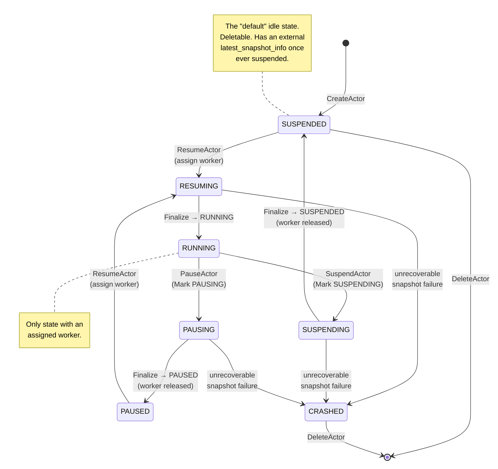

Every actor is in exactly one of **eight states** at any moment. State is
stored in Redis at `actor:<atespace>:<name>` and changed only by ateapi's
workflow engine under a per-actor lock.

The actor status values are:
`STATUS_UNSPECIFIED`, `STATUS_RESUMING`, `STATUS_RUNNING`, `STATUS_SUSPENDING`,
`STATUS_SUSPENDED`, `STATUS_PAUSING`, `STATUS_PAUSED`, and `STATUS_CRASHED`.

There are **two hibernation paths**. A [suspend](/flows/suspend-actor/) commits
an *external* snapshot to object storage (GCS/S3) and fully frees the node; a
**pause** keeps a *local* snapshot on the node VM so the following resume can be
steered back onto that same node. Both free the worker; they differ only in
where the snapshot lands.

## The states



## What each state means

| State | Worker assigned? | Snapshot | Can be deleted? |
|---|---|---|---|
| `SUSPENDED` | No | External (object storage), if ever suspended | **Yes** |
| `PAUSED` | No | Local, on the node VM(s) in `LocalSnapshotInfo.node_vms_with_local_snapshots` | No |
| `RESUMING` | Yes (just assigned) | Restoring from latest, else golden, else cold boot | No |
| `RUNNING` | Yes | n/a (live) | No |
| `SUSPENDING` | Yes (about to release) | External snapshot being written | No |
| `PAUSING` | Yes (about to release) | Local snapshot being written | No |
| `CRASHED` | No | Whatever it had | **Yes** |

`SUSPENDED` is the state a freshly created actor starts in and the state it
returns to after a suspend. `PAUSED` is a lighter-weight hibernation: the
snapshot never leaves the node, so a resume that lands back on that node skips
the download entirely. `CRASHED` is set when a snapshot operation fails
unrecoverably (see below).

## Allowed transitions

| From | RPC | To |
|---|---|---|
| `(none)` | `CreateActor` | `SUSPENDED` |
| `SUSPENDED` / `PAUSED` | `ResumeActor` | `RESUMING` → `RUNNING` |
| `RUNNING` | `SuspendActor` | `SUSPENDING` → `SUSPENDED` |
| `RUNNING` | `PauseActor` | `PAUSING` → `PAUSED` |
| `SUSPENDED` / `CRASHED` | `DeleteActor` | gone |

`DeleteActor` accepts an actor **only when it is `SUSPENDED` or `CRASHED`**; any
other status is rejected with a precondition error. The store enforces this
check on delete.

Some "no-op" transitions are idempotent rather than rejected. Suspending an
already-suspended actor short-circuits inside the workflow and returns the actor
unchanged (the suspend workflow treats `SUSPENDING`/`SUSPENDED` actors as
already complete; the pause workflow does the same for `PAUSING`/`PAUSED`). The
real serialization guarantee is the per-actor lock below.

## The CRASHED state

When an atelet checkpoint or restore RPC fails in a way the workflow can't
recover from, ateapi moves the actor to `STATUS_CRASHED` rather than leaving it
wedged in a transient state:

- The suspend/pause workflows guard against calling atelet with no assigned
  worker. If the actor was marked `SUSPENDING` / `PAUSING` but has no assigned
  worker pod, the step crashes the actor and fails - there's nothing to
  checkpoint.
- When an atelet RPC returns an error signalling that the actor should be
  crashed (for example, atelet failing to upload an external snapshot returns a
  data-loss error), ateapi moves the actor to `CRASHED` and returns the
  data-loss error to the caller.

Crashing an actor also **releases its worker and clears the binding**, so a
`CRASHED` actor no longer pins a worker and can be cleanly deleted. It keeps
whatever `latest_snapshot_info` it had, is not auto-recovered, and its only exit
is `DeleteActor`.

## Who writes each transition

```mermaid
flowchart LR
  subgraph WF_Resume["ResumeActor workflow"]
    R1[Load actor<br/>SUSPENDED / PAUSED ✓]
    R2[Assign worker<br/>→ RESUMING]
    R3[Restore via atelet]
    R4[Finalize → RUNNING]
    R1 --> R2 --> R3 --> R4
  end

  subgraph WF_Suspend["SuspendActor workflow"]
    S1[Load actor<br/>RUNNING ✓]
    S2[Mark SUSPENDING<br/>→ SUSPENDING]
    S3[Checkpoint via atelet<br/>external upload]
    S4[Finalize → SUSPENDED]
    S1 --> S2 --> S3 --> S4
  end

  subgraph WF_Pause["PauseActor workflow"]
    P1[Load actor<br/>RUNNING ✓]
    P2[Mark PAUSING<br/>→ PAUSING]
    P3[Checkpoint via atelet (local)<br/>keep local]
    P4[Finalize → PAUSED]
    P1 --> P2 --> P3 --> P4
  end
```

The suspend and pause workflows are near-identical four-step machines; the only
differences are the checkpoint type they hand atelet (external upload vs.
node-local), the snapshot scope they pass (`onCommit` vs. `onPause`), and the
`SnapshotInfo` variant they write back (external vs. local).

## The lock that protects all of this

Every transition runs inside a workflow that holds `lock:actor:<atespace>:<name>`
in Redis with a 30-second TTL. The workflow itself times out at 28 seconds (TTL
minus 2s of padding before the lock expires). Two concurrent calls for the same
actor cannot both succeed - the second gets `Aborted`.

This is what prevents nasty races like "resume + suspend at the same time" or
"delete while a worker is still assigned."

## What can move an actor *without* an RPC?

One path: **the worker pod dies**. The worker-pool syncer's pod-delete (and
soft-delete) handler finds the actor via the worker's `Assignment` and forces it
back to `SUSPENDED` - even mid-`RUNNING` - unless the actor is already
`CRASHED`, in which case it is left alone. It also clears the actor's
`ateom_pod_namespace`/`ateom_pod_name`/`ateom_pod_ip` pointers,
`in_progress_snapshot`, and `worker_pool_name` (the `ateom_pod_uid` is left set -
only a crash clears it). The
actor's `latest_snapshot_info` is left untouched (whatever it was before, or
empty for never-run actors).

This is a best-effort recovery path, not a normal transition, and it is known to
race with concurrent `SuspendActor`/`PauseActor` calls (optimistic-version
checking means whichever writes first wins).

## Where state actually lives

Just one place: Redis. The key is `actor:<atespace>:<name>` and the value is the
serialized `Actor` proto. Every other component (atelet, atecontroller, atenet)
reads it via ateapi RPCs - they never touch Redis directly.

## Related

- [Create actor](/flows/create-actor/) · [Resume actor](/flows/resume-actor/) ·
  [Suspend actor](/flows/suspend-actor/)
- [Worker lifecycle](/flows/worker-lifecycle/) - the dual state machine
  on the worker side.
- [Snapshot](/concepts/snapshot/) - external vs. local snapshots.
- [ateapi internals](/components/ateapi/) - the workflow engine that drives
  every transition.
