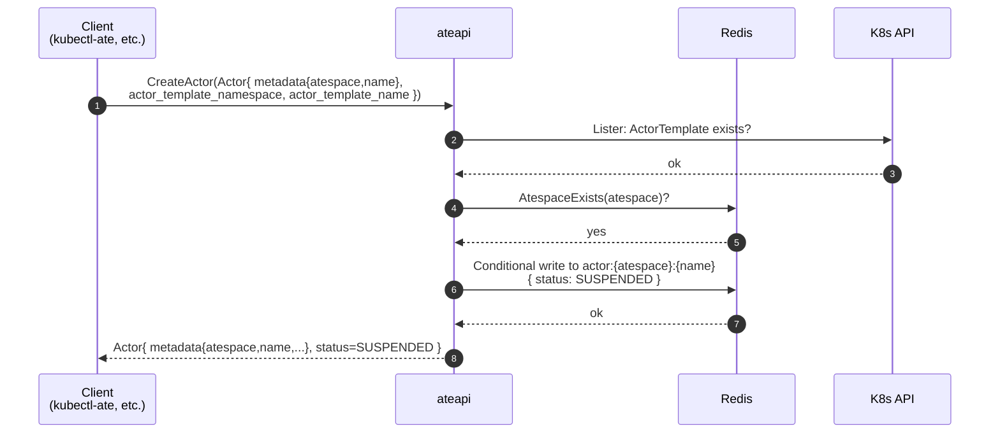

`CreateActor` is intentionally minimal: it produces a new Actor record with
`STATUS_SUSPENDED` and no assigned worker. The first real work happens later,
on the first `ResumeActor` call.

## Sequence

`CreateActorRequest` carries an `Actor` body. Identity comes from
`actor.metadata.{atespace, name}` - there is no bare `actor_id` field
anymore. The referenced `ActorTemplate` and the target atespace must both
already exist.

## What's actually written

A new actor record in Redis at key `actor:<atespace>:<name>` containing:

| Field | Value at create time |
|---|---|
| `metadata.atespace` / `metadata.name` | **caller-supplied** in `CreateActorRequest.actor.metadata` (identity) |
| `actor_template_namespace` / `actor_template_name` | from the request's `Actor` body |
| `status` | `STATUS_SUSPENDED` |
| `worker_selector` | copied from the request if set (per-actor placement) |
| `ateom_pod_*` | empty |
| `latest_snapshot_info` | unset |

The server assigns the rest of `ResourceMetadata` (`uid`, `version`,
timestamps) on write. There is no `last_snapshot` string field - snapshot
state now lives in `latest_snapshot_info` (a `SnapshotInfo`).

No call to atelet or atecontroller. One K8s lister hit (to verify the
referenced `ActorTemplate` exists - `FailedPrecondition` if not), one Redis
`AtespaceExists` check (`FailedPrecondition` if the atespace does not exist),
and one conditional Redis write.

<code class="fileref">cmd/ateapi/internal/controlapi/create_actor.go</code>

## Why this is so simple

Actor creation is **cheap and lazy**. The expensive work - pulling images,
allocating a worker, restoring memory - only happens when something actually
needs the actor to be running. That's the [resume flow](/flows/resume-actor/).

## What if an actor with that name already exists?

`CreateActor` uses a conditional write - a duplicate create for the same
`(atespace, name)` returns `AlreadyExists` and does not overwrite the
record.

## Related

- [Resume actor](/flows/resume-actor/) - what happens on first wakeup.
- [Actor lifecycle](/flows/actor-lifecycle/) - full state machine.
- [Golden snapshot bootstrap](/flows/golden-snapshot/) - the atecontroller's
  use of `CreateActor` to build a template's golden snapshot.
