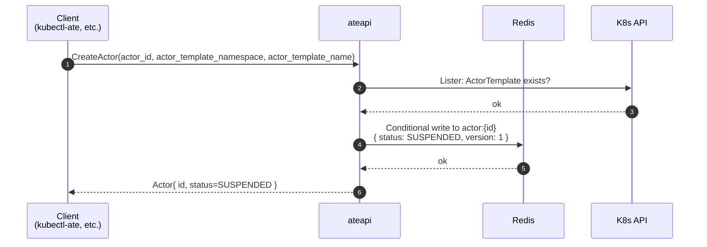

`CreateActor` is intentionally minimal: it produces a new Actor record with
`STATUS_SUSPENDED` and no assigned worker. The first real work happens later,
on the first `ResumeActor` call.

## Sequence

## What's actually written

A new actor record in Redis at key `actor:<actor-id>` containing:

| Field | Value at create time |
|---|---|
| `actor_id` | **caller-supplied** in `CreateActorRequest` |
| `actor_template_ref` | from `actor_template_namespace` + `actor_template_name` in the request |
| `status` | `STATUS_SUSPENDED` |
| `version` | 1 |
| `ateom_pod_*` | empty |
| `last_snapshot` | empty |

No call to atelet or atecontroller. One K8s lister hit (to verify the
referenced `ActorTemplate` exists - `FailedPrecondition` if not) and one
conditional Redis write.

<code class="fileref">cmd/ateapi/internal/controlapi/create_actor.go:30-66</code>

## Why this is so simple

Actor creation is **cheap and lazy**. The expensive work - pulling images,
allocating a worker, restoring memory - only happens when something actually
needs the actor to be running. That's the [resume flow](/flows/resume-actor/).

## What if an actor with that ID already exists?

`CreateActor` uses a conditional write - duplicate creates return
`AlreadyExists` and don't overwrite the record.

## Related

- [Resume actor](/flows/resume-actor/) - what happens on first wakeup.
- [Actor lifecycle](/flows/actor-lifecycle/) - full state machine.
- [Golden snapshot bootstrap](/flows/golden-snapshot/) - the atecontroller's
  use of `CreateActor` to build a template's golden snapshot.
