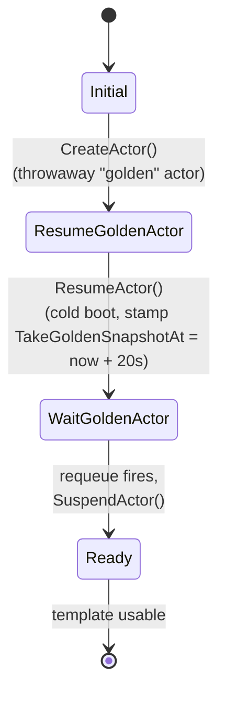
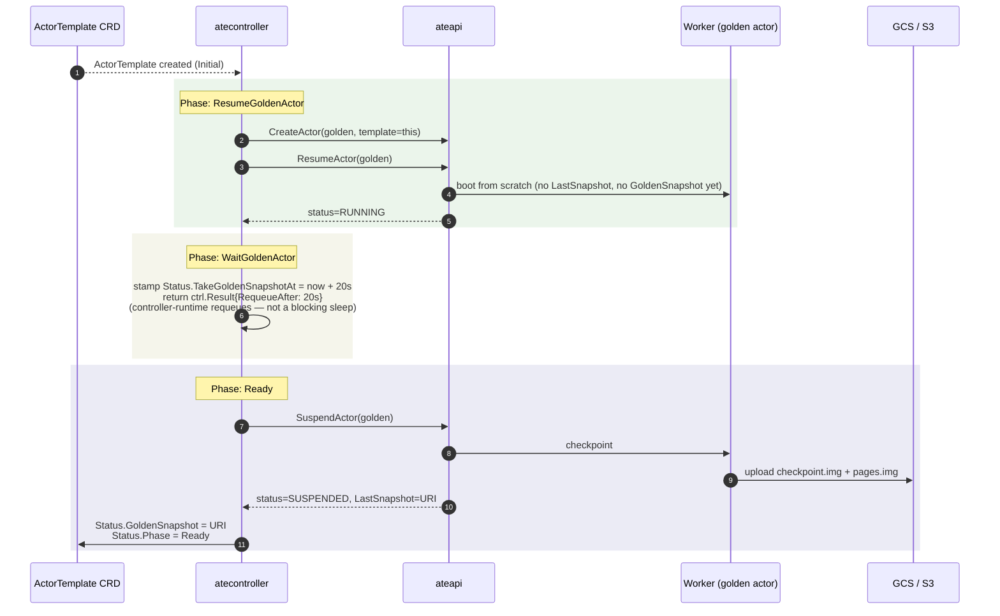

An `ActorTemplate` says *"this is what an actor of this kind looks like"* —
image, entrypoint, env vars, worker pool. By itself that's just a manifest.
The interesting part is that `atecontroller` immediately uses it to **create
one throwaway actor, let it boot, then snapshot it** — producing a **golden
snapshot** that all future actors of this template can restore from instead
of cold-booting.

This is what lets new actors come up in milliseconds: they're not booting,
they're being restored from a pre-recorded RAM image.

## Phase machine

`PhaseFailed` is declared in the CRD type but the reconciler never assigns
it — errors return up and trigger a normal requeue.

<code class="fileref">internal/controllers/actortemplate_controller.go:70-155</code>

## Sequence

## What "Ready" means

Once `ActorTemplate.Status.GoldenSnapshot` is set:

- Any subsequent `CreateActor + ResumeActor` for an actor of this template
  will be **restored from the golden snapshot** (priority 2 in the resume
  workflow's strategy selection, see
  <code class="fileref">workflow_resume.go:230-248</code>).
- The result: new actors of this template come up in **lazy-page-restore
  time**, not cold-boot time.

## The 20-second wait — why?

The reconciler **waits 20 seconds between resume and suspend** to give the
workload time to initialize. It's not a blocking sleep: the reconciler
stamps `Status.TakeGoldenSnapshotAt = now + 20s` and returns
`ctrl.Result{RequeueAfter: 20s}`, so controller-runtime re-fires reconcile
later. This is intentionally crude: the controller has no protocol for
"ready" callbacks from arbitrary user code, so it just budgets a fixed
window.

If your workload needs longer (e.g. downloading a model), the resulting
golden snapshot will be of a partially-initialized process — and that's
what every actor of this template will restore from. You'd typically build
the heavy initialization into your container image instead.

<code class="fileref">internal/controllers/actortemplate_controller.go:112</code>

## What about the workload running during the wait?

Yes, real CPU/memory is consumed during the 20-second wait. The golden
actor is a normal actor on a normal worker pod — atecontroller is just
using the user-facing `CreateActor`/`ResumeActor`/`SuspendActor` API,
exactly as a client would. The reconcile goroutine is *not* blocked
during the wait; the work-queue holds the item until `RequeueAfter`
elapses.

## After Ready

The golden actor record stays in Redis but with `status=SUSPENDED`. It can
be re-resumed and re-suspended to refresh the snapshot (e.g. if the
template's image changes). Today this happens via re-reconcile when the
spec changes.

## Failure paths

The reconciler does **not** transition to `PhaseFailed` on errors — it
simply returns the error up to controller-runtime, which requeues with
backoff. The phase stays at whatever it was (Initial / ResumeGoldenActor /
WaitGoldenActor), and the next reconcile retries the same step.

- **CreateActor fails** → stays in `Initial`, requeued.
- **ResumeActor fails** (no workers, image pull error) → stays in
  `ResumeGoldenActor`, requeued.
- **SuspendActor fails** (checkpoint or upload error) → stays in
  `WaitGoldenActor`, requeued.

The golden actor record may be left dangling on a worker if a reconcile
errored mid-flow — cleanup is the operator's responsibility for now.

## Related

- [Resume actor](/flows/resume-actor/) — sees the GoldenSnapshot strategy
  branch in action.
- [Actor lifecycle](/flows/actor-lifecycle/) — full state machine.
- [atecontroller](/components/atecontroller/) — reconciler internals (Cut 3).
- [ActorTemplate](/concepts/actortemplate/) — the CRD itself (Cut 3).
