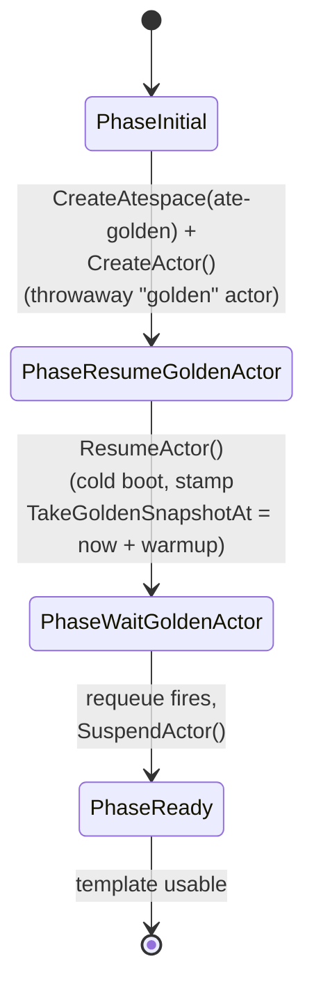

import goldenLifecycle from '../../../assets/golden-snapshot-lifecycle.svg?raw';

An `ActorTemplate` says *"this is what an actor of this kind looks like"* -
container image(s), entrypoint, env vars, sandbox class, and a
`workerSelector`. By itself that's just a manifest. (The template no longer
names a worker pool: placement is selector-based, so an `ActorTemplate` and
a `WorkerPool` are decoupled - see [WorkerPool](/concepts/workerpool/).)

The interesting part is how Substrate produces the **golden snapshot** that
later lets actors of this template come up in milliseconds. It does *not*
build the snapshot statically from the image. Instead:

:::caution[The snapshot is recorded, not built]
`atecontroller` reacts to the new template by ensuring the reserved
**`ate-golden`** atespace exists (`CreateAtespace`), creating a **throwaway
"golden" actor** into it (`CreateActor`), calling `ResumeActor` on it, and
letting the workload **actually boot on a real worker pod** - same sandbox
(gVisor or micro-VM), same pulled OCI image, real CPU and RAM. Once the
workload has had time to initialize it issues `SuspendActor`, which
checkpoints the running sandbox. atelet uploads the resulting snapshot
files to external storage (GCS/S3), and the URI prefix gets stamped back
onto `ActorTemplate.Status.GoldenSnapshot`.

So the "golden" image is a **live memory snapshot of a freshly-booted
workload**, not a precomputed artifact. New actors get the side effects of
all that initialization work - heap state, JIT caches, opened FDs, parsed
config - without paying for it again.
:::

<figure style="margin: 1.5rem 0;">
  <div class="atlas-hero-svg" set:html={goldenLifecycle} />
  <figcaption style="text-align: center; font-size: 0.85em; opacity: 0.7; margin-top: 0.5rem;">
    The bootstrap really does occupy a worker pod for the warmup window - that pod is
    the one a regular actor would have gotten. After Ready, every later actor of this
    template skips ①–④ entirely and restores from the external snapshot.
  </figcaption>
</figure>

## Phase machine

The reconciler drives the template through four phases, tracked in
`Status.Phase`. `PhaseInitial` is the empty-string zero value, so a freshly
applied template starts there.



`PhaseFailed` is declared in the CRD type but the reconciler never assigns
it - errors return up and trigger a normal requeue.

## Sequence

```mermaid
sequenceDiagram
  autonumber
  participant K as ActorTemplate CRD
  participant CT as atecontroller
  participant A as ateapi
  participant W as Worker (golden actor)
  participant G as GCS / S3

  K-->>CT: ActorTemplate created (PhaseInitial)

  rect rgb(235,245,235)
    Note over CT: PhaseInitial → PhaseResumeGoldenActor
    CT->>A: CreateAtespace(ate-golden)<br/>(idempotent; ignores AlreadyExists)
    CT->>A: CreateActor(golden actor into ate-golden, template=this)
  end

  rect rgb(235,245,235)
    Note over CT: PhaseResumeGoldenActor → PhaseWaitGoldenActor
    CT->>A: ResumeActor(golden)
    A->>W: boot from scratch (no snapshot, no GoldenSnapshot yet)
    A-->>CT: RUNNING (ResumeActor waits on readyz)
    CT->>CT: stamp Status.TakeGoldenSnapshotAt = now + warmup<br/>(warmup = 0 if every container has a readyz probe)
  end

  rect rgb(245,245,235)
    Note over CT: PhaseWaitGoldenActor
    CT->>CT: if now < TakeGoldenSnapshotAt:<br/>return ctrl.Result{RequeueAfter: remaining}<br/>(controller-runtime requeues - not a blocking sleep)
  end

  rect rgb(235,235,245)
    Note over CT: PhaseWaitGoldenActor → PhaseReady
    CT->>A: SuspendActor(golden)
    A->>W: checkpoint
    W->>G: upload snapshot files (parallel)
    A-->>CT: SUSPENDED, latest_snapshot_info.external.snapshot_uri_prefix
    CT->>K: Status.GoldenSnapshot = URI prefix<br/>Status.Phase = PhaseReady<br/>Ready condition = True
  end
```

## What "Ready" means

Once `ActorTemplate.Status.GoldenSnapshot` is set:

- Any subsequent `CreateActor + ResumeActor` for an actor of this template
  will be **restored from the golden snapshot** - unless the actor has its
  own newer snapshot. The resume workflow picks the restore strategy in this
  order: the actor's own `latest_snapshot_info` (local or external) if set,
  else the template's `GoldenSnapshot` (when `ResumeActor` was not called
  with `boot=true`), else a cold boot from the template spec.
- The result: new actors of this template come up in **lazy-page-restore
  time**, not cold-boot time.

## The warmup wait - why?

The reconciler stamps `Status.TakeGoldenSnapshotAt = now + warmup` after
resuming and defers the suspend until that time. It's not a blocking sleep:
`PhaseWaitGoldenActor` returns `ctrl.Result{RequeueAfter: remaining}`, so
controller-runtime re-fires reconcile later.

The warmup is now a **fallback**, not a fixed 20 seconds for everyone:

- If **every** container in the template declares a `readyz` HTTP probe, the
  warmup is **0**. `ResumeActor` already blocks until each container's `readyz`
  reports 200 (both runtimes wait for every readiness probe before `Run` /
  `Restore` returns), so the workload is already initialized by the time the
  controller gets `RUNNING` back - no extra wait is needed.
- Otherwise (any container lacks a probe, or the template declares no
  containers), it falls back to a default **20 s** warmup as a coarse "give the
  workload time to initialize" budget.

If you rely on the fallback and your workload needs longer (e.g. downloading
a model), the resulting golden snapshot will be of a partially-initialized
process - and that's what every actor of this template will restore from.
Declaring a `readyz` probe (or baking the heavy initialization into your
container image) is the way to make this deterministic.

## What about the workload running during the wait?

Yes - the golden actor is occupying a real worker pod, eating real
resources, for the whole warmup window (see the callout at the top of the
page). The reconcile goroutine is *not* blocked during the wait; the
work-queue holds the item until `RequeueAfter` elapses, so atecontroller
is free to handle other reconciles in the meantime.

If an eligible `WorkerPool` is sized tightly, this matters: bootstrap
consumes a slot. Operationally you'll want to either provision an extra
worker for the bootstrap window, or accept that during warmup one fewer
worker is available for traffic. (Which pool the golden actor lands on is
selector-based, like any other actor of the template.)

## After Ready

The golden actor record stays in Redis (in the `ate-golden` atespace) with
`status=SUSPENDED`. Once a template reaches `PhaseReady` the reconciler is a
no-op for it: the `ActorTemplate` spec is **immutable** after creation, so
there is no in-place "refresh" - you create a new template (with a new
image) to get a new golden snapshot.

## Failure paths

The reconciler does **not** transition to `PhaseFailed` on errors - it
simply returns the error up to controller-runtime, which requeues with
backoff. The phase stays at whatever it was (`PhaseInitial` /
`PhaseResumeGoldenActor` / `PhaseWaitGoldenActor`), and the next reconcile
retries the same step.

- **CreateAtespace / CreateActor fails** → stays in `PhaseInitial`,
  requeued (`AlreadyExists` on the atespace is ignored, not an error).
- **ResumeActor fails** (no eligible workers, image pull error) → stays in
  `PhaseResumeGoldenActor`, requeued.
- **SuspendActor fails** (checkpoint or upload error), or the suspended
  actor comes back without an external snapshot → stays in
  `PhaseWaitGoldenActor`, requeued.

The golden actor record may be left dangling on a worker if a reconcile
errored mid-flow - cleanup is the operator's responsibility for now.

## Related

- [Resume actor](/flows/resume-actor/) - sees the GoldenSnapshot strategy
  branch in action.
- [Actor lifecycle](/flows/actor-lifecycle/) - full state machine.
- [atecontroller](/components/atecontroller/) - reconciler internals.
- [ActorTemplate](/concepts/actortemplate/) - the CRD itself.
- [Atespace](/concepts/atespace/) - including the reserved `ate-golden`.
