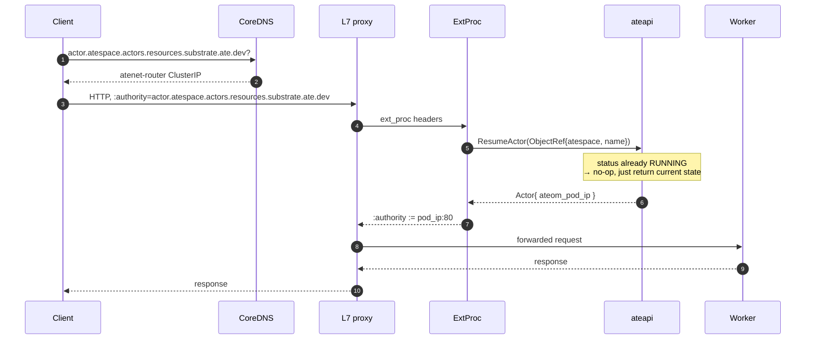
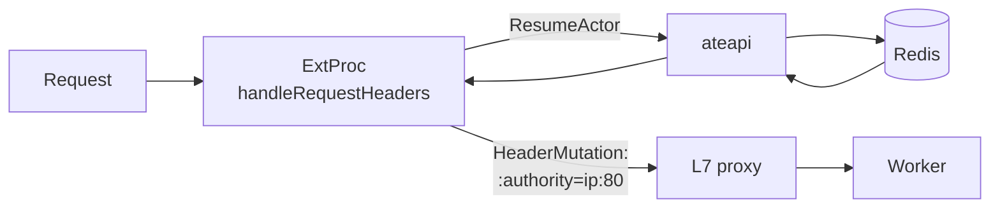

The [resume actor flow](/flows/resume-actor/) covers the **cold** path
end-to-end. This page focuses on the **routing mechanics**: how atenet
discovers the worker IP for a given actor, what the L7 proxy is configured to
do, and what happens when the actor is already running (the warm path).

## Warm path - already running actor

In the warm case `ResumeActor` is a quick Redis read of the actor record
(`actor:<atespace>:<name>`) that returns the running actor's current
`ateom_pod_ip` - no atelet, no GCS, no runsc. The actor is already on a worker;
we just need to learn which one.

## Why there's no per-pod sidecar

There is **one L7-proxy Deployment** for the whole cluster (atenet router).
Every request goes through it. This is deliberate:

- A sidecar per worker pod would mean configuring N proxies any time routing
  state changes. With a centralized proxy, the xDS snapshot lives in one
  place.
- The cost of one extra hop is dwarfed by the cost of a cold actor restore.
- Worker pods are stateless - Substrate is free to repack actors onto any
  worker, and the router just learns the new IP from ateapi on the next
  request.

## How atenet learns the worker IP

There is **no cache** in atenet. ExtProc calls `ResumeActor` on every
request and gets back the current `ateom_pod_ip` from the Actor record in
Redis.

This costs one extra hop per request but guarantees the router never gets
stale routing data. If an actor moved from worker A to worker B between two
requests, the second request sees the new IP without any cache invalidation
choreography.

<code class="fileref">cmd/atenet/internal/router/extproc.go</code> ·
<code class="fileref">cmd/atenet/internal/router/extproc_out.go</code>

## The singleflight optimization

Hammering ExtProc with 50 simultaneous requests for the same cold actor
would otherwise produce 50 `ResumeActor` calls. ExtProc wraps the call in a
[`golang.org/x/sync/singleflight`](https://pkg.go.dev/golang.org/x/sync/singleflight)
group keyed by `<atespace>/<actor_name>` - the first call goes through, the rest
piggyback on its result.

<code class="fileref">cmd/atenet/internal/router/resumer.go</code>

## Tracing

The router is instrumented with **OpenTelemetry**. Envoy emits an ingress span
per request (when an OTLP collector is configured on the xDS snapshot), and
ExtProc extracts any inbound `traceparent` from the request headers to start its
own `ExtProc.RequestHeaders` span, with a nested `ResumeActor` span, so the
per-request work links back to the Envoy ingress span. The ExtProc gRPC server
also runs the `otelgrpc` stats handler.

<code class="fileref">cmd/atenet/internal/router/extproc.go</code> ·
<code class="fileref">cmd/atenet/internal/router/resumer.go</code>

## L7 proxy configuration via xDS

The proxy is bootstrapped pointing at the atenet router's **xDS server on
`:18000`**. The xDS snapshot has:

| Element | Purpose |
|---|---|
| `ingress_http_listener` (:8080) | Plain HTTP ingress |
| `ingress_https_listener` (:8443) | HTTPS ingress |
| Route `substrate_routes` | Sends everything through ext_proc |
| Cluster `ate-cluster` | Static cluster pointing at ExtProc (:50051) |
| Cluster `dynamic_forward_proxy_cluster` | Forwards to whatever :authority the proxy now holds |

When an OTLP collector address is configured, the snapshot also carries an
`otel_collector_cluster` and the connection manager gets an OpenTelemetry
tracing provider, so the proxy emits ingress spans.

The snapshot is refreshed every 5 seconds by a controller loop that
re-reads `atStore.readyTemplates(...)` and rebuilds the snapshot - it's a
**periodic poll**, not an informer-driven watch.

<code class="fileref">cmd/atenet/internal/router/xds.go</code> ·
<code class="fileref">cmd/atenet/internal/router/controller.go</code>

## DNS - why we resolve to the router, not the worker

Worker IPs can change at any moment (actors move between workers). If DNS
returned a worker IP directly, clients would cache it and break the first
time the actor migrated.

Instead CoreDNS returns the **router's ClusterIP** for any name matching
`*.actors.resources.substrate.ate.dev` (the DNS controller looks up the
`atenet-router` Service ClusterIP in `ate-system` and bakes it into the
Corefile `template` plugin). The router (via ExtProc) does the per-request
lookup that yields the current worker IP - and rewrites `:authority` so the
proxy's `dynamic_forward_proxy_cluster` hits it.

<code class="fileref">cmd/atenet/internal/dns/dns.go</code> ·
<code class="fileref">cmd/atenet/internal/dns/corefile.go</code>

## Error mapping

`mapResumeError` translates the gRPC status from ateapi into an HTTP status
(the original error is preserved via `Unwrap` for logging):

| ateapi gRPC code | HTTP status |
|---|---|
| `NotFound` (no such actor) | 404 Not Found |
| `FailedPrecondition` (no free workers) | 503 Service Unavailable (keeps the gRPC message) |
| `Unavailable` | 503 Service Unavailable |
| `DeadlineExceeded` | 504 Gateway Timeout |
| `PermissionDenied` | 403 Forbidden |
| `Unauthenticated` | 401 Unauthorized |
| `ResourceExhausted` | 429 Too Many Requests |
| anything else | 500 Internal Server Error (generic body, no server detail leaked) |

An unparseable `:authority`/`Host` is rejected earlier with a 404 before any
`ResumeActor` call. `Aborted` (a concurrent resume) never reaches this table:
`ActorResumer` retries it internally with backoff.

<code class="fileref">cmd/atenet/internal/router/errors.go</code>

## Related

- [Resume actor](/flows/resume-actor/) - the cold path in full.
- [atenet](/components/atenet/) - router + DNS internals.
- [System topology](/topology/) - where the router sits in the cluster.
