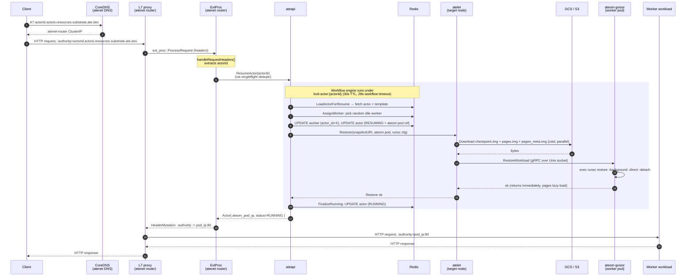
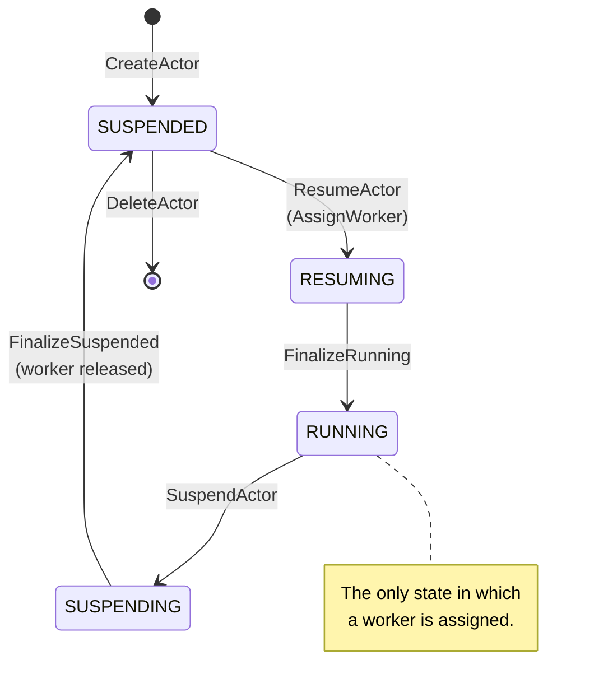

This is **the** flow to understand if you want to understand Substrate. It
touches DNS, the L7 proxy, ExtProc, ateapi's workflow engine, the Redis store,
atelet, GCS, ateom-gvisor, and `runsc restore`. Six components and two data
stores collaborate on a single HTTP request.

## The setup

- The actor was created earlier (status `SUSPENDED`, with a `LastSnapshot`
  pointing at a checkpoint in GCS).
- A pool of worker pods is pre-warmed and **idle** (`actor_id == ""`).
- A client wants to hit the actor.

## The full sequence (cold path)



## What's happening in each step

### 1–3. DNS to the front door

The client resolves `actorId.actors.resources.substrate.ate.dev`. The atenet **DNS controller**
programs CoreDNS so this name pattern always returns the **ClusterIP of the
atenet router service** — not the worker IP. This is deliberate: the worker IP
isn't known until ExtProc consults ateapi, and it may change between requests
if the actor moves between workers.

<code class="fileref">internal/dns/dns.go:71-88</code> ·
<code class="fileref">internal/dns/corefile.go:42-59</code>

### 4–5. L7 proxy + ExtProc

The L7 proxy accepts the request on `:8080` and applies a single `ext_proc` filter
that streams headers to **ExtProc on `:50051`**. ExtProc extracts the actor
ID from the `:authority` header and decides where the request should go.

<code class="fileref">cmd/atenet/internal/app/router/extproc.go:125-175</code>
(`handleRequestHeaders` lives in `extproc.go`; `extproc_in.go` only holds
the `requestMetadata` / `parseActorID` helpers.)

### 6. ResumeActor (with singleflight)

ExtProc calls `ateapi.ResumeActor(actorId)`. To avoid stampedes when 50
concurrent requests hit a cold actor, ExtProc wraps the call in a
`singleflight.Group` so only the first call goes through; the rest piggyback
on its result.

<code class="fileref">cmd/atenet/internal/app/router/resumer.go:29-93</code>

### 7–9. ateapi runs the resume workflow

ateapi acquires `lock:actor:<actorId>` in Redis (30s TTL, 28s workflow
timeout) and steps through:

1. **LoadActorForResume** — fetch actor + ActorTemplate.
2. **AssignWorker** — random shuffle over idle workers in the target
   WorkerPool; update Redis: worker becomes assigned, actor goes `RESUMING`.
3. **CallAteletRestore** — pick which restore strategy to use, then call
   atelet on the chosen pod's IP.
4. **FinalizeRunning** — set actor to `RUNNING`.

<code class="fileref">cmd/ateapi/internal/controlapi/workflow_resume.go:35-293</code>

The restore strategy priority (lines 213–265):

```
if actor.LastSnapshot exists                  → restore from it
else if template.GoldenSnapshot exists & !boot → restore from golden snapshot
else                                          → atelet.Run (boot from scratch)
```

### 10–14. atelet does the heavy lifting

atelet's `Restore` handler downloads the three snapshot files from GCS in
parallel, zstd-decompresses them onto the worker pod's local volume at
`/var/lib/ateom-gvisor/actors/{ns}:{name}:{id}/restore-state/`, then calls
ateom-gvisor over the Unix socket to begin the restore.

<code class="fileref">cmd/atelet/main.go:414-474</code>

### 15–16. ateom-gvisor runs `runsc restore -background -direct`

This is where the magic happens. The `-background` flag enables **demand
paging**: `runsc` returns control as soon as the sentry is up; actual memory
pages stream in lazily as the workload touches them. `-direct` skips some
gVisor security restrictions for snapshot data. `-detach` returns
immediately.

<code class="fileref">cmd/ateom-gvisor/runsc.go:134-158</code>

This is the trick that makes resume *fast*: we don't wait for the entire
snapshot to be paged in before serving the request — only what the workload
actually needs to handle this request.

### 17–18. ExtProc rewrites :authority

When ResumeActor returns, the Actor object now carries `ateom_pod_ip`.
ExtProc emits a header-mutation response telling the proxy to overwrite
`:authority` with `<pod_ip>:80`. The proxy then forwards the request to the
worker.

<code class="fileref">cmd/atenet/internal/app/router/extproc_out.go:36-44</code>

### 19–22. The workload responds

From the workload's perspective, this is a plain old HTTP request arriving at
its listener. It has no idea it was suspended five seconds ago.

## What if there are no idle workers?

ateapi's `AssignWorkerStep` retries 5 times with exponential backoff (10ms
initial). If no worker is available after that, it returns
`codes.FailedPrecondition`, which ExtProc maps to HTTP **503
ServiceUnavailable**.

<code class="fileref">cmd/ateapi/internal/controlapi/workflow_resume.go:134-141</code> ·
<code class="fileref">cmd/atenet/internal/app/router/errors.go:66-71</code>

## What about the warm path?

If the actor is already `RUNNING`, the workflow is a no-op: `ResumeActor`
returns the current Actor (with current `ateom_pod_ip`) and ExtProc proceeds
straight to step 17. Same code path, just no atelet / GCS / runsc work.

## State transitions during this flow



## Why this design is interesting

- **No K8s scheduler on the hot path.** Worker pods are pre-warmed; ateapi
  picks one in microseconds via a Redis lookup.
- **No per-pod sidecar.** A single L7-proxy fleet handles all routing.
- **Lazy-paging restore.** The workload is "back" the instant `runsc restore
  -background` returns; pages come in on demand.
- **Per-actor distributed lock.** Two concurrent `Resume` calls for the same
  actor don't race — the second one waits or gets `Aborted`.

## Related

- [Suspend actor](/flows/suspend-actor/) — the reverse flow (Cut 2).
- [Actor lifecycle](/flows/actor-lifecycle/) — full state machine (Cut 2).
- [ateapi internals](/components/ateapi/) — the workflow engine in detail.
