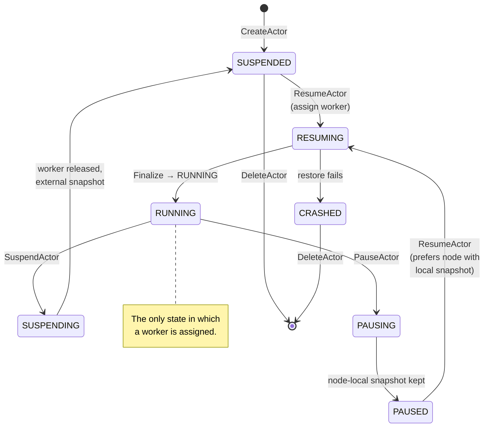

import nodeHostpath from '../../../assets/resume-node-hostpath.svg?raw';
import lazyPaging from '../../../assets/resume-lazy-paging.svg?raw';

This is **the** flow to understand if you want to understand Substrate. It
touches DNS, the L7 proxy, ExtProc, ateapi's workflow engine, the Redis store,
atelet, GCS, ateom-gvisor, and `runsc restore`. Six components and two data
stores collaborate on a single HTTP request.

## The setup

- The actor was created earlier and is now `SUSPENDED` (or `PAUSED`), carrying a
  `latest_snapshot_info` that points at a checkpoint - either an
  `ExternalSnapshotInfo` in object storage (Suspend) or a `LocalSnapshotInfo`
  kept on a specific worker node's VM (Pause).
- A pool of worker pods is pre-warmed and **idle** (no `assignment`).
- A client wants to hit the actor, addressed by its `(atespace, name)` identity.

## The full sequence (cold path)

```mermaid
sequenceDiagram
  autonumber
  participant C as Client
  participant DNS as CoreDNS<br/>(atenet DNS)
  participant E as L7 proxy<br/>(atenet router)
  participant X as ExtProc<br/>(atenet router)
  participant A as ateapi
  participant R as Redis
  participant L as atelet DaemonSet<br/>(on assigned worker's node)
  participant G as GCS / S3
  participant O as ateom-gvisor<br/>(worker pod)
  participant W as Worker workload

  C->>DNS: A? actor.atespace.actors.resources.substrate.ate.dev
  DNS-->>C: atenet-router ClusterIP
  C->>E: HTTP request, :authority=actor.atespace.actors.resources.substrate.ate.dev

  E->>X: ext_proc: ProcessRequest (headers)
  Note over X: parse request headers<br/>host → (atespace, actor_name)

  X->>A: ResumeActor(ObjectRef{atespace, name})<br/>(de-duplicated, key atespace/name)

  rect rgb(240,240,255)
    Note over A,R: Workflow engine runs under<br/>lock:actor:{atespace}:{name} (30s TTL, 28s workflow timeout)

    A->>R: Load actor → fetch actor + template
    A->>R: Assign worker: pick random idle eligible worker<br/>(local snapshot? restrict to nodes that hold it)
    A->>R: UPDATE worker (assignment), UPDATE actor (RESUMING + ateom pod ref)

    Note over A,L: Dial atelet on the *node* hosting<br/>the assigned worker pod (atelet pod IP : 8085)
    A->>L: Restore(snapshot config, ateom pod, workload spec)
    L->>G: Fetch manifest, then download checkpoint images (zstd, parallel)<br/>[LocalSnapshotInfo → copy from node instead]
    G-->>L: bytes
    L->>O: Restore call (gRPC over Unix socket)
    O->>O: setup veth+nftables, exec runsc restore -background -direct -detach
    O->>O: wait on container readyz (200)
    O-->>L: ok (sentry up; pages lazy-load)
    L-->>A: Restore ok

    A->>R: Finalize → RUNNING: UPDATE actor (RUNNING)
  end

  A-->>X: Actor{ ateom_pod_ip, status=RUNNING }
  X-->>E: HeaderMutation: :authority := pod_ip:80

  E->>W: HTTP request, :authority=pod_ip:80
  W-->>E: HTTP response
  E-->>C: HTTP response
```

## What's happening in each step

### 1–3. DNS to the front door

The client resolves `<actor_name>.<atespace>.actors.resources.substrate.ate.dev`
(both labels are DNS-1123). The atenet **DNS controller** programs CoreDNS so
this name pattern always returns the **ClusterIP of the atenet router service** -
not the worker IP. This is deliberate: the worker IP isn't known until ExtProc
consults ateapi, and it may change between requests if the actor moves between
workers.

### 4–5. L7 proxy + ExtProc

The L7 proxy accepts the request on `:8080` and applies a single `ext_proc` filter
that streams headers to **ExtProc on `:50051`**. ExtProc parses the `:authority`
(or `Host`) header into an **`(atespace, actor_name)`** pair (port stripped); an
unparseable host is answered with a 404.

### 6. ResumeActor (with request coalescing)

ExtProc calls `ResumeActor` with an `ObjectRef{atespace, name}`. To avoid
stampedes when 50 concurrent requests hit a cold actor, ExtProc dedupes
concurrent calls keyed by `<atespace>/<actor_name>` so only the first call goes
through; the rest piggyback on its result. The in-flight resume runs under a
detached background timeout so a caller disconnecting doesn't abort the resume
for the others, and `Aborted` (a concurrent resume) is retried with backoff.
ExtProc also opens an OTel span here.

### 7–9. ateapi runs the resume workflow

ateapi acquires `lock:actor:<atespace>:<name>` in Redis (30s TTL, 2s padding →
28s workflow timeout) and steps through:

1. **Load the actor** and its `ActorTemplate`.
2. **Assign a worker** - random shuffle over idle **eligible** workers (the
   worker's `sandbox_class` must match the template's, and both the template's
   `workerSelector` and the actor's own `worker_selector` must match the
   worker's labels), then claim one via an `assignment`; the actor goes
   `RESUMING`. **If the actor's `latest_snapshot_info` is a local snapshot**,
   the free-worker search is restricted to the nodes in
   `node_vms_with_local_snapshots` so the resume lands back on a node that
   already holds the bytes.
3. **Call atelet to restore** - pick which restore strategy to use, then
   resolve the atelet DaemonSet pod that runs on the *same node* as the
   assigned worker and dial that atelet's pod IP on `:8085`. atelet is a
   per-node DaemonSet, not a per-pod sidecar - one atelet serves every worker
   pod scheduled to its node.
4. **Finalize** - set actor to `RUNNING`.

The restore strategy branches on the actor's `latest_snapshot_info` first, then
the template's golden snapshot, then a cold boot:

```
if actor.latest_snapshot_info is set          → Restore from it
    ├─ LocalSnapshotInfo  → CHECKPOINT_TYPE_LOCAL, scope = onPause
    └─ ExternalSnapshotInfo → CHECKPOINT_TYPE_EXTERNAL, scope = onCommit
else if template.GoldenSnapshot != "" && !boot → Restore from golden snapshot
else                                          → cold boot from spec (Run)
```

`boot=true` on the `ResumeActorRequest` forces the cold path by skipping the
golden snapshot.

### 10–14. atelet does the heavy lifting

:::note[What ateom-gvisor actually is]
A worker pod runs **exactly one container** - and that container is
**ateom-gvisor**, a small gRPC server. ateom-gvisor
is **not** itself sandboxed; it runs as PID 1 in the worker pod with normal
container privileges. Its job is to receive RPCs from atelet and `exec`
`runsc` (the gVisor runtime), which spawns a **separate gVisor sandbox**.
The actor's workload - pulled from the **actor's OCI image** - runs *inside
that sandbox*, not alongside ateom-gvisor. The pod hosts at most one such
sandbox at a time. See [ateom-gvisor](/components/ateom-gvisor/) for the
RPC surface.
:::

**Where the actor's state actually lands: on the node, not in the pod.**
When atelet restores, it first fetches the small `manifest.json` (which pins
the sandbox binaries and lists the checkpoint files), then downloads the
snapshot images from GCS/S3 in parallel and zstd-decompresses them onto the
**node's own filesystem**, under
`/var/lib/ateom-gvisor/actors/<actor-uid>/restore-state/`. For a
`LocalSnapshotInfo` there's no download at all - atelet copies the images from
the node's local checkpoint dir instead. The files are owned by the host -
they're not written into either pod's container filesystem.

How does the worker pod then *see* those bytes? Through a **`hostPath`
bind mount**. Both pods on the node - the atelet DaemonSet pod and every
worker pod - mount the same node directory `/var/lib/ateom-gvisor` into
their own filesystem at the same path. A `hostPath` volume is a slice of
the host's filesystem grafted into the pod's mount namespace, so when
atelet writes a file there, ateom-gvisor (inside the worker pod) reads
exactly the same bytes - no copy, no network, same inode.

This is also why the gRPC channel from atelet to ateom-gvisor can be a
**unix socket**: the socket file `/var/lib/ateom-gvisor/ateoms/<podUID>/ateom.sock`
sits in the same shared hostPath, so both ends address it by the same
path. atelet opens it and makes the Restore call; ateom-gvisor, listening
on the same path inside the worker pod, accepts the call and proceeds with
the restore.

<figure style="margin: 1.5rem 0;">
  <div class="atlas-hero-svg" set:html={nodeHostpath} />
  <figcaption style="text-align: center; font-size: 0.85em; opacity: 0.7; margin-top: 0.5rem;">
    Two pods on one node, talking through the node's own filesystem. The shared
    <code>hostPath</code> is how atelet "delivers" the snapshot files <em>and</em>
    where it finds the unix socket to ateom-gvisor. Note the purple
    <strong>gVisor sandbox</strong> inside the worker pod - that's a separate
    runsc-managed sandbox that ateom-gvisor spawns; the actor's OCI image runs
    in there, not in ateom-gvisor itself.
  </figcaption>
</figure>

The pieces worth noticing in that picture:

- **atelet is per-node, not per-pod.** One DaemonSet pod handles every
  worker pod scheduled to that node. It does not run as a sidecar.
- **ateom-gvisor and the actor live at different layers.** ateom-gvisor is
  the *pod's* container (PID 1, unsandboxed). The actor runs in a
  *runsc-managed gVisor sandbox* that ateom-gvisor spawns - a sibling
  process tree, not a child of the ateom-gvisor binary. The "exec runsc
  restore" step is the moment the sandbox comes into existence.
- **The snapshot images are downloaded in parallel** and streamed through
  `zstd` on the way to disk. atelet doesn't assume a fixed file list - the
  manifest tells it exactly which files the runtime wrote.
- **The download and the bundle prep overlap.** atelet runs the checkpoint
  download (or local copy) *concurrently* with fetching the sandbox assets and
  unpacking the OCI image, since only the final Restore call needs both.
- **The unix socket path is conventional, not negotiated.** atelet
  composes it from the worker pod's UID
  (`/var/lib/ateom-gvisor/ateoms/<podUID>/ateom.sock`) and dials it
  directly. ateom-gvisor inside the worker pod is listening on the same
  path because it sees the same mount.
- **OCI bundle goes there too.** Before making the Restore call, atelet
  writes a fresh `config.json` + rootfs (unpacked from the actor's image)
  into the hostPath so `runsc restore` finds everything in one place.
- **The actor's identity file is (re)written on every resume.** atelet writes
  the actor's own name to `/run/ate/actor-id` (atomic write) in a per-actor
  identity dir and bind-mounts that dir read-only into each application
  container - so the value is correct even when the actor was restored from a
  shared golden snapshot whose checkpointed process env would otherwise carry
  the golden actor's identity.

### 15–16. ateom-gvisor sets up networking, then runs `runsc restore -background -direct`

Before restoring, ateom-gvisor (re)builds the actor's network: a **veth pair**
between the pod netns (`ateom0`, `169.254.17.1/30`) and the interior sandbox
netns (`eth0`, `169.254.17.2/30`), plus an nftables table `ateom_actor` that
masquerades actor egress and DNATs inbound pod-IP:80 traffic to the actor. The
pod keeps its real `eth0`; the veth pair is torn down on checkpoint and rebuilt
on restore. See [ateom-gvisor](/components/ateom-gvisor/) for the full wiring.

Then it runs the restore. The `-background` flag enables **demand paging**.

:::note[What "demand paging" means]
A normal "eager" restore would have to copy the *entire* `pages.img` file
into the sandbox's RAM before the workload could execute a single
instruction - for a multi-GB snapshot that's seconds of wall clock spent
just shuffling bytes.

**Demand paging** flips that: `runsc` brings the sentry up immediately
with `pages.img` mapped but **not yet resident in memory**. The very
first time the workload reads or writes a given memory page, the CPU
takes a *page fault*; `runsc` catches the fault, reads just that one
page out of `pages.img`, hands it to the workload, and execution
continues. Pages that the workload never touches are never loaded at
all.

This is the same trick the Linux kernel uses for `mmap`'d files and for
loading executables - it's just being applied to the RAM image of a
checkpointed process.
:::

So `-background` returns control as soon as the sentry is up; actual
memory pages stream in lazily, on fault, as the workload touches them.
`-direct` skips some gVisor security restrictions for snapshot data.
`-detach` returns immediately.

<figure style="margin: 1.5rem 0;">
  <div class="atlas-hero-svg" set:html={lazyPaging} />
  <figcaption style="text-align: center; font-size: 0.85em; opacity: 0.7; margin-top: 0.5rem;">
    Without <code>-background</code>, restore would have to map every page of
    <code>pages.img</code> before the workload can run a single instruction.
    With it, the sentry is "up" the moment the metadata is loaded; the first
    HTTP request page-faults its own working set in.
  </figcaption>
</figure>

A few things to note about this trick:

- **The first request pays a small page-in tax**, but only for the pages it
  actually touches - usually a tiny fraction of resident memory.
- **Subsequent requests are warm.** Once a page is in, it stays in until
  the actor suspends again, so steady-state latency is whatever the
  workload's normal latency is.
- **`-detach` is what makes `runsc restore` return.** Without it, the exec
  would block until the sandboxed process exited. Combined with `-background`,
  the sentry is up in milliseconds without paging the whole memory image in.
- **The Restore call still waits on readyz.** After the restore exec returns,
  ateom-gvisor blocks until every readyz-enabled container reports HTTP 200
  (probing the actor's veth IP) before it returns `ok` to atelet. So ateapi
  finalizes the actor to `RUNNING` only once the workload is actually serving.

This is the trick that makes resume *fast*: we don't wait for the entire
snapshot to be paged in before serving the request - only what the workload
actually needs to handle this request.

### 17–18. ExtProc rewrites :authority

When ResumeActor returns, the Actor object now carries `ateom_pod_ip`.
ExtProc emits a header-mutation response telling the proxy to overwrite
`:authority` with `<pod_ip>:80`. The proxy then forwards the request to the
worker.

### 19–22. The workload responds

From the workload's perspective, this is a plain old HTTP request arriving at
its listener. It has no idea it was suspended five seconds ago.

## What if there are no idle workers?

ateapi's assign-worker step retries a few times with exponential backoff (10ms
initial, factor 2, jitter). If no eligible worker is available after that, it
fails with a "no free workers available" precondition error, which ExtProc maps
to HTTP **503 ServiceUnavailable**.

## What about the warm path?

If the actor is already `RUNNING`, the workflow is a no-op: `ResumeActor`
returns the current Actor (with current `ateom_pod_ip`) and ExtProc proceeds
straight to step 17. Same code path, just no atelet / GCS / runsc work.

## State transitions during this flow



`ResumeActor` can wake an actor from either `SUSPENDED` (restore from an
external snapshot) or `PAUSED` (restore from the node-local snapshot, steered
back to a node that holds it). A restore failure lands the actor in `CRASHED`;
both `SUSPENDED` and `CRASHED` actors can be deleted.

## Why this design is interesting

- **No K8s scheduler on the hot path.** Worker pods are pre-warmed; ateapi
  picks one in microseconds via a Redis lookup.
- **No per-pod sidecar.** A single L7-proxy fleet handles all routing.
- **Lazy-paging restore.** The workload is "back" the instant `runsc restore
  -background` returns; pages come in on demand.
- **Per-actor distributed lock.** Two concurrent `Resume` calls for the same
  actor don't race - the second one waits or gets `Aborted`.

## Related

- [Suspend actor](/flows/suspend-actor/) - the reverse flow.
- [Actor lifecycle](/flows/actor-lifecycle/) - full state machine.
- [ateapi internals](/components/ateapi/) - the workflow engine in detail.
