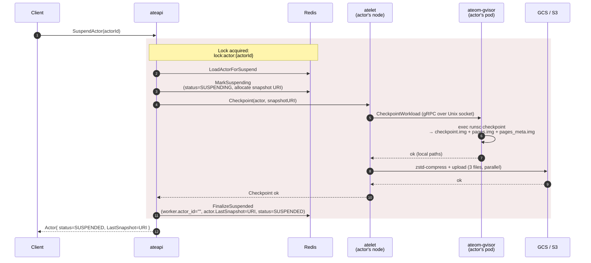

Suspend is the trick that lets Substrate run 30× more actors than there are
worker pods. A running actor is checkpointed to object storage, its worker is
released, and the actor record is updated to point at the snapshot. The next
request triggers a [resume](/flows/resume-actor/) onto a different (or the
same) worker.

## Sequence



## What happens in each step

### MarkSuspending — reserve the snapshot location

Before doing any work, ateapi flips the actor to `STATUS_SUSPENDING` and
**generates a fresh snapshot URI** of the form:

```
<ActorTemplate.spec.snapshotsConfig.location>/<actorId>/<RFC3339-timestamp>-<random>
```

The bucket/prefix comes entirely from the template's `snapshotsConfig.location`;
ateapi just appends `/<actorId>/<ts>-<rand>` (no fixed `actors/` or
`snapshots/` segments).

This URI is written into `actor.InProgressSnapshot` so that if anything
crashes mid-checkpoint, the stale data has a known location.

<code class="fileref">cmd/ateapi/internal/controlapi/workflow_suspend.go:73-93</code>

### CallAteletSuspend — drive the checkpoint

ateapi dials atelet at the actor's pod IP and calls `Checkpoint`. atelet:

1. Calls `ateom-gvisor.CheckpointWorkload` over the Unix socket.
2. ateom-gvisor execs `runsc checkpoint -image-path <local-path> <container>`,
   producing `checkpoint.img`, `pages.img`, `pages_meta.img` on the worker
   pod's local volume.
3. atelet zstd-compresses each file and uploads them to GCS/S3
   **sequentially** (`pages.img` and `pages_meta.img` are uploaded via
   `uploadIfExists`, so they're skipped if `runsc checkpoint` didn't
   produce them). The parallel `errgroup` is only on the restore download
   path, not on checkpoint upload.

<code class="fileref">cmd/ateapi/internal/controlapi/workflow_suspend.go:95-172</code> ·
<code class="fileref">cmd/atelet/main.go:351-405</code> ·
<code class="fileref">cmd/ateom-gvisor/runsc.go:102-130</code>

### FinalizeSuspended — release the worker

Once the snapshot is durably in GCS, ateapi:

1. **Clears the worker** (`actor_id=""`, `actor_namespace=""`,
   `actor_template=""`) so it's eligible to host a new actor.
2. **Updates the actor**: `LastSnapshot = InProgressSnapshot`,
   clears `AteomPodNamespace`, `AteomPodName`, and `AteomPodIp`, and sets
   `status = SUSPENDED`.

<code class="fileref">cmd/ateapi/internal/controlapi/workflow_suspend.go:174-239</code>

## What gets uploaded

| File | Contents | Purpose at restore |
|---|---|---|
| `checkpoint.img.zstd` | Sentry state, registers, FD table | Required up-front. Always uploaded. |
| `pages.img.zstd` | RAM page data | Lazy-paged during `runsc restore -background`. Uploaded only if produced. |
| `pages_meta.img.zstd` | Page metadata / index | Lazy-paged. Uploaded only if produced. |

Lazy paging is what makes resume fast even on multi-GB checkpoints — only
pages the workload actually touches get pulled in.

## What if the workload is unresponsive?

`runsc checkpoint` doesn't gracefully ask the workload to pause — gVisor
freezes the sentry, then writes the state. From the workload's perspective,
its next syscall just blocks until resume. There's no SIGTERM, no cleanup
hook.

## Failure modes

- **Lock conflict**: a concurrent operation on the same actor returns
  `Aborted`. Client should back off and retry.
- **GCS upload fails**: actor stays in `SUSPENDING` until the workflow
  retries or times out. Best-effort cleanup of partial uploads.
- **Worker pod dies mid-checkpoint**: the syncer's `releaseActorOnDeadWorker`
  resets the actor to `SUSPENDED` without a fresh snapshot — the previous
  `LastSnapshot` (if any) is still the resume target.

## Related

- [Resume actor](/flows/resume-actor/) — the reverse flow.
- [Actor lifecycle](/flows/actor-lifecycle/) — full state machine.
- [atelet](/components/atelet/) — the node-side machinery (Cut 3).
