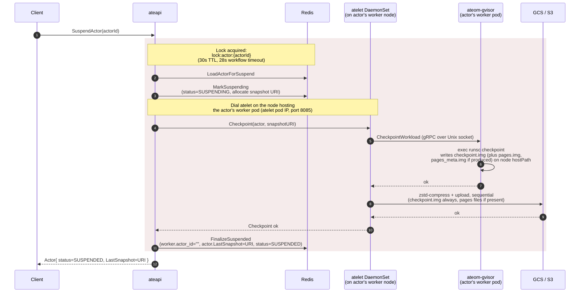

Suspend is the trick that lets Substrate run 30× more actors than there are
worker pods. A running actor is checkpointed to object storage, its worker is
released, and the actor record is updated to point at the snapshot. The next
request triggers a [resume](/flows/resume-actor/) onto a different (or the
same) worker.

## Sequence



## What happens in each step

### MarkSuspending - reserve the snapshot location

Before doing any work, ateapi flips the actor to `STATUS_SUSPENDING` and
**generates a fresh snapshot URI** of the form:

```
<ActorTemplate.spec.snapshotsConfig.location>/<actorId>/<RFC3339-timestamp>-<random>
```

The bucket/prefix comes entirely from the template's `snapshotsConfig.location`;
ateapi just appends `/<actorId>/<ts>-<rand>` (no fixed `actors/` or
`snapshots/` segments).

This URI is written into `actor.InProgressSnapshot` so that if anything
crashes mid-checkpoint, the stale data has a known location.

<code class="fileref">cmd/ateapi/internal/controlapi/workflow_suspend.go:73-93</code>

### CallAteletSuspend - drive the checkpoint

ateapi resolves the **atelet DaemonSet pod running on the same node** as
the actor's worker pod (informer indexed by node name from
`actor.AteomPodNamespace` / `AteomPodName`) and dials that atelet's pod IP
on `:8085`. atelet is per-node, not per-pod - one atelet serves every
worker pod scheduled to its node. atelet then:

1. Calls `ateom-gvisor.CheckpointWorkload` over a Unix socket. The socket
   sits in the shared `/var/lib/ateom-gvisor` hostPath, so atelet (on the
   node) and ateom-gvisor (inside the worker pod) see it at the same
   path. See [resume actor](/flows/resume-actor/) for the hostPath
   diagram - checkpoint uses the same plumbing in reverse.
2. ateom-gvisor execs `runsc checkpoint -image-path <local-path> <container>`,
   writing `checkpoint.img` (and, depending on the workload,
   `pages.img` / `pages_meta.img`) into
   `/var/lib/ateom-gvisor/actors/{ns}:{name}:{id}/checkpoint-state/` on
   the node. atelet reads them straight back through the same hostPath -
   no copy across pod boundaries.
3. atelet zstd-compresses each file and uploads them to GCS/S3
   **sequentially**. `checkpoint.img` is always uploaded; `pages.img`
   and `pages_meta.img` go through `uploadIfExists`, so they're silently
   skipped if `runsc checkpoint` didn't produce them. The parallel
   `errgroup` lives on the *restore* download path; the checkpoint
   upload path is plain sequential calls.

<code class="fileref">cmd/ateapi/internal/controlapi/workflow_suspend.go:95-172</code> ·
<code class="fileref">cmd/ateapi/internal/controlapi/dialer.go:47-99</code> ·
<code class="fileref">cmd/atelet/main.go:351-412</code> ·
<code class="fileref">cmd/ateom-gvisor/runsc.go:102-130</code>

### FinalizeSuspended - release the worker

Once the snapshot is durably in GCS, ateapi:

1. **Clears the worker** (`actor_id=""`, `actor_namespace=""`,
   `actor_template=""`) so it's eligible to host a new actor.
2. **Updates the actor**: `LastSnapshot = InProgressSnapshot`,
   clears `AteomPodNamespace`, `AteomPodName`, and `AteomPodIp`, and sets
   `status = SUSPENDED`.

<code class="fileref">cmd/ateapi/internal/controlapi/workflow_suspend.go:174-239</code>

## What gets uploaded

| File | Contents | Purpose at restore |
|---|---|---|
| `checkpoint.img.zstd` | Sentry state, registers, FD table | Required up-front. Always uploaded. |
| `pages.img.zstd` | RAM page data | Lazy-paged during `runsc restore -background`. Uploaded only if produced. |
| `pages_meta.img.zstd` | Page metadata / index | Lazy-paged. Uploaded only if produced. |

Lazy paging is what makes resume fast even on multi-GB checkpoints - only
pages the workload actually touches get pulled in.

## What if the workload is unresponsive?

`runsc checkpoint` doesn't gracefully ask the workload to pause - gVisor
freezes the sentry, then writes the state. From the workload's perspective,
its next syscall just blocks until resume. There's no SIGTERM, no cleanup
hook.

## What about in-flight requests?

Suspend is **not graceful**. There is no drain phase, no signal to the
workload, and no coordination with the L7 proxy - the proxy keeps
routing right up until the sandbox is destroyed. Two distinct cases are
worth pulling apart.

### Requests *already inside* the sandbox when suspend fires

Once `ateom-gvisor.CheckpointWorkload` runs, the sequence inside the
worker pod is:

1. `runsc checkpoint pause` - freezes the sentry of the pause container
   (which roots the sandbox). Any goroutine in the workload that was
   mid-syscall stops where it is. The kernel never sees the syscall
   complete; userspace never sees the result.
2. `runsc delete` on every application container, then on `pause`.
   The sandbox process tree is destroyed.
3. `eth0` is moved back out of the interior (sandbox) netns into the
   pod's own netns.

That order matters. By step 2, the sentry that owned the request's
sockets is gone, so any TCP state the workload was holding (open
connections from the L7 proxy, half-written HTTP responses, in-flight
DB queries to external services) is dropped on the floor. By step 3,
even segments still in flight on the wire land on a `eth0` with no
listener - the kernel responds with RST. The L7 proxy sees the
connection close mid-response and propagates that to the client as a
**502 / upstream-reset**. The work is lost; the checkpoint captured
the state *before* the request finished, so the next resume has no
memory it ever happened.

This is also the moment any non-durable work disappears: an open file
write that wasn't `fsync`'d, an outbound RPC whose response hadn't
arrived yet, a metric increment that lived only in process memory.
**Suspend has at-most-once semantics for whatever the workload was
doing.** Anything that needs to survive must be flushed to durable
storage before the request appears done from the workload's side -
which, since suspend can be called at any moment, is the same
discipline you'd want anyway.

<code class="fileref">cmd/ateom-gvisor/main.go:308-382</code>

### Requests that arrive *during* the suspend window

New requests routed by the L7 proxy go through ExtProc, which always
calls `ResumeActor` on every request. While the SuspendActor workflow
holds `lock:actor:<id>` in Redis, that `ResumeActor` call returns gRPC
`Aborted` ("another operation is in progress for this actor").

Crucially, this **does not** propagate to the client as an error. The
router's `ActorResumer` wraps the call in a `singleflight.Group` plus an
explicit retry loop: on `Aborted` it backs off and retries with an
exponential backoff (7 steps, starting at 200ms, factor 1.5, jitter 0.2,
capped by a 15s background context). All concurrent requests for the
same actor share the single in-flight call via `singleflight.DoChan`, so
the suspend → resume transition causes one resume to happen and every
waiting request piggybacks on it.

The client-visible effect is **added latency** (suspend duration plus a
cold resume) rather than a failure. The only way these requests turn
into errors is if the retry budget runs out - i.e. suspend takes longer
than ~15 seconds, which exceeds even the workflow's own 28s timeout
budget and would point at a stuck checkpoint upload. If that happens,
the gRPC `Aborted` falls through `mapResumeError`'s default branch and
the client gets HTTP 500.

<code class="fileref">cmd/atenet/internal/app/router/resumer.go:42-93</code> ·
<code class="fileref">cmd/atenet/internal/app/router/errors.go:56-92</code>

### Net effect

| Request state when `Checkpoint` runs | Outcome |
|---|---|
| Already routed to the worker, being handled by the workload | Sandbox destroyed under it. Proxy sees connection reset, client gets 502, work is lost. |
| Still in ExtProc / not yet routed | `ResumeActor` returns `Aborted`, router's `singleflight` + backoff retries until the suspend completes, then routes to a fresh worker. Added latency, no error. |

The lack of a drain phase is a deliberate trade - it keeps suspend
cheap and bounded (no waiting for indeterminate request lifetimes), at
the cost of pushing exactly-once semantics onto the workload. There's
a tracked plan to do this more gracefully via a finalizer-based
controller that holds the pod `Terminating` until the actor is
suspended; see the comment in `cmd/ateapi/internal/controlapi/syncer.go:147-160`
and [issue #23](https://github.com/agent-substrate/substrate/issues/23).

## Failure modes

- **Lock conflict**: a concurrent operation on the same actor returns
  gRPC `Aborted` ("another operation is in progress for this actor").
  Client should back off and retry.
- **GCS upload fails**: actor stays in `SUSPENDING` with
  `InProgressSnapshot` set. No proactive cleanup runs - partial objects
  at that URI are simply overwritten on the next `SuspendActor` attempt
  (`MarkSuspending` skips re-allocating the URI when status is already
  `SUSPENDING`).
- **Worker pod dies mid-checkpoint**: the syncer's `releaseActorOnDeadWorker`
  resets the actor to `SUSPENDED`, clears `InProgressSnapshot`, and
  leaves `LastSnapshot` alone - so the previous successful snapshot (if
  any) is still the resume target.

## Related

- [Resume actor](/flows/resume-actor/) - the reverse flow.
- [Actor lifecycle](/flows/actor-lifecycle/) - full state machine.
- [atelet](/components/atelet/) - the node-side machinery (Cut 3).
