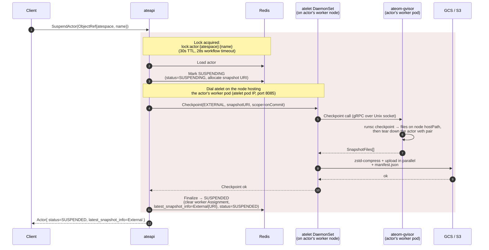

Freezing a running actor is the trick that lets Substrate run far more actors
than there are worker pods. A running actor is checkpointed, its worker is
released back to the pool, and the actor record is updated to point at the
snapshot. The next request triggers a [resume](/flows/resume-actor/) onto a
worker.

There are **two flavors** of this, driven by two RPCs on the `Control` service:

| RPC | Where the snapshot lands | Effect on the next resume |
|---|---|---|
| **`SuspendActor`** | Uploaded to **object storage** (GCS/S3), node freed entirely | Can resume onto any eligible worker; downloads the snapshot |
| **`PauseActor`** | Kept **local to the node VM**, node freed but the snapshot stays | Prefers to resume back onto that same node; no download |

Both take a `SuspendActorRequest`/`PauseActorRequest` whose only field is an
`actor` `ObjectRef{atespace, name}`, and both run as a four-step workflow under
the per-actor lock. The workflows are near-identical - they differ only in the
checkpoint type handed to atelet, the snapshot scope, and the `SnapshotInfo`
variant written back.

## Sequence (suspend)

**Pause** follows the same shape, with a different tail: `PauseActor` marks the
actor `PAUSING`, checkpoints locally (`Checkpoint(LOCAL, snapshotPrefix,
scope=onPause)`) so atelet moves the checkpoint into the node's local-checkpoint
directory instead of uploading, then finalizes to status `PAUSED` and writes a
`LocalSnapshotInfo` recording the node VM that holds the snapshot.

## What happens in each step

### Mark suspending / pausing - reserve the snapshot location

Before doing any work, ateapi flips the actor to `STATUS_SUSPENDING`
(or `STATUS_PAUSING`) and reserves a snapshot location in
`actor.in_progress_snapshot`, so that if anything crashes mid-checkpoint the
stale data has a known location.

- **Suspend** builds an external URI prefix of the form
  `<snapshotsConfig.location>/<name>/<RFC3339-timestamp>-<random>`. The
  bucket/prefix comes entirely from the template's `snapshotsConfig.location`
  (trailing slash trimmed); ateapi appends `/<name>/<ts>-<rand>` (no fixed
  `actors/` or `snapshots/` segment).
- **Pause** reserves a plain, node-local prefix: `<name>-<RFC3339-timestamp>-<random>`
  (no bucket - the snapshot never leaves the node).

Both steps only act when the actor is `RUNNING`, and both short-circuit if the
actor is already in the terminal state for their flow (`SUSPENDED` / `PAUSED`).

### Drive the checkpoint on atelet

ateapi resolves the **atelet DaemonSet pod running on the same node** as the
actor's worker pod - it looks up the atelet on that worker's node and dials
its pod IP on `:8085`. atelet is per-node, not per-pod: one atelet serves every
worker pod scheduled to its node.

If the actor is in `SUSPENDING`/`PAUSING` but has no assigned worker (empty pod
pointers), the step crashes the actor and fails - there's nothing to checkpoint.

Otherwise atelet is sent a `CheckpointRequest`. The only differences between the
two flows are:

| | Suspend | Pause |
|---|---|---|
| `Type` | `CHECKPOINT_TYPE_EXTERNAL` | `CHECKPOINT_TYPE_LOCAL` |
| Config | `ExternalConfig{ snapshot_uri_prefix }` | `LocalConfig{ snapshot_prefix }` |
| `Scope` | `snapshotsConfig.onCommit` | `snapshotsConfig.onPause` |

The checkpoint request does **not** carry the sandbox config - atelet uses the
version the actor is currently running (recorded on-node at Run/Restore) and
pins it into the snapshot manifest. atelet then:

1. Makes the Checkpoint call to ateom over a Unix socket in the shared
   `/var/lib/ateom-gvisor` hostPath, so atelet (on the node) and ateom-gvisor
   (inside the worker pod) see it at the same path. See
   [resume actor](/flows/resume-actor/) for the hostPath diagram - checkpoint
   uses the same plumbing in reverse.
2. ateom-gvisor execs `runsc` to checkpoint into
   `/var/lib/ateom-gvisor/actors/<actor-uid>/checkpoint-state/` on the
   node - a full checkpoint of the `pause` container that roots the sandbox for
   `Full` scope, or just an `fs-checkpoint` of the durable-dir volumes for
   `Data` scope - then reports back **exactly the files runsc wrote** (a
   `checkpoint.img` plus any pages images it emitted) rather than a hardcoded
   list.
3. **Suspend** zstd-compresses each reported file and uploads it to GCS/S3 **in
   parallel**, then writes a `manifest.json` alongside them.
   **Pause** instead moves the checkpoint into the node's
   `.../local-checkpoint/` directory - no upload.

### Finalize - release the worker

Once the snapshot is durably in place, ateapi:

1. **Clears the worker's `Assignment`** (sets `worker.Assignment = nil`) so it's
   eligible to host a new actor - but only if the assignment still points at
   this actor (guarding against a concurrent reassignment).
2. **Updates the actor**: promotes `in_progress_snapshot` into
   `latest_snapshot_info`, then clears `ateom_pod_namespace`,
   `ateom_pod_name`, `ateom_pod_ip`, and `worker_pool_name`, and sets the final
   status.

The two flows write different `SnapshotInfo` variants:

- **Suspend** → `SnapshotInfo{ external: ExternalSnapshotInfo{ snapshot_uri_prefix } }`, status `SUSPENDED`.
- **Pause** → `SnapshotInfo{ local: LocalSnapshotInfo{ snapshot_prefix, node_vms_with_local_snapshots: [nodeName] } }`, status `PAUSED`. The node name is read from the worker being released, so the following resume knows which node still holds the snapshot.

## What gets checkpointed

The checkpoint contents are decided by the snapshot **scope**, chosen per
trigger in `snapshotsConfig` - `onCommit` for suspend, `onPause` for pause
(with `onCommit` a subset of `onPause`). See [Snapshot](/concepts/snapshot/) for
the `Full` vs. `Data` scopes and the exact on-disk layout. atelet treats the
files as opaque: it ships exactly what `runsc` wrote, each zstd-compressed, plus
a `manifest.json`. For gVisor that's a `checkpoint.img` (sentry state,
registers, FD table, filesystem deltas) plus any pages images `runsc` emits;
resume streams RAM pages in lazily, which is what keeps resume fast even on
multi-GB checkpoints.

## What if the workload is unresponsive?

`runsc checkpoint` doesn't gracefully ask the workload to pause - gVisor freezes
the sentry, then writes the state. From the workload's perspective, its next
syscall just blocks until resume. There's no SIGTERM, no cleanup hook.

## What about in-flight requests?

Neither suspend nor pause is **graceful**. There is no drain phase, no signal to
the workload, and no coordination with the L7 proxy - the proxy keeps routing
right up until the sandbox is destroyed. Two distinct cases are worth pulling
apart.

### Requests *already inside* the sandbox when the checkpoint fires

Once the Checkpoint call to ateom runs, the sequence inside the worker pod
is:

1. `runsc checkpoint` on the `pause` container (which roots the sandbox) freezes
   the sentry. Any goroutine in the workload that was mid-syscall stops where it
   is. The kernel never sees the syscall complete; userspace never sees the
   result.
2. Best-effort `runsc delete` on the application containers and the `pause`
   container. The sandbox process tree is destroyed.
3. The **actor veth pair is torn down**: ateom deletes the host-side veth
   `ateom0` (which also removes its peer) and any interior veth, undoing the
   link-local `169.254.17.0/30` wiring and the `ateom_actor` nftables rules.
   (This is the current model - the actor no longer moves a real `eth0` between
   netns; the pod keeps its own `eth0` throughout.)

That order matters. By step 2, the sentry that owned the request's sockets is
gone, so any TCP state the workload was holding (open connections from the L7
proxy, half-written HTTP responses, in-flight DB queries to external services)
is dropped. By step 3, even segments still in flight land on a torn-down veth
with no listener - the kernel responds with RST. The L7 proxy sees the
connection close mid-response and propagates that to the client as a
**502 / upstream-reset**. The work is lost; the checkpoint captured the state
*before* the request finished, so the next resume has no memory it ever
happened.

This is also the moment any non-durable work disappears: an open file write that
wasn't `fsync`'d, an outbound RPC whose response hadn't arrived yet, a metric
increment that lived only in process memory. **Freezing an actor has
at-most-once semantics for whatever the workload was doing.** Anything that
needs to survive must be flushed to durable storage before the request appears
done from the workload's side - which, since suspend/pause can be called at any
moment, is the same discipline you'd want anyway.

### Requests that arrive *during* the freeze window

New requests routed by the L7 proxy go through ExtProc, which always calls
`ResumeActor` on every request. While the Suspend or Pause workflow holds
`lock:actor:<atespace>:<name>` in Redis, that `ResumeActor` call returns gRPC
`Aborted` ("another operation is in progress for this actor").

Crucially, this **does not** propagate to the client as an error. The router
dedupes concurrent calls for the same actor (keyed `<atespace>/<actor_name>`)
and adds an explicit retry loop: on `Aborted` it backs off and retries with an
exponential backoff (7 steps, starting at 200ms, factor 1.5, jitter 0.2, capped
by a 15s background context). All concurrent requests for the same actor share
the single in-flight call, so the freeze → resume transition causes one resume
to happen and every waiting request piggybacks on it.

The client-visible effect is **added latency** (the freeze duration plus a
resume) rather than a failure. The only way these requests turn into errors is
if the retry budget runs out - i.e. the freeze takes longer than ~15 seconds,
which exceeds even the workflow's own 28s timeout budget and would point at a
stuck checkpoint. If that happens, the gRPC `Aborted` falls through to the
default error mapping and the client gets HTTP 500.

### Net effect

| Request state when `Checkpoint` runs | Outcome |
|---|---|
| Already routed to the worker, being handled by the workload | Sandbox destroyed under it. Proxy sees connection reset, client gets 502, work is lost. |
| Still in ExtProc / not yet routed | `ResumeActor` returns `Aborted`, the router dedupes and retries with backoff until the freeze completes, then routes to a worker. Added latency, no error. |

The lack of a drain phase is a deliberate trade - it keeps suspend/pause cheap
and bounded (no waiting for indeterminate request lifetimes), at the cost of
pushing exactly-once semantics onto the workload. There's a tracked plan to do
this more gracefully via a finalizer-based controller that holds the pod
`Terminating` until the actor is suspended; see
[issue #23](https://github.com/agent-substrate/substrate/issues/23).

## Failure modes

- **Lock conflict**: a concurrent operation on the same actor returns gRPC
  `Aborted` ("another operation is in progress for this actor"). Client should
  back off and retry.
- **External upload fails (suspend)**: atelet returns a data-loss error that
  signals the actor should be crashed; ateapi moves the actor to **`CRASHED`**
  (external snapshot files aren't cached on failure, so the workflow can't safely
  retry - tracked as
  [#362](https://github.com/agent-substrate/substrate/issues/362)).
- **No worker at checkpoint time**: if the actor is `SUSPENDING`/`PAUSING` but
  has no assigned worker, the workflow crashes the actor - see
  [actor lifecycle](/flows/actor-lifecycle/).
- **Worker pod dies mid-checkpoint**: the syncer's release-on-death path
  resets the actor to `SUSPENDED` (unless already `CRASHED`), clears
  `in_progress_snapshot` and the `ateom_pod_namespace`/`ateom_pod_name`/`ateom_pod_ip`
and `worker_pool_name` pointers, and
  leaves `latest_snapshot_info` alone - so the previous successful snapshot (if
  any) is still the resume target.

## Related

- [Resume actor](/flows/resume-actor/) - the reverse flow.
- [Actor lifecycle](/flows/actor-lifecycle/) - full state machine, including
  `PAUSED` and `CRASHED`.
- [Snapshot](/concepts/snapshot/) - external vs. local snapshots and scopes.
- [atelet](/components/atelet/) - the node-side machinery.
