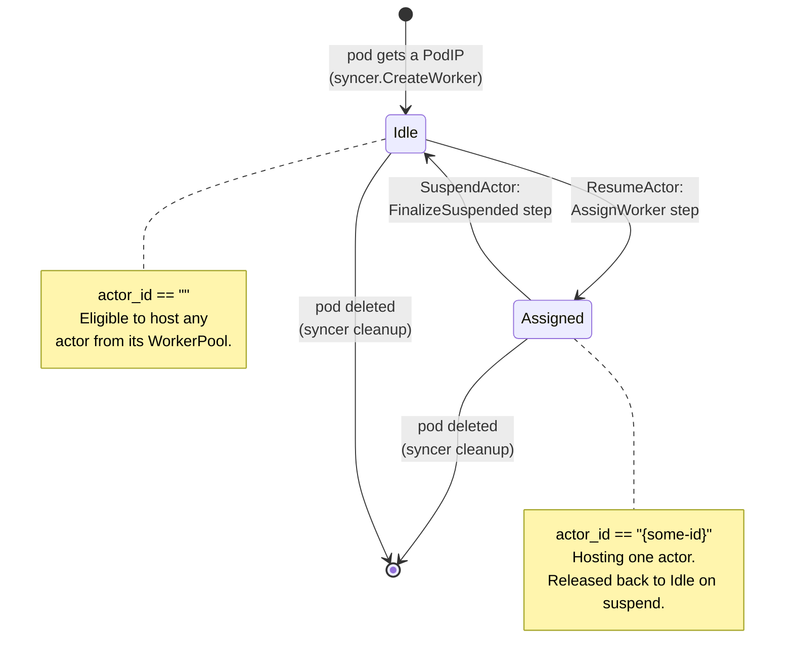
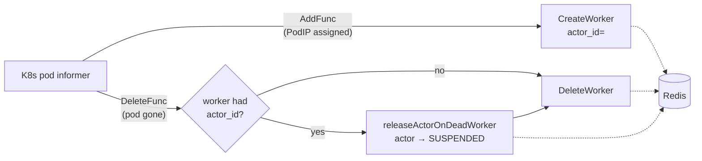
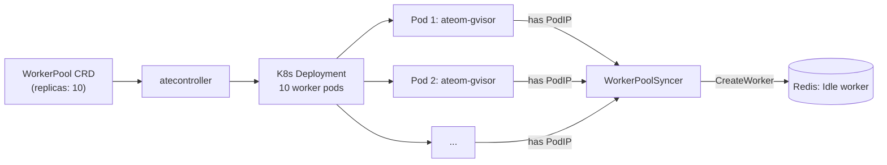

A **worker** in Substrate is a pre-warmed gVisor sandbox pod - a member of a
`WorkerPool` Deployment, sitting around with `ateom-gvisor` running and a
pause container, waiting for an actor to be restored into it.

Workers are simpler than actors: just two states (plus "gone").

## States

## Worker record in Redis

A worker is just a JSON proto at key `worker:<ns>:<pool>:<pod>`:

| Field | Idle worker | Assigned worker |
|---|---|---|
| `worker_namespace`, `worker_pool`, `worker_pod` | always set | always set |
| `ip`, `worker_pod_uid`, `version` | always set | always set |
| `actor_id` | `""` | actor ID |
| `actor_namespace` | `""` | actor's namespace |
| `actor_template` | `""` | template name |

<code class="fileref">cmd/ateapi/internal/store/ateredis/ateredis.go:40-80</code>

## The WorkerPoolSyncer keeps this fresh

`releaseActorOnDeadWorker` runs **before** `DeleteWorker` so the actor is
restored to SUSPENDED while the worker record is still readable.
Eligibility to create a worker is keyed on `pod.Status.PodIP != ""`, not
on the Ready condition.

<code class="fileref">cmd/ateapi/internal/controlapi/syncer.go:28-192</code>

## How workers get *assigned*

When `ResumeActor` runs, `AssignWorkerStep` does a randomized shuffle over
**idle workers in the target WorkerPool** (matching the actor's
`ActorTemplate.WorkerPoolRef`) and picks one. If none are available it
retries up to 5 times with exponential backoff (10ms initial). After that:
`FailedPrecondition`.

This is the bypass-the-K8s-scheduler trick: pod allocation is just a Redis
shuffle, not a scheduler decision.

<code class="fileref">cmd/ateapi/internal/controlapi/workflow_resume.go:78-158</code>

## How workers get *released*

When `SuspendActor` finishes, `FinalizeSuspendedStep` zeros out the
worker's actor fields and writes it back to Redis. The worker is
immediately eligible to host a different actor.

<code class="fileref">cmd/ateapi/internal/controlapi/workflow_suspend.go:174-239</code>

## What happens when a worker pod dies

The syncer's `DeleteFunc` fires on pod removal. If the worker was hosting
an actor, the syncer **forces the actor back to `SUSPENDED`** without
producing a snapshot (the actor's existing `LastSnapshot`, if any, is
still valid). Then the worker record is deleted.

This is a recovery path, not a planned transition.

:::caution[Known race]
If a worker pod dies **and** a concurrent `SuspendActor` is in flight, the
release-on-death and the suspend workflow can both touch the actor. Today
this is best-effort - the worse outcome is a benign double-write, not data
loss.
:::

## Pre-warming: where workers come from

The `WorkerPool` CRD owns a Deployment of N replicas. atecontroller
reconciles changes to that CRD into Deployment spec changes. Pods come up,
start `ateom-gvisor`, get a PodIP, and the syncer registers them as
**Idle** workers.

<code class="fileref">internal/controllers/workerpool_controller.go:52-176</code>

## Worker pools are isolation boundaries

Actors of a given `ActorTemplate` can only be assigned to workers from the
pool referenced by `template.WorkerPoolRef`. Different pools never share
workers. This is the unit at which:

- You can have different worker base images per pool.
- You can scale capacity independently per workload class.

## Related

- [Actor lifecycle](/flows/actor-lifecycle/) - the dual state machine on
  the actor side.
- [Resume actor](/flows/resume-actor/) · [Suspend actor](/flows/suspend-actor/)
- [WorkerPool](/concepts/workerpool/) · [Workers](/components/workers/) (Cut 3).
