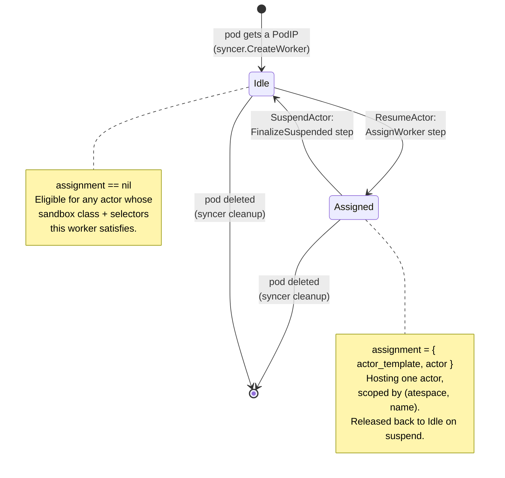
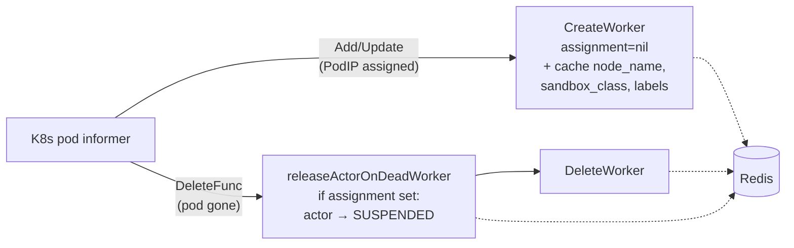
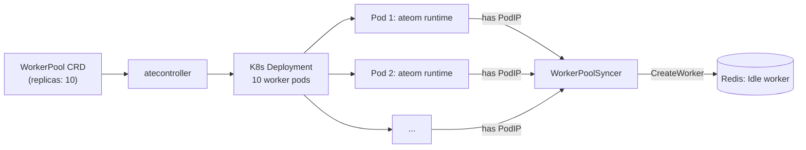

A **worker** in Substrate is a pre-warmed sandbox pod - a member of a
`WorkerPool` Deployment, sitting around with the ateom runtime
(`ateom-gvisor` or `ateom-microvm`) running, waiting for an actor to be
restored into it.

Workers are simpler than actors: just two states (plus "gone").

## States

Idle vs. assigned is expressed by a single `Assignment` message on the
worker record: **no assignment = idle**; an assignment = hosting one actor.

## Worker record in Redis

A worker is just a JSON proto at key `worker:<ns>:<pool>:<pod>` (unchanged):

| Field | Idle worker | Assigned worker |
|---|---|---|
| `worker_namespace`, `worker_pool`, `worker_pod` | always set | always set |
| `ip`, `worker_pod_uid`, `version` | always set | always set |
| `node_name` | always set | always set |
| `sandbox_class` | cached from the pool (`gvisor` \| `microvm`) | same |
| `labels{}` | cached from the pool's labels | same |
| `assignment` | **unset** (idle) | `{ actor_template, actor }` |

The old flat `actor_id` / `actor_namespace` / `actor_template` fields are
gone. `assignment.actor_template` is a `KubeNamespacedObjectRef{namespace,
name}` and `assignment.actor` is an `ObjectRef{atespace, name}` - so the
assignment is scoped by the actor's `(atespace, name)` identity, not a bare
id. The cached `sandbox_class` and `labels` are what the scheduler matches
eligibility against without re-reading the `WorkerPool`.

<code class="fileref">cmd/ateapi/internal/store/ateredis/ateredis.go</code>
<code class="fileref">pkg/proto/ateapipb/ateapi.proto</code>

## The WorkerPoolSyncer keeps this fresh

On Add/Update the syncer reads the pod's `WorkerPool` to cache the pool's
`sandboxClass` and labels onto the worker record (and refreshes them if they
change). `releaseActorOnDeadWorker` runs **before** `DeleteWorker`, and only
acts when the worker has an `assignment` (and the actor still points back at
this pod), so the actor is restored to `SUSPENDED` while the worker record
is still readable. A `CRASHED` actor is left `CRASHED`, not forced back to
`SUSPENDED`. Eligibility to create a worker is keyed on
`pod.Status.PodIP != ""`, not on the Ready condition.

<code class="fileref">cmd/ateapi/internal/controlapi/syncer.go</code>

## How workers get *assigned*

When `ResumeActor` runs, `AssignWorkerStep` reads the in-memory
[worker cache](/components/ateapi/), filters to **eligible idle workers**,
and does a randomized shuffle to pick one. If none are available it retries
up to 5 times with exponential backoff (10ms initial). After that:
`FailedPrecondition`.

There is no `WorkerPoolRef` anymore - eligibility is **selector-based**
(`isWorkerEligibleForActor`). A worker is eligible for an actor when **all**
of these hold:

1. **Sandbox class matches** - the worker's cached `sandbox_class` equals
   the template's `sandboxClass` (snapshots are not portable across
   classes).
2. **Template gate** - the worker's `labels` satisfy the template's
   `workerSelector`.
3. **Actor selector** - the worker's `labels` also satisfy the actor's own
   `worker_selector`.

Both selectors are AND'd. If the actor's `latest_snapshot_info` is a
**local** snapshot pinned to specific node VMs, the candidate set is further
restricted to workers on one of those nodes.

This is the bypass-the-K8s-scheduler trick: pod allocation is just a filter
plus a shuffle over the cached worker set, not a scheduler decision.

<code class="fileref">cmd/ateapi/internal/controlapi/workflow_resume.go</code>

## How workers get *released*

When `SuspendActor` finishes, `FinalizeSuspendedStep` clears the worker's
`assignment` (sets it to nil) and writes it back to Redis, and clears the
actor's `worker_pool_name` / `ateom_pod_*` pointers. The worker is
immediately idle again and eligible to host a different actor.

<code class="fileref">cmd/ateapi/internal/controlapi/workflow_suspend.go</code>

## What happens when a worker pod dies

The syncer's `DeleteFunc` fires on pod removal. If the worker had an
`assignment`, the syncer **forces the actor back to `SUSPENDED`** without
producing a snapshot (the actor's existing `latest_snapshot_info`, if any,
is still valid) and clears its pod pointers and `worker_pool_name`. A
`CRASHED` actor keeps its status. Then the worker record is deleted.

This is a recovery path, not a planned transition. It is best-effort: the
optimistic version check means a concurrent `SuspendActor`/`ResumeActor`
can win and this attempt is dropped.

:::caution[Known race]
If a worker pod dies **and** a concurrent `SuspendActor` is in flight, the
release-on-death and the suspend workflow can both touch the actor. Today
this is best-effort - the worse outcome is a benign double-write, not data
loss.
:::

## Pre-warming: where workers come from

The `WorkerPool` CRD owns a Deployment of N replicas. atecontroller
reconciles changes to that CRD into Deployment spec changes. Pods come up,
start the pool's ateom runtime (`ateom-gvisor` or `ateom-microvm`), get a
PodIP, and the syncer registers them as **Idle** workers - caching the
pool's `sandboxClass` and labels onto each record.

<code class="fileref">cmd/atecontroller/internal/controllers/workerpool_controller.go</code>

## Worker pools are isolation boundaries

A `WorkerPool` is no longer named directly by an `ActorTemplate`. Instead an
actor lands on a pool whose `sandboxClass` matches the template's **and**
whose labels satisfy both the template's `workerSelector` and the actor's
own `worker_selector`. This selector-based eligibility is the unit at which:

- You separate sandbox runtimes: a `gvisor` pool and a `microvm` pool never
  share workers (snapshots are not portable across classes).
- You have different worker base images / node placement per pool.
- You scale capacity independently per workload class, and target templates
  at a pool with labels.

## Related

- [Actor lifecycle](/flows/actor-lifecycle/) - the dual state machine on
  the actor side.
- [Resume actor](/flows/resume-actor/) · [Suspend actor](/flows/suspend-actor/)
- [WorkerPool](/concepts/workerpool/) · [Workers](/components/workers/)
