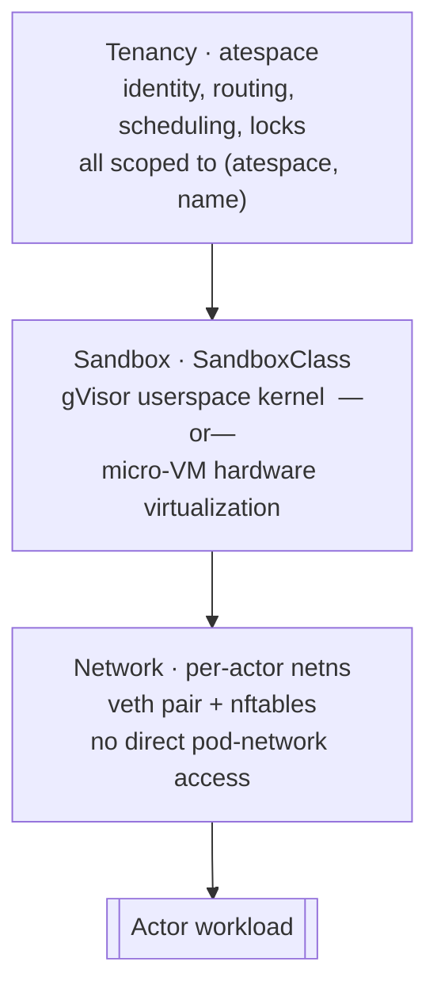

Substrate has to answer two questions constantly: **"who is this?"** (identity and
authentication) and **"what is it allowed to touch?"** (isolation). It answers
both at several layers, and those layers are spread across the other pages in
this atlas - this page ties them together.

:::note[Authoritative source]
The project's own [`docs/threat-model.md`](https://github.com/agent-substrate/substrate/blob/main/docs/threat-model.md)
is the canonical security document. This page maps the mechanisms that exist
**today**; Substrate is early and, by the threat model's own admission, still
lightly hardened - so treat this as "what's wired up," not "what's guaranteed."
When in doubt, the threat model and the code win.
:::

## Two layers of identity

Substrate deliberately separates the identity of a **resource** from the identity
of the **workload** running inside it.

| Layer | What it names | Form | Stable across… |
|---|---|---|---|
| **Resource identity** | the actor as a control-plane object | `(atespace, name)` in `ResourceMetadata` (+ server-assigned `uid`) | its whole lifecycle; survives suspend/resume and moving between workers |
| **Workload (session) identity** | the app/user/session the workload acts as | JWT `sub` `apps/<appid>/users/<userid>/sessions/<sessionid>` or SPIFFE `spiffe://substrate-session.local/app/<appid>/user/<userid>/session/<sessionid>` | the life of the session, even as it migrates across physical workers |

- **Resource identity** is what routing, scheduling, storage, and locking all key
  off - the [atespace](/concepts/atespace/) is the tenancy boundary, and an actor
  name is only unique within it. See [Actor](/concepts/actor/).
- **Workload identity** is minted on demand by the `SessionIdentity` service
  (`MintJWT` / `MintCert`) so a workload can prove *what it is* to other services
  regardless of which worker it currently sits on. See [Session](/concepts/session/).
- **Actor self-identity at runtime:** atelet writes each actor's identity to
  `/run/ate/actor-id` (atomically, regenerated on every resume), so the workload
  can discover its own `(atespace, name)` without parsing headers. See
  [atelet](/components/atelet/).

<code class="fileref">pkg/proto/ateapipb/ateapi.proto</code> ·
<code class="fileref">cmd/ateapi/internal/sessionidentity/sessionidentity.go</code>

## Authenticating to the control plane

Calls into `ateapi` are authenticated in one of two modes, selected by the
`--auth-mode` flag:

- **`mtls`** (default) - client identity comes from transport-level mutual TLS.
- **`jwt`** - *in addition* to TLS, every RPC must carry a Kubernetes
  ServiceAccount **Bearer token**, verified via OIDC discovery against a
  configured issuer and audience (`--client-jwt-issuer` / `--client-jwt-audience`).

JWT mode is explicitly **transitional**: the flag's own help notes Substrate will
drop it once the Kubernetes **Pod Certificates** feature is enabled by default in
the minimum supported Kubernetes version.

Component-to-component **mTLS identity** is issued by `podcertcontroller`, a
polyfill for that upcoming Pod Certificates feature. It runs two signers:

- `servicedns.podcert.ate.dev/identity` - certs for Kubernetes service DNS names.
- `podidentity.podcert.ate.dev/identity` - certs equivalent to ServiceAccount tokens.

Both are backed by a local CA and are expected to be replaced by upstream signers
over time. Note that not every internal hop is mTLS: atelet talks to `ateom`
over a **Unix domain socket** inside the worker pod (addressed by pod UID), not a
network connection.

<code class="fileref">internal/ateapiauth/server.go</code> ·
<code class="fileref">cmd/ateapi/internal/k8sjwt</code> ·
<code class="fileref">cmd/podcertcontroller/main.go</code>

## Isolation, layer by layer

Substrate is defense-in-depth: a request has to clear several independent
boundaries before it reaches your code.

- **Tenancy (atespace).** Every actor is scoped to an atespace; the store keys
  (`actor:<atespace>:<name>`), DNS names, scheduling, and the per-actor workflow
  lock (`lock:actor:<atespace>:<name>`) all include it, so tenants don't collide
  or contend. Golden/system actors live in the reserved `ate-golden` atespace.
- **Sandbox (SandboxClass).** Each actor runs inside a sandbox - either
  [gVisor](/components/ateom-gvisor/) (a userspace kernel that intercepts the
  workload's syscalls so it never calls the host kernel directly) or a
  [micro-VM](/components/ateom-microvm/) (a real guest kernel behind KVM - a
  stronger, hardware-virtualized boundary, at the cost of requiring `/dev/kvm`
  and vhost device access on the node). The class is a hard scheduling gate, and
  because a gVisor checkpoint and a micro-VM snapshot are different formats, a
  snapshot from one class can never be restored on the other.
- **Network.** Each actor gets its own network namespace wired to the pod by a
  **veth pair** on a link-local `/30` (`169.254.17.1` host, `169.254.17.2` actor),
  with an `ateom_actor` nftables table doing egress masquerade and inbound DNAT.
  The workload never sits directly on the pod's network.

<code class="fileref">cmd/ateom-gvisor/main.go</code> ·
<code class="fileref">cmd/ateapi/internal/controlapi/workflow_resume.go</code>

## Secrets & log hygiene

- **Secret env:** an ActorTemplate container may source an env var from a
  Kubernetes Secret via `valueFrom.secretKeyRef` (never both a literal `value`
  and a `secretKeyRef`). See [ActorTemplate](/concepts/actortemplate/).
- **Router log redaction:** the atenet router does **not** log secrets in its
  ext_proc request logs, and redacts the query string at its `statusz` sink, so
  bearer tokens / query params don't leak into logs.
- **Store transport:** ValKey (v9.1) is fronted by TLS and reloads its certs
  every 12h, so cert rotation doesn't require a restart. ateapi can additionally
  authenticate to it with Google Cloud **IAM** (`--redis-use-iam-auth`, on by
  default), and it is the only component that connects to the database. See
  [Storage](/components/storage/).

## Integrity controls

- **Pinned images.** Both `pauseImage` and container `image` must be digest-pinned
  (contain `@`) - a CRD validation rule enforces it, because changing an image out
  from under a snapshot would invalidate it.
- **Verified assets.** `SandboxConfig` assets are content-addressed: each carries a
  `sha256`, which both names the cached file and verifies the download. A
  `ValidatingAdmissionPolicy` (`manifests/ate-install/sandboxconfig-validation.yaml`)
  rejects configs that don't declare the assets their class requires. See
  [SandboxConfig](/concepts/sandboxconfig/).
- **Immutable templates.** An `ActorTemplate` spec is immutable
  (`self == oldSelf`) - you publish a new template for a new version rather than
  mutating one that snapshots already depend on.
- **Input validation.** atelet validates every RPC field that becomes a host
  filesystem path (atespace, name, container names, hashes) against DNS-1123 /
  length rules, so a malicious control-plane input can't traverse out of an
  actor's directory. See <code class="fileref">internal/resources/validate.go</code>.

## Threats & mitigations

`docs/threat-model.md` enumerates the attack surfaces Substrate reasons about:
attacks **from external networks**, **from internal network / API clients**,
**from actors** (the primary untrusted party - what the sandbox, network, and
tenancy layers above defend against), **from nodes**, **insiders**,
**misconfiguration**, and **detection & response**.

:::caution[Read the threat model as a roadmap, not a spec of today]
The threat model is explicit that Substrate is early and "has little to no
security hardening at this time." Its **Suggested Concrete Mitigations** are
*recommended invariants*, not a description of what the code does today. Treat the
mechanisms documented on this page as the parts that **are** implemented, and the
threat model as the target state. Don't assume a mitigation is in place because
the threat model lists it.
:::

Some notable invariants the threat model calls for that are **not yet guaranteed**
(verify current status before relying on them):

- **Default-deny actor networking** - cross-actor and actor→control-plane traffic
  blocked by default, synced with actor lifecycle.
- **Cryptographic snapshot verification** before restore - today the gVisor
  restore even passes `runsc`'s `-direct` flag, which *assumes the snapshot source
  is trusted*, so snapshot integrity rests on securing the object store, not on a
  verified digest.
- **Deprivileged worker pods** - worker/atelet components currently run
  `privileged: true` to manage sandboxes and namespaces.
- **Snapshot-access credentials scoped away from the sandbox**, and **audit
  logging** across the API and node components.

The threat model also states Substrate's explicit **goals and non-goals** - the
right starting point before relying on any single mechanism here.

## Related

- [Atespace](/concepts/atespace/) - the tenancy boundary.
- [Session](/concepts/session/) - workload identity (JWT / SPIFFE).
- [ateapi](/components/ateapi/) - where control-plane auth is enforced.
- [ateom-gvisor](/components/ateom-gvisor/) · [ateom-microvm](/components/ateom-microvm/) - the sandbox boundaries.
