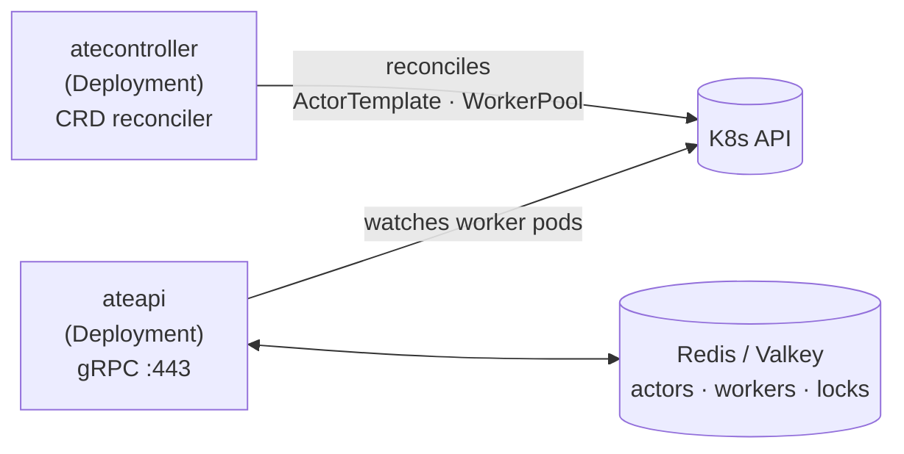
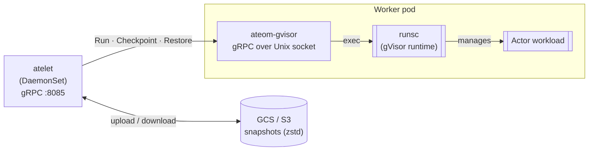
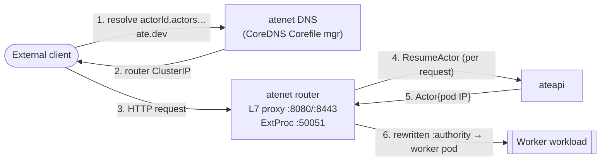

Substrate is a **control plane / data plane** split that runs on Kubernetes but
deliberately **routes around the K8s scheduler** for the hot path. Actor
assignment to pre-warmed worker pods happens in `ateapi` in milliseconds, not in
`kube-scheduler` in seconds.

## In three pictures

The whole-picture hero on the [Overview](/) is the elevator pitch. This page
zooms in on the three regions that matter most — what's *in* each plane,
and how a request actually flows.

### 1 · Control plane

Stateless workloads, declarative inputs. `atecontroller` owns the CRDs;
`ateapi` is the operational brain backed by Redis.

### 2 · Data plane (one worker node)

Every node runs one `atelet` DaemonSet pod and many worker pods. atelet is
the single component on the node that touches object storage; ateom-gvisor
is the only thing that talks to runsc.

### 3 · Request flow

The thing that lets Substrate scale: routing is **resolved at the request
moment**, not pre-baked. No worker-IP DNS records, no sidecars, no
scheduler involvement. For the full sequence (including the cold-restore
case), see [Resume actor](/flows/resume-actor/).

## What each component is for

| Component | Kind | Role |
|---|---|---|
| **ateapi** | Deployment | Source of truth for actor & worker state. Serves `Control` and `SessionIdentity` gRPC services. Owns the suspend/resume workflows. |
| **atecontroller** | Deployment | Watches the K8s API. Reconciles `WorkerPool` (→ Deployments of worker pods) and `ActorTemplate` (→ golden snapshot bootstrap). |
| **atenet** | Deployments (one binary, two subcommands) | `atenet router` runs an L7 proxy + ExtProc and does the per-request dance to find the right worker. `atenet dns` programs CoreDNS so `<actorId>.actors.resources.substrate.ate.dev` resolves. Each subcommand is typically deployed as its own Deployment. |
| **atelet** | DaemonSet | Lives on each worker node. Receives gRPC calls from ateapi. Pulls images, manages OCI bundles, talks to ateom over a Unix socket, ships snapshots to GCS/S3. |
| **ateom-gvisor** | In-pod helper | Lives inside every worker pod. Tiny gRPC server on a Unix socket. Shells out to `runsc checkpoint` / `runsc restore`. |
| **Worker pods** | Deployment-spawned (from `WorkerPool`) | Pre-warmed gVisor sandboxes. Each can host one actor at a time; the gVisor sandbox (with its pause process) is created on assignment, not at pod start. |
| **Redis / Valkey** | StatefulSet | Holds actor records, worker records, and the per-actor distributed locks that serialize workflows. |
| **GCS / S3** | External | Holds the checkpoint images (RAM + sentry state + lazy-load pages), zstd-compressed. |
| **podcertcontroller** | Deployment | Polyfill for the upstream K8s Pod Certificate signers feature. Not on the hot path. |

## Ports at a glance

| Service | Port | Protocol |
|---|---|---|
| ateapi | 443 | gRPC (TLS) |
| atelet | 8085 | gRPC |
| atenet router (L7 proxy) | 8080 / 8443 | HTTP / HTTPS |
| atenet ExtProc | 50051 | gRPC (ext_proc) |
| atenet xDS | 18000 | gRPC (xDS control plane) |
| ateom-gvisor | Unix socket | gRPC — `/var/lib/ateom-gvisor/ateoms/{podUID}/ateom.sock` |

## How traffic *actually* gets to an actor

The short version: there is **no per-pod sidecar**. atenet's centralized
L7 proxy is the single dataplane proxy, and ExtProc consults ateapi on each
request to discover (and if needed, resume) the actor's worker.

See the [request path flow](/flows/resume-actor/) for the full sequence.

## The hot path bypasses kube-scheduler

The big architectural bet: when an actor needs to wake up, **ateapi picks a
pre-warmed worker out of Redis and tells atelet to restore into it**. The
Kubernetes scheduler is never on the critical path. That's how Substrate gets
sub-second resume times against 30× more actors than pods.

:::tip[Where in the code]
- ateapi entry: <code class="fileref">cmd/ateapi/main.go:70-161</code>
- atecontroller entry: <code class="fileref">cmd/atecontroller/main.go:49-107</code>
- atenet router init: <code class="fileref">cmd/atenet/internal/app/router/router.go:164-218</code>
- atelet entry: <code class="fileref">cmd/atelet/main.go</code>
- ateom-gvisor entry: <code class="fileref">cmd/ateom-gvisor/main.go</code>
:::
